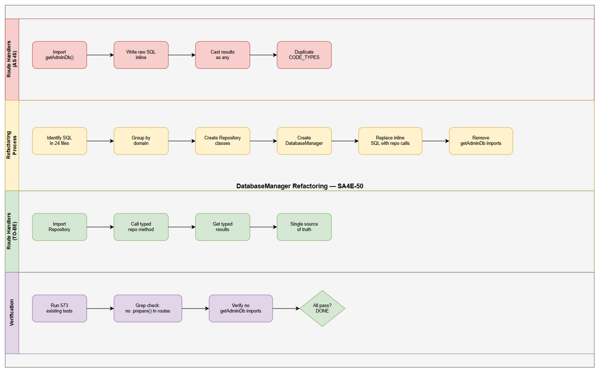
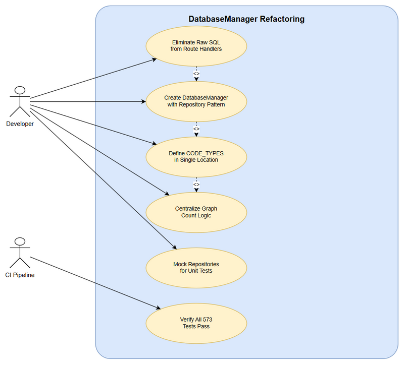

# Business Requirements Document (BRD)

## SA4E Code Intelligence — SA4E-50: Refactor: DatabaseManager — Eliminate Raw SQL from Routes, Enforce DRY

---

## Document Information

| Field | Value |
|-------|-------|
| Jira Ticket | SA4E-50 |
| Title | Refactor: DatabaseManager — Eliminate Raw SQL from Routes, Enforce DRY |
| Author | BA Agent |
| Version | 1.0 |
| Date | 2025-07-27 |
| Status | Draft |

---

## Author Tracking

| Role | Name - Position | Responsibility |
|------|-----------------|----------------|
| Author | BA Agent – Business Analyst | Create document |
| Peer Reviewer | SA Agent – Solution Architect | Review document |

---

## Revision History

| Version | Date | Author | Changes |
|---------|------|--------|---------|
| 1.0 | 2025-07-27 | BA Agent | Initiate document — auto-generated from Jira ticket SA4E-50 and linked tickets |

---

## Sign-Off

| Name | Signature and date |
|------|--------------------|
| | ☐ I agree and confirm all criteria on this BRD as expected requirements |
| | ☐ I agree and confirm all criteria on this BRD as expected requirements |

---

## 1. Introduction

### 1.1 Scope

This document defines the business requirements for refactoring the database access layer in the SA4E Code Intelligence Server. Currently, 24 files import directly from `admin-db.js` and write raw SQL inline within route handlers. The refactoring introduces a **DatabaseManager** class with a **Repository pattern** (GraphRepository, KbRepository, UserRepository, AuditRepository, SymbolRepository), ensuring all database access is encapsulated behind well-defined repository interfaces. Route handlers will call repository methods exclusively — no raw SQL will remain in route files.

This is an **internal refactoring ticket** focused on improving developer experience, maintainability, and testability. There are no user-facing feature changes.

### 1.2 Out of Scope

- New feature development or API endpoint changes
- Database schema modifications (tables, columns, indexes)
- Migration to a different database engine
- Performance optimization of existing queries (beyond DRY consolidation)
- Changes to the frontend/extension UI
- Authentication/authorization logic changes

### 1.3 Preliminary Requirement

| Prerequisite | Ticket | Status |
|--------------|--------|--------|
| DB Consolidation — unified database access via adapters | SA4E-49 | DONE |
| Multi-database support — DatabaseAdapter layer | SA4E-45 | Exists (provides adapter foundation) |

---

## 2. Business Requirements

### 2.1 High Level Process Map

The refactoring replaces the current scattered database access pattern with a centralized, layered architecture:

**Current State (AS-IS):**
Route Handler → `import { getAdminDb } from 'admin-db.js'` → inline `db.prepare('SELECT...')` → raw results

**Target State (TO-BE):**
Route Handler → `DatabaseManager.getRepository(XxxRepository)` → Repository method → encapsulated SQL → typed results

This eliminates code duplication (e.g., CODE_TYPES defined in 3+ places, graph count logic duplicated in `analytics.ts` and `kb-graph-spatial.ts`), centralizes SQL maintenance, and enables easy mocking for unit tests.

### 2.2 List of User Stories / Use Cases

| # | Story / Use Case | Priority | Source Ticket |
|---|------------------|----------|---------------|
| 1 | As a developer, I want all database queries encapsulated in repository classes so that I never write raw SQL in route handlers | MUST HAVE | SA4E-50 |
| 2 | As a developer, I want a single DatabaseManager entry point so that I can discover and access all repositories consistently | MUST HAVE | SA4E-50 |
| 3 | As a developer, I want shared constants (CODE_TYPES) defined once so that changes propagate automatically without hunting through files | MUST HAVE | SA4E-50 |
| 4 | As a developer, I want repository interfaces that are easily mockable so that I can write unit tests for route handlers without a real database | SHOULD HAVE | SA4E-50 |
| 5 | As a developer, I want graph count logic centralized in GraphRepository so that dashboard, analytics, and spatial endpoints use identical logic | MUST HAVE | SA4E-50 |

---

### 2.3 Details of User Stories

---

#### Business Flow

**Step 1:** Identify all 24 files that import from `admin-db.js` and use raw SQL inline.

**Step 2:** Group SQL operations by domain: Graph operations, KB operations, User operations, Audit operations, Symbol operations.

**Step 3:** Create Repository classes for each domain with typed methods encapsulating the raw SQL.

**Step 4:** Create a DatabaseManager class that instantiates and provides access to all repositories.

**Step 5:** Replace all raw SQL calls in route handlers with repository method calls.

**Step 6:** Remove direct `getAdminDb()` usage from all route files (only repositories call `getAdminDb()` internally).

**Step 7:** Verify all 573 existing tests still pass with no behavioral changes.

> **Note:** This is a pure refactoring — no external behavior changes. All existing API contracts remain identical.

---

#### STORY 1: Eliminate Raw SQL from Route Handlers

> As a developer, I want all database queries encapsulated in repository classes so that I never write raw SQL in route handlers.

**Requirement Details:**

1. No file under `server/routes/admin/*.ts` shall contain `.prepare()`, `.exec()`, or raw SQL strings (SELECT, INSERT, UPDATE, DELETE). [Source: SA4E-50 Acceptance Criteria]
2. All existing inline SQL in route files must be migrated to the appropriate Repository class.
3. Route handlers call typed repository methods that return properly-typed results (no `as any` casts for DB rows).
4. The following route files currently contain raw SQL and must be refactored:
   - `server/routes/admin/sse.ts` — user count query
   - `server/routes/admin/rbac.ts` — user count per group
   - `server/routes/admin/users.ts` — email update
   - `server/routes/admin/kb-graph-spatial.ts` — graph node counts, CODE_TYPES
   - `server/routes/admin/kb-graph.ts` — graph reset (DELETE)
   - `server/routes/admin/analytics.ts` — user count, graph counts, symbol counts
   - `server/routes/api-index.ts` — project registry upsert, graph node upsert

**Acceptance Criteria:**

1. Zero occurrences of `.prepare(` or `.exec(` in any file under `server/routes/admin/*.ts`
2. Zero raw SQL string literals (SELECT/INSERT/UPDATE/DELETE) in route handler files
3. All 573 existing tests pass without modification (behavioral equivalence)
4. No new `getAdminDb()` imports in route files

---

#### STORY 2: Create DatabaseManager with Repository Pattern

> As a developer, I want a single DatabaseManager entry point so that I can discover and access all repositories consistently.

**Requirement Details:**

1. Create a `DatabaseManager` class as the single entry point for all database operations.
2. DatabaseManager provides typed access to repositories: `GraphRepository`, `KbRepository`, `UserRepository`, `AuditRepository`, `SymbolRepository`.
3. `getAdminDb()` is only called inside repository implementations — never in route handlers or service layers directly. [Source: SA4E-50 Acceptance Criteria]
4. Repositories are instantiated lazily or via constructor injection for testability.
5. DatabaseManager integrates with the existing `DatabaseAdapter` layer from SA4E-45.

**Data Fields (Repository Classes):**

| Repository | Domain | Key Methods | Source |
|------------|--------|-------------|--------|
| GraphRepository | Graph nodes and edges | getNodeCounts(), resetGraph(), upsertNode() | kb-graph-spatial.ts, analytics.ts, api-index.ts |
| KbRepository | Knowledge base entries | getEntries(), getEntryCount(), searchEntries() | kb-entries.ts, kb-quality.ts |
| UserRepository | User management | getUserCount(), updateEmail(), getUsers() | users.ts, sse.ts, rbac.ts |
| AuditRepository | Audit logging | recordAudit(), getAuditLogs() | mcp-crud.ts, mcp.ts |
| SymbolRepository | Code symbols | getSymbolCount(), getSymbolById() | analytics.ts, kb-entries.ts |

**Acceptance Criteria:**

1. DatabaseManager class exists with typed repository accessors
2. Each repository encapsulates all SQL for its domain
3. Route handlers import from DatabaseManager or individual repositories — never from `admin-db.js` directly
4. Repository methods have proper TypeScript return types (no `any`)

---

#### STORY 3: DRY — Shared Constants and Centralized Logic

> As a developer, I want shared constants (CODE_TYPES) defined once so that changes propagate automatically without hunting through files.

**Requirement Details:**

1. `CODE_TYPES` (the tuple of symbol types: FUNCTION, METHOD, CLASS, INTERFACE, TYPE, CONSTRUCTOR, ENUM, CONSTANT, VARIABLE) is currently defined inline in at least 3 locations: `kb-graph-spatial.ts`, `analytics.ts`, and the graph service. It must be defined exactly once. [Source: SA4E-50 Acceptance Criteria]
2. Graph count logic (total nodes, code nodes, KB nodes per project) is currently duplicated between `analytics.ts` and `kb-graph-spatial.ts`. It must be defined once in `GraphRepository.getNodeCounts()`. [Source: SA4E-50 Acceptance Criteria]
3. Project registry upsert logic (INSERT OR REPLACE into project_registry) must be a single method in the appropriate repository.
4. User count queries (SELECT COUNT FROM users) must have a single method in `UserRepository`.

**Acceptance Criteria:**

1. `CODE_TYPES` defined in exactly 1 location, referenced everywhere else
2. `GraphRepository.getNodeCounts(projectId)` is the single source of truth for graph node counting
3. No duplicated SQL queries performing the same logical operation across files

**Validation Rules:**

- If a new CODE_TYPE is added in future, only one file needs modification
- Graph count queries must handle the NULL project_id fallback consistently (legacy/unscoped nodes)

**Error Handling:**

- Repository methods must throw typed errors (not raw SQLite errors) when database operations fail
- Route handlers catch repository-level errors and return appropriate HTTP status codes

---

#### STORY 4: Enable Unit Test Mocking via Repository Interfaces

> As a developer, I want repository interfaces that are easily mockable so that I can write unit tests for route handlers without a real database.

**Requirement Details:**

1. Each Repository class should be backed by an interface or abstract class that defines the contract.
2. Route handlers accept repositories via dependency injection (constructor or context parameter) rather than importing singletons directly.
3. Test files can provide mock implementations of repository interfaces without touching real SQLite databases.
4. The existing `AdminContext` pattern in routes should be extended to include repository references.

**Acceptance Criteria:**

1. Repository interfaces/types are exported for test mocking
2. At least one route handler test demonstrates mocking a repository
3. No test requires a real database connection to verify route handler logic (unit tests only; integration tests may still use real DB)

---

#### STORY 5: Centralize Graph Node Count Logic

> As a developer, I want graph count logic centralized in GraphRepository so that dashboard, analytics, and spatial endpoints use identical logic.

**Requirement Details:**

1. Create `GraphRepository.getNodeCounts(projectId: string)` returning `{ total: number, code: number, kb: number }`.
2. The method must implement the NULL project_id fallback logic (if total=0 with exact match, retry including NULL project_id rows).
3. `analytics.ts`, `kb-graph-spatial.ts`, and `sse.ts` all call this single method instead of inline SQL.
4. CODE_TYPES filtering is internal to the repository — callers do not need to know the SQL.

**Acceptance Criteria:**

1. Single `getNodeCounts` method in GraphRepository
2. Dashboard, analytics, and spatial endpoints all use it
3. NULL project_id fallback logic in one place only
4. Results are identical to current behavior (verified by existing tests)

---

## 3. Dependencies

| Dependency | Type | Related Ticket | Description |
|------------|------|----------------|-------------|
| DB Consolidation Complete | System | SA4E-49 (DONE) | Unified DB access via adapters must be in place before repositories can be layered on top |
| DatabaseAdapter Layer | System | SA4E-45 | Multi-database support provides the adapter foundation that repositories will use internally |
| Existing Test Suite | Infrastructure | N/A | All 573 tests must continue passing — they serve as the behavioral regression safety net |
| admin-db.ts Barrel Export | System | N/A | Current barrel file re-exports from db/*.ts modules; repositories will replace this pattern |

---

## 4. Stakeholders

| Role | Name / Team | Responsibility | Source |
|------|-------------|----------------|--------|
| Developer | Engineering Team | Implement repositories, migrate route handlers | SA4E-50 assignee |
| Reviewer | Solution Architect | Verify architecture alignment with SA4E-45 adapter layer | SA4E-50 reviewer |
| QA | Automated Test Suite | Verify 573 tests pass, no regressions | Existing CI pipeline |

---

## 5. Risks and Assumptions

### 5.1 Risks

| Risk | Impact | Likelihood | Mitigation |
|------|--------|------------|------------|
| Behavioral regression during migration | High | Medium | Run full test suite after each file migration; migrate one route file at a time |
| Repository abstraction adds unnecessary overhead | Low | Low | Keep repositories thin (no caching layer); methods map 1:1 to SQL operations |
| Incomplete migration leaves some raw SQL behind | Medium | Low | Automated grep check in CI: fail if .prepare( found in routes/ |
| Circular dependencies between repositories | Medium | Low | Strict domain separation; shared constants in a separate constants.ts module |

### 5.2 Assumptions

- SA4E-49 (DB consolidation) is fully complete and stable — no further changes to the adapter layer during this refactoring
- The existing 573 tests provide sufficient behavioral coverage to catch regressions
- No new features will be merged into the route files during this refactoring (feature freeze on affected files recommended)
- The repository pattern does not require a full ORM — thin wrappers around prepared statements are sufficient
- Existing `admin/services/*.service.ts` files may remain and call repositories (they are not route handlers)

---

## 6. Non-Functional Requirements

| Category | Requirement | Details |
|----------|-------------|---------|
| Maintainability | Single Responsibility per Repository | Each repository handles exactly one domain (Graph, KB, User, Audit, Symbol) |
| Testability | Repository Mocking | All repository dependencies injectable; route handlers unit-testable without real DB |
| Developer Experience | Discoverability | DatabaseManager provides typed autocomplete for all available data operations |
| Performance | No Degradation | Refactoring must not introduce measurable latency (no new abstractions in hot paths) |
| Code Quality | DRY Compliance | Zero duplicated SQL; shared constants defined once |
| Code Quality | File Size | Each repository file 200 lines max per project coding standards |
| Code Quality | Method Size | Each repository method 20 lines max per project coding standards |
| Reliability | Test Parity | All 573 existing tests pass without modification |

---

## 7. Related Tickets

| Ticket Key | Summary | Status | Type | Relationship |
|------------|---------|--------|------|--------------|
| SA4E-50 | Refactor: DatabaseManager — eliminate raw SQL from routes, enforce DRY | To Do | Task | Main ticket |
| SA4E-49 | DB Consolidation — unified database access via adapters | Done | Task | Prerequisite (blocks SA4E-50) |
| SA4E-45 | Multi-database support — DatabaseAdapter layer | Done | Task | Related (provides adapter foundation) |

---

## 8. Appendix

### Glossary

| Term | Definition |
|------|------------|
| Repository Pattern | A design pattern that mediates between the domain and data mapping layers, acting like an in-memory collection of domain objects |
| DatabaseManager | The single entry-point class that provides access to all domain-specific repositories |
| DRY (Don't Repeat Yourself) | Principle stating that every piece of knowledge must have a single, unambiguous, authoritative representation |
| CODE_TYPES | The canonical list of code symbol types used in graph queries: FUNCTION, METHOD, CLASS, INTERFACE, TYPE, CONSTRUCTOR, ENUM, CONSTANT, VARIABLE |
| admin-db.js | Current barrel module that re-exports all database functions — to be replaced by repository access |
| DatabaseAdapter | Abstraction layer from SA4E-45 enabling multi-database support (SQLite, PostgreSQL, etc.) |

### Files Currently Containing Raw SQL in Routes

| # | File | SQL Operations | Target Repository |
|---|------|---------------|-------------------|
| 1 | server/routes/admin/sse.ts | SELECT COUNT users | UserRepository |
| 2 | server/routes/admin/rbac.ts | SELECT COUNT users per group | UserRepository |
| 3 | server/routes/admin/users.ts | UPDATE users SET email | UserRepository |
| 4 | server/routes/admin/kb-graph-spatial.ts | SELECT COUNT graph_nodes (multiple) | GraphRepository |
| 5 | server/routes/admin/kb-graph.ts | DELETE FROM graph_nodes; DELETE FROM graph_edges | GraphRepository |
| 6 | server/routes/admin/analytics.ts | SELECT COUNT users, graph_nodes, symbols | UserRepository, GraphRepository, SymbolRepository |
| 7 | server/routes/api-index.ts | INSERT/UPDATE project_registry, graph_nodes | GraphRepository |
| 8 | server/routes/admin/mcp-crud.ts | recordAudit (function call, not raw SQL) | AuditRepository |
| 9 | server/routes/admin/kb-entries.ts | SELECT from symbols via adapter | SymbolRepository |

### Diagram Index

| # | Diagram | Image | Source (editable) |
|---|---------|-------|-------------------|
| 1 | Use Case Diagram | [use-case.png](diagrams/use-case.png) | [use-case.drawio](diagrams/use-case.drawio) |
| 2 | Business Flow | [business-flow.png](diagrams/business-flow.png) | [business-flow.drawio](diagrams/business-flow.drawio) |
