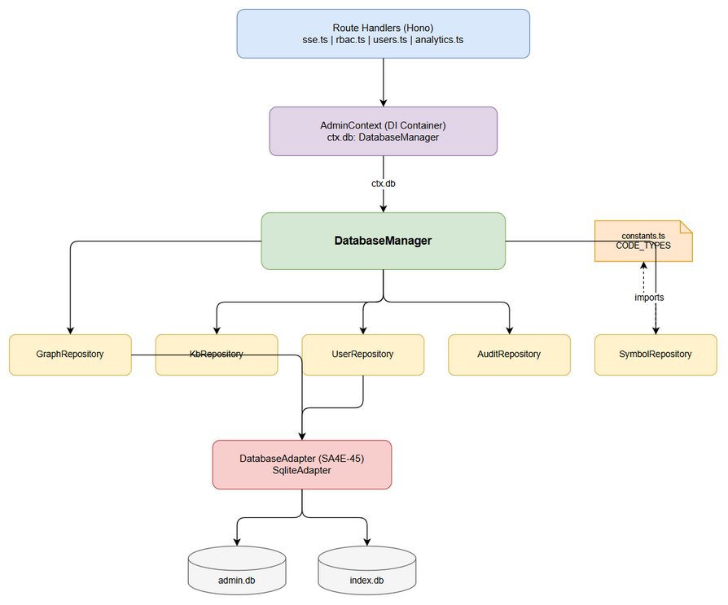

# Functional Specification Document (FSD)

## SA4E Code Intelligence — SA4E-50: Refactor: DatabaseManager — Eliminate Raw SQL from Routes, Enforce DRY

---

## Document Information

| Field | Value |
|-------|-------|
| Jira Ticket | SA4E-50 |
| Title | Refactor: DatabaseManager — Eliminate Raw SQL from Routes, Enforce DRY |
| Author | BA Agent |
| Version | 1.0 |
| Date | 2025-07-27 |
| Status | Draft |
| Related BRD | documents/SA4E-50/BRD.md |

---

## Revision History

| Version | Date | Author | Changes |
|---------|------|--------|---------|
| 1.0 | 2025-07-27 | BA Agent | Initiate document — auto-generated from BRD and codebase analysis |

---

## 1. Introduction

### 1.1 Purpose

This FSD specifies HOW the DatabaseManager refactoring (SA4E-50) will be implemented functionally. It defines the repository interfaces, method signatures, dependency injection pattern, constants centralization, and the migration strategy from inline raw SQL to encapsulated repository calls.

### 1.2 Scope

- Creation of `DatabaseManager` class as single entry point for all database operations
- Five repository classes: `GraphRepository`, `KbRepository`, `UserRepository`, `AuditRepository`, `SymbolRepository`
- Migration of all raw SQL from 9 route files into repository methods
- Centralization of `CODE_TYPES` constant and graph count logic
- Extension of `AdminContext` for dependency injection of repositories

### 1.3 Definitions & Acronyms

| Term | Definition |
|------|------------|
| Repository Pattern | Design pattern mediating between domain logic and data access, encapsulating SQL behind typed methods |
| DatabaseManager | Single entry-point class providing access to all domain repositories |
| DRY | Don't Repeat Yourself — every piece of knowledge has a single authoritative representation |
| CODE_TYPES | Canonical list of code symbol types: FUNCTION, METHOD, CLASS, INTERFACE, TYPE, CONSTRUCTOR, ENUM, CONSTANT, VARIABLE |
| DI | Dependency Injection — pattern where dependencies are provided to consumers rather than created internally |
| AdminContext | Existing Hono context object passed to route factories; will be extended with repository references |
| DatabaseAdapter | Abstraction layer (SA4E-45) enabling multi-database support (SQLite, PostgreSQL, MySQL) |

### 1.4 References

| Document | Location |
|----------|----------|
| BRD | documents/SA4E-50/BRD.md |
| DatabaseAdapter Interface | backend/src/database/adapters/DatabaseAdapter.ts |
| Current admin-db barrel | backend/src/admin/admin-db.ts |
| SA4E-49 DB Consolidation | Done — prerequisite |
| SA4E-45 Multi-DB Adapter | Done — foundation layer |

---

## 2. System Overview

### 2.1 System Context Diagram



The DatabaseManager sits between the Hono route handlers and the underlying SQLite database (via DatabaseAdapter). Route handlers no longer access the database directly — they request repositories from DatabaseManager via AdminContext.

### 2.2 System Architecture

**Layered Architecture (TO-BE):**

| Layer | Components | Responsibility |
|-------|-----------|---------------|
| Route Handlers | sse.ts, rbac.ts, users.ts, analytics.ts, kb-graph-spatial.ts, kb-graph.ts, api-index.ts | HTTP request handling, call repository methods |
| AdminContext | Extended with `db` property | DI container providing repository access to routes |
| DatabaseManager | Single class | Instantiates and owns all repository instances |
| Repositories | GraphRepository, KbRepository, UserRepository, AuditRepository, SymbolRepository | Encapsulate SQL, return typed results |
| DatabaseAdapter (SA4E-45) | SqliteAdapter, PostgresAdapter, MysqlAdapter | Abstract database engine differences |
| Database Engine | Better-SQLite3 (primary) | Physical data storage |

**Key Design Decisions:**

- DatabaseManager uses **lazy instantiation** — repositories created on first access
- Repositories receive DatabaseAdapter via constructor (not global import)
- AdminContext extended with `ctx.db: DatabaseManager` for route handler access
- Constants module provides single-source-of-truth for CODE_TYPES and other shared values

---

## 3. Functional Requirements

### 3.1 Feature: DatabaseManager — Single Entry Point

**Source:** BRD Story 2

#### 3.1.1 Description

DatabaseManager is the single class that instantiates, owns, and provides typed access to all domain repositories. It integrates with the existing DatabaseAdapter layer from SA4E-45 and is injected into AdminContext for route handler consumption.

#### 3.1.2 Use Case

**Use Case ID:** UC-01
**Use Case Name:** Access Repository via DatabaseManager
**Actor:** Route Handler (Developer code)
**Preconditions:** Server is started, DatabaseManager initialized with valid DatabaseAdapter
**Postconditions:** Route handler receives typed repository instance and can call domain methods

**Main Flow:**

| Step | Actor | System | Description |
|------|-------|--------|-------------|
| 1 | Route handler | | Accesses `ctx.db.graph` (or .kb, .user, .audit, .symbol) |
| 2 | | AdminContext | Returns DatabaseManager instance |
| 3 | | DatabaseManager | Returns cached repository instance (lazy-init on first call) |
| 4 | Route handler | | Calls typed method e.g. `ctx.db.graph.getNodeCounts(projectId)` |
| 5 | | Repository | Executes encapsulated SQL via DatabaseAdapter, returns typed result |
| 6 | Route handler | | Uses typed result to build HTTP response |

**Alternative Flows:**

| ID | Condition | Steps |
|----|-----------|-------|
| AF-01 | Repository not yet instantiated | DatabaseManager creates instance with adapter reference, caches it, returns |
| AF-02 | Multiple repositories needed in one request | Route handler accesses multiple ctx.db.* properties; each returns independent cached instance |

**Exception Flows:**

| ID | Condition | Steps |
|----|-----------|-------|
| EF-01 | DatabaseAdapter not connected | Repository method throws `DatabaseNotConnectedError`; route handler returns 503 |
| EF-02 | SQL execution fails | Repository wraps SQLite error in typed `RepositoryError`; route handler returns 500 with safe message |

---

### 3.2 Feature: Eliminate Raw SQL from Routes

**Source:** BRD Story 1

#### 3.2.1 Description

All inline SQL statements (SELECT, INSERT, UPDATE, DELETE) and `.prepare()` / `.exec()` calls currently in route handler files must be migrated to the appropriate repository class. Route files will only contain HTTP logic and repository method calls.

#### 3.2.2 Use Case

**Use Case ID:** UC-02
**Use Case Name:** Route Handler Calls Repository Instead of Raw SQL
**Actor:** Route Handler
**Preconditions:** Repository methods exist for required operations
**Postconditions:** Route handler file contains zero raw SQL; behavior identical to before

**Main Flow:**

| Step | Actor | System | Description |
|------|-------|--------|-------------|
| 1 | Route handler | | Needs user count for SSE stats |
| 2 | Route handler | | Calls `ctx.db.user.getUserCount()` |
| 3 | | UserRepository | Executes `SELECT COUNT(*) as cnt FROM users` internally |
| 4 | | UserRepository | Returns typed `number` |
| 5 | Route handler | | Includes count in JSON response |

**Alternative Flows:**

| ID | Condition | Steps |
|----|-----------|-------|
| AF-01 | Route needs graph counts with project scoping | Calls `ctx.db.graph.getNodeCounts(projectId)`; repository handles NULL fallback internally |
| AF-02 | Route needs to update user email | Calls `ctx.db.user.updateEmail(userId, email)`; repository handles prepared statement |

**Exception Flows:**

| ID | Condition | Steps |
|----|-----------|-------|
| EF-01 | User not found for update | Repository returns `{ updated: false }`; route returns 404 |
| EF-02 | Database constraint violation | Repository throws `ConstraintViolationError`; route returns 409 |

---

### 3.3 Feature: Centralize Graph Node Count Logic

**Source:** BRD Story 5

#### 3.3.1 Description

Graph node counting logic (total nodes, code nodes, KB nodes per project) is currently duplicated in `analytics.ts` and `kb-graph-spatial.ts` with identical SQL and NULL project_id fallback. This must be a single method in GraphRepository.

#### 3.3.2 Use Case

**Use Case ID:** UC-03
**Use Case Name:** Get Graph Node Counts
**Actor:** Dashboard/Analytics/Spatial endpoints
**Preconditions:** graph_nodes table populated; project_id known
**Postconditions:** Returns consistent counts regardless of which endpoint calls it

**Main Flow:**

| Step | Actor | System | Description |
|------|-------|--------|-------------|
| 1 | Any route | | Calls `ctx.db.graph.getNodeCounts(projectId)` |
| 2 | | GraphRepository | Query: `SELECT COUNT(*) FROM graph_nodes WHERE project_id = ?` |
| 3 | | GraphRepository | Filter code nodes using CODE_TYPES constant |
| 4 | | GraphRepository | If total = 0, retry with `project_id = ? OR project_id IS NULL` |
| 5 | | GraphRepository | Return `{ total, code, kb }` where kb = total - code |

**Alternative Flows:**

| ID | Condition | Steps |
|----|-----------|-------|
| AF-01 | Project has no graph nodes (even with NULL fallback) | Returns `{ total: 0, code: 0, kb: 0 }` |

**Exception Flows:**

| ID | Condition | Steps |
|----|-----------|-------|
| EF-01 | Database error during count | Throws RepositoryError; caller handles |

---

### 3.4 Feature: DRY Constants — CODE_TYPES

**Source:** BRD Story 3

#### 3.4.1 Description

The `CODE_TYPES` tuple is defined once in `backend/src/database/constants.ts` and imported by GraphRepository and SymbolRepository. No other file defines this list.

#### 3.4.2 Use Case

**Use Case ID:** UC-04
**Use Case Name:** Use Shared CODE_TYPES Constant
**Actor:** Repository classes
**Preconditions:** constants.ts exists with CODE_TYPES export
**Postconditions:** All graph/symbol filtering uses the single constant

**Main Flow:**

| Step | Actor | System | Description |
|------|-------|--------|-------------|
| 1 | GraphRepository | | Imports CODE_TYPES from constants.ts |
| 2 | GraphRepository | | Uses CODE_TYPES in SQL WHERE clause for filtering |
| 3 | | | Adding a new type requires editing only constants.ts |

**Alternative Flows:**

| ID | Condition | Steps |
|----|-----------|-------|
| AF-01 | New code type added in future | Developer adds to CODE_TYPES array; all queries automatically include it |

---

### 3.5 Feature: Repository Mockability for Unit Tests

**Source:** BRD Story 4

#### 3.5.1 Description

Each repository class implements a TypeScript interface. Routes receive repositories via AdminContext (DI). Test files can substitute mock implementations without real database connections.

#### 3.5.2 Use Case

**Use Case ID:** UC-05
**Use Case Name:** Mock Repository in Unit Test
**Actor:** Developer writing unit tests
**Preconditions:** Repository interface exported; AdminContext accepts custom DatabaseManager
**Postconditions:** Unit test runs without database; verifies route handler logic only

**Main Flow:**

| Step | Actor | System | Description |
|------|-------|--------|-------------|
| 1 | Test | | Creates mock implementation of IGraphRepository |
| 2 | Test | | Constructs AdminContext with mock DatabaseManager |
| 3 | Test | | Calls route handler with mock context |
| 4 | Route handler | | Calls `ctx.db.graph.getNodeCounts()` — gets mock data |
| 5 | Test | | Asserts HTTP response matches expected shape |

**Alternative Flows:**

| ID | Condition | Steps |
|----|-----------|-------|
| AF-01 | Integration test with real DB | Uses real DatabaseManager with SqliteAdapter pointing to test DB file |

---

### 3.6 Feature: Graph Reset via Repository

**Source:** BRD Story 1 (kb-graph.ts migration)

#### 3.6.1 Description

The graph sync/reset operation (`DELETE FROM graph_nodes; DELETE FROM graph_edges`) currently uses raw `.exec()` in kb-graph.ts. This must move to `GraphRepository.resetGraph()`.

#### 3.6.2 Use Case

**Use Case ID:** UC-06
**Use Case Name:** Reset Graph Data
**Actor:** Admin user triggering graph sync
**Preconditions:** User has GRAPH_VIEW permission; graph service initialized
**Postconditions:** graph_nodes and graph_edges tables are emptied

**Main Flow:**

| Step | Actor | System | Description |
|------|-------|--------|-------------|
| 1 | Route handler | | Verifies permission |
| 2 | Route handler | | Calls `ctx.db.graph.resetGraph()` |
| 3 | | GraphRepository | Executes DELETE FROM graph_nodes; DELETE FROM graph_edges in transaction |
| 4 | Route handler | | Triggers graph service fullSync in background |

**Exception Flows:**

| ID | Condition | Steps |
|----|-----------|-------|
| EF-01 | Transaction fails | Repository rolls back; throws RepositoryError |

---

### 3.7 Business Rules

| Rule ID | Rule | Source |
|---------|------|--------|
| BR-01 | No file under `server/routes/admin/*.ts` shall contain `.prepare()`, `.exec()`, or raw SQL strings | SA4E-50 AC |
| BR-02 | `CODE_TYPES` must be defined in exactly 1 location (`database/constants.ts`) | SA4E-50 AC |
| BR-03 | `getAdminDb()` must never be imported in route handler files; only repositories call it | SA4E-50 AC |
| BR-04 | Graph node count logic (with NULL project_id fallback) must exist in exactly 1 method | SA4E-50 AC |
| BR-05 | All 573 existing tests must pass without modification after refactoring | SA4E-50 AC |
| BR-06 | Repository methods must return properly-typed results (no `as any` for DB rows) | SA4E-50 AC |
| BR-07 | Repository methods must throw typed errors (not raw SQLite errors) | BRD Story 3 |
| BR-08 | Each repository file must not exceed 200 lines per project coding standards | Code Standards |
| BR-09 | Each repository method must not exceed 20 lines per project coding standards | Code Standards |
| BR-10 | Repositories are instantiated lazily — only created when first accessed | Design Decision |
| BR-11 | DatabaseManager integrates with existing DatabaseAdapter from SA4E-45 | SA4E-50 AC |
| BR-12 | No new features or API changes — pure internal refactoring | BRD Scope |

---

### 3.8 Data Specifications

#### 3.8.1 GraphRepository — Input/Output Types

**getNodeCounts Input:**

| Field | Type | Required | Validation | Description |
|-------|------|----------|------------|-------------|
| projectId | string | Y | Non-empty string | Tenant project identifier |

**getNodeCounts Output:**

| Field | Type | Description |
|-------|------|-------------|
| total | number | Total graph nodes for project |
| code | number | Nodes matching CODE_TYPES |
| kb | number | Non-code nodes (total - code) |

**resetGraph Input:**

| Field | Type | Required | Description |
|-------|------|----------|-------------|
| (none) | | | Resets all graph data |

**upsertNode Input:**

| Field | Type | Required | Validation | Description |
|-------|------|----------|------------|-------------|
| entryId | string | Y | Non-empty | KB entry reference |
| label | string | Y | Max 255 chars | Display label |
| type | string | Y | Valid node type | Node classification |
| tier | string | Y | Valid tier value | Scope tier |
| projectId | string | Y | Non-empty | Tenant project |
| x | number | N | Finite number | X coordinate |
| y | number | N | Finite number | Y coordinate |
| z | number | N | Finite number | Z coordinate |

#### 3.8.2 UserRepository — Input/Output Types

**getUserCount Output:**

| Field | Type | Description |
|-------|------|-------------|
| (return) | number | Total user count |

**getUserCountByGroup Input:**

| Field | Type | Required | Description |
|-------|------|----------|-------------|
| accessGroupId | string | Y | Group to count |

**updateEmail Input:**

| Field | Type | Required | Validation | Description |
|-------|------|----------|------------|-------------|
| userId | string | Y | Non-empty | Target user |
| email | string | Y | Valid email format | New email value |

#### 3.8.3 SymbolRepository — Input/Output Types

**getSymbolCount Output:**

| Field | Type | Description |
|-------|------|-------------|
| (return) | number | Total code symbols matching standard kinds |

---

### 3.9 API Specifications — Repository Method Signatures

> **Note:** These are internal TypeScript APIs (not HTTP endpoints). HTTP endpoints remain unchanged.

#### 3.9.1 IGraphRepository Interface

```typescript
export interface IGraphRepository {
  /** Get node counts for a project with NULL fallback logic. [BR-04] */
  getNodeCounts(projectId: string): GraphNodeCounts;

  /** Delete all graph_nodes and graph_edges. [UC-06] */
  resetGraph(): void;

  /** INSERT OR REPLACE a graph node. [Source: api-index.ts] */
  upsertNode(params: UpsertNodeParams): void;
}

export interface GraphNodeCounts {
  total: number;
  code: number;
  kb: number;
}

export interface UpsertNodeParams {
  entryId: string;
  label: string;
  type: string;
  tier: string;
  projectId: string;
  x?: number;
  y?: number;
  z?: number;
  level?: string;
  clusterId?: string;
}
```

#### 3.9.2 IUserRepository Interface

```typescript
export interface IUserRepository {
  /** Get total user count. [Source: sse.ts, analytics.ts] */
  getUserCount(): number;

  /** Get user count for a specific access group. [Source: rbac.ts] */
  getUserCountByGroup(accessGroupId: string): number;

  /** Update user email. [Source: users.ts POST /api/admin/profile] */
  updateEmail(userId: string, email: string): void;
}
```

#### 3.9.3 ISymbolRepository Interface

```typescript
export interface ISymbolRepository {
  /** Get count of code symbols (function, class, interface, etc.). [Source: analytics.ts] */
  getSymbolCount(): number;
}
```

#### 3.9.4 IAuditRepository Interface

```typescript
export interface IAuditRepository {
  /** Record an audit log entry. [Source: mcp-crud.ts, users.ts] */
  recordAudit(userId: string, username: string, action: string, resource: string, resourceId?: string, details?: string): void;

  /** Get recent audit logs. [Source: analytics.ts] */
  getAuditLogs(limit?: number): AuditEntry[];
}
```

#### 3.9.5 IKbRepository Interface

```typescript
export interface IKbRepository {
  /** Get KB entry count for project. [Source: sse.ts, analytics.ts] */
  getEntryCount(projectId: string, userId?: string): number;

  /** Get paginated KB entries. [Source: kb-graph.ts, kb-graph-spatial.ts] */
  getEntries(page: number, pageSize: number, sortBy: string, sortOrder: string, projectId: string, userId?: string): PaginatedResult;
}
```

#### 3.9.6 DatabaseManager Class

```typescript
export class DatabaseManager {
  private _graph?: GraphRepository;
  private _user?: UserRepository;
  private _symbol?: SymbolRepository;
  private _audit?: AuditRepository;
  private _kb?: KbRepository;

  constructor(
    private readonly adminAdapter: DatabaseAdapter,
    private readonly indexAdapter: DatabaseAdapter
  ) {}

  /** Lazy accessor for GraphRepository. */
  get graph(): IGraphRepository { ... }

  /** Lazy accessor for UserRepository. */
  get user(): IUserRepository { ... }

  /** Lazy accessor for SymbolRepository. */
  get symbol(): ISymbolRepository { ... }

  /** Lazy accessor for AuditRepository. */
  get audit(): IAuditRepository { ... }

  /** Lazy accessor for KbRepository. */
  get kb(): IKbRepository { ... }
}
```

---

### 3.10 Constants Module Specification

**File:** `backend/src/database/constants.ts`

```typescript
/**
 * Shared database constants — single source of truth. [BR-02]
 * SA4E-50: Centralize values previously duplicated across route files.
 */

/** Canonical code symbol types used in graph queries. */
export const CODE_TYPES = [
  'FUNCTION', 'METHOD', 'CLASS', 'INTERFACE',
  'TYPE', 'CONSTRUCTOR', 'ENUM', 'CONSTANT', 'VARIABLE',
] as const;

/** SQL-ready IN clause value for CODE_TYPES. */
export const CODE_TYPES_SQL = ('');

/** Symbol kinds used in index.db queries (lowercase). */
export const SYMBOL_KINDS = [
  'function', 'class', 'interface', 'method',
  'type', 'enum', 'constructor',
] as const;

export type CodeType = typeof CODE_TYPES[number];
export type SymbolKind = typeof SYMBOL_KINDS[number];
```

---

### 3.11 AdminContext Extension Specification

**Current AdminContext** (`backend/src/server/routes/admin/context.ts`):

The existing AdminContext interface will be extended with a `db` property:

```typescript
export interface AdminContext {
  // ... existing properties unchanged ...
  logger: Logger;
  authenticate: (c: any) => any;
  requireAuth: (c: any) => any;
  // ... etc ...

  /** DatabaseManager providing typed repository access. [UC-01] */
  db: DatabaseManager;
}
```

**Factory function update:**

```typescript
export function createAdminContext(
  logger: Logger,
  registry?: any,
  dbManager?: DatabaseManager  // NEW: optional for backward compat
): AdminContext {
  const db = dbManager ?? DatabaseManager.createDefault();
  return {
    // ... existing properties ...
    db,
  };
}
```

This ensures existing code continues working while new code uses `ctx.db.*`.

---

## 4. Data Model

> **Note:** This refactoring does NOT modify the database schema. The logical data model below describes the existing tables that repositories will encapsulate.

### 4.1 Logical Entities

#### Entity: graph_nodes

| Attribute | Type | Required | Business Rule | Description |
|-----------|------|----------|---------------|-------------|
| entry_id | TEXT | Y | Primary key | KB entry reference |
| label | TEXT | Y | Max 255 | Display name |
| type | TEXT | Y | Valid CODE_TYPE or KB type | Node classification |
| tier | TEXT | Y | SEMANTIC/PROJECT/USER/SHARED | Scope tier |
| project_id | TEXT | N | BR-04: NULL fallback | Tenant project (NULL = legacy/unscoped) |
| x | REAL | N | | 3D x-coordinate |
| y | REAL | N | | 3D y-coordinate |
| z | REAL | N | | 3D z-coordinate |
| level | TEXT | N | | Zoom level classification |
| cluster_id | TEXT | N | | Cluster grouping |

#### Entity: graph_edges

| Attribute | Type | Required | Description |
|-----------|------|----------|-------------|
| source | TEXT | Y | Source node entry_id |
| target | TEXT | Y | Target node entry_id |
| weight | REAL | N | Edge strength (0-1) |

#### Entity: users

| Attribute | Type | Required | Description |
|-----------|------|----------|-------------|
| user_id | TEXT | Y | Primary key (UUID) |
| username | TEXT | Y | Unique login name |
| email | TEXT | N | User email (updatable via UserRepository) |
| access_group_id | TEXT | Y | FK to access groups |
| status | TEXT | Y | ACTIVE / DISABLED |

#### Entity: project_registry

| Attribute | Type | Required | Description |
|-----------|------|----------|-------------|
| project_id | TEXT | Y | Primary key |
| display_name | TEXT | Y | Human-readable name |
| workspace_path | TEXT | Y | Filesystem path |
| last_seen | DATETIME | Y | Last activity timestamp |

#### Entity: symbols (index.db)

| Attribute | Type | Required | Description |
|-----------|------|----------|-------------|
| id | INTEGER | Y | Auto-increment PK |
| kind | TEXT | Y | function/class/interface/method/type/enum/constructor |
| name | TEXT | Y | Symbol name |
| file_path | TEXT | Y | Source file |

### 4.2 Relationships

| From Entity | To Entity | Cardinality | Description |
|-------------|-----------|-------------|-------------|
| graph_nodes | knowledge_entries | 1:1 | Node references KB entry via entry_id |
| graph_edges | graph_nodes | M:1 | Edge connects two nodes (source, target) |
| users | access_groups | M:1 | User belongs to one group |
| project_registry | graph_nodes | 1:N | Project owns many graph nodes |

### 4.3 Repository-to-Table Mapping

| Repository | Primary Table(s) | Database |
|-----------|-----------------|----------|
| GraphRepository | graph_nodes, graph_edges | admin.db |
| UserRepository | users | admin.db |
| AuditRepository | audit_logs | admin.db |
| KbRepository | knowledge_entries | admin.db |
| SymbolRepository | symbols | index.db |

---

## 5. Integration Specifications

> **Note:** This is an internal refactoring. No external system integrations are added or modified.

### 5.1 Internal Integration: DatabaseAdapter Layer (SA4E-45)

| Attribute | Value |
|-----------|-------|
| Purpose | Provide database-engine-agnostic access to repositories |
| Direction | Repositories consume DatabaseAdapter interface |
| Data Format | TypeScript method calls returning typed objects |
| Frequency | Synchronous, per-request |

**Integration Pattern:**

| Repository Layer | DatabaseAdapter Method | Purpose |
|-----------------|----------------------|---------|
| `graph.getNodeCounts()` | `adapter.get<T>(sql, params)` | Single-row count query |
| `graph.resetGraph()` | `adapter.exec(sql)` | DDL-style multi-statement |
| `graph.upsertNode()` | `adapter.run(sql, params)` | INSERT OR REPLACE |
| `user.getUserCount()` | `adapter.get<T>(sql, params)` | Single-row count query |
| `user.updateEmail()` | `adapter.run(sql, params)` | UPDATE single row |
| `symbol.getSymbolCount()` | `indexAdapter.get<T>(sql, params)` | Count from index.db |

### 5.2 Internal Integration: AdminContext DI

| Attribute | Value |
|-----------|-------|
| Purpose | Provide repository access to route handlers without direct imports |
| Direction | AdminContext owns DatabaseManager; routes consume via `ctx.db` |
| Pattern | Constructor injection at server startup; property access per request |
| Lifetime | DatabaseManager singleton for server lifetime; repositories lazy-created once |

---

## 6. Processing Logic

### 6.1 Graph Node Count with NULL Fallback

**Trigger:** Any endpoint needing graph statistics (dashboard, analytics, spatial)
**Input:** projectId (string)
**Output:** `{ total: number, code: number, kb: number }`

**Processing Steps:**

| Step | Description | Error Handling |
|------|-------------|----------------|
| 1 | Query `SELECT COUNT(*) FROM graph_nodes WHERE project_id = ?` | Return 0 on error |
| 2 | Query code nodes: `WHERE project_id = ? AND type IN (CODE_TYPES)` | Return 0 on error |
| 3 | If total = 0, retry both queries with `project_id = ? OR project_id IS NULL` | Same error handling |
| 4 | Calculate kb = total - code | N/A |
| 5 | Return `{ total, code, kb }` | N/A |

**Pseudocode:**

```typescript
getNodeCounts(projectId: string): GraphNodeCounts {
  let total = this.adapter.get<{cnt: number}>(
    'SELECT COUNT(*) as cnt FROM graph_nodes WHERE project_id = ?', [projectId]
  )?.cnt ?? 0;

  let code = this.adapter.get<{cnt: number}>(
    SELECT COUNT(*) as cnt FROM graph_nodes WHERE project_id = ? AND type IN , [projectId]
  )?.cnt ?? 0;

  // BR-04: NULL project_id fallback for legacy/unscoped nodes
  if (total === 0) {
    total = this.adapter.get<{cnt: number}>(
      'SELECT COUNT(*) as cnt FROM graph_nodes WHERE project_id = ? OR project_id IS NULL', [projectId]
    )?.cnt ?? 0;

    code = this.adapter.get<{cnt: number}>(
      SELECT COUNT(*) as cnt FROM graph_nodes WHERE (project_id = ? OR project_id IS NULL) AND type IN , [projectId]
    )?.cnt ?? 0;
  }

  return { total, code, kb: total - code };
}
```

### 6.2 Project Registry Upsert

**Trigger:** POST /api/index/source
**Input:** projectId, workspace path
**Output:** void (non-fatal — failures logged only)

**Processing Steps:**

| Step | Description | Error Handling |
|------|-------------|----------------|
| 1 | Extract display_name from workspace path basename | N/A |
| 2 | Execute INSERT OR REPLACE into project_registry | Log warning, continue |

### 6.3 Graph Reset (Sync Trigger)

**Trigger:** POST /api/admin/kb/graph/sync
**Input:** None
**Output:** void

**Processing Steps:**

| Step | Description | Error Handling |
|------|-------------|----------------|
| 1 | Execute `DELETE FROM graph_nodes` | Roll back transaction on error |
| 2 | Execute `DELETE FROM graph_edges` | Roll back transaction on error |
| 3 | Trigger graph service fullSync asynchronously | Log error if sync fails |

---

## 7. Security Requirements

> **Note:** This refactoring does not change authentication, authorization, or data access patterns. Security model remains identical.

### 7.1 Authentication & Authorization

No changes. Existing permission checks (`ctx.requirePermission`) remain in route handlers. Repositories do NOT enforce permissions — they are pure data-access layers.

| Role | Permissions | Affected Repositories |
|------|-------------|----------------------|
| Admin | All operations | All repositories accessible |
| User with DASHBOARD_VIEW | Read stats | UserRepository.getUserCount(), GraphRepository.getNodeCounts() |
| User with KB_READ | Read KB data | KbRepository.getEntries(), KbRepository.getEntryCount() |
| User with GRAPH_VIEW | Graph operations | GraphRepository.getNodeCounts(), resetGraph() |
| User with USER_MANAGE | User management | UserRepository.updateEmail() |

### 7.2 Data Sensitivity

| Data Type | Classification | Impact of Refactoring |
|-----------|---------------|----------------------|
| User emails | Internal | Moved from inline SQL to UserRepository — same access control |
| Audit logs | Internal | Already via function call (recordAudit) — wrapped in AuditRepository |
| Graph data | Internal | Moved from inline SQL to GraphRepository — same access control |

### 7.3 SQL Injection Prevention

Repositories use parameterized queries exclusively (via DatabaseAdapter.prepare/get/all/run methods). This was already the pattern for inline SQL; repositories formalize it. [BR-06]

---

## 8. Non-Functional Requirements

| Category | Business Requirement | Acceptance Criteria |
|----------|---------------------|---------------------|
| Performance | No measurable latency increase | Response times within +/- 5% of current (refactoring only adds 1 function call overhead) |
| Maintainability | Single Responsibility per Repository | Each repository <= 200 lines, handles exactly one domain |
| Testability | Repository mocking | All repositories accessible via interfaces; at least 1 mock test demo |
| Developer Experience | Typed autocomplete | DatabaseManager provides IntelliSense for all available methods |
| Code Quality | DRY compliance | Zero duplicated SQL; CODE_TYPES in 1 file only |
| Reliability | Test parity | All 573 existing tests pass without modification |
| Code Quality | Method size | Each method <= 20 lines per project coding standards |
| Backward Compatibility | Existing admin-db.ts exports unchanged | Old imports still work (admin-db.ts re-exports remain) — gradual migration |

---

## 9. Error Handling (User-Facing)

> **Note:** Since this is an internal refactoring, user-facing behavior does NOT change. Error handling is standardized at the repository layer.

### 9.1 Repository Error Hierarchy

```typescript
/** Base error for all repository operations. */
export class RepositoryError extends Error {
  constructor(
    message: string,
    public readonly repository: string,
    public readonly operation: string,
    public readonly cause?: Error
  ) {
    super(message);
    this.name = 'RepositoryError';
  }
}

/** Thrown when database is not connected. */
export class DatabaseNotConnectedError extends RepositoryError {}

/** Thrown on constraint violations (UNIQUE, FK). */
export class ConstraintViolationError extends RepositoryError {}
```

### 9.2 Error Mapping in Routes

| Repository Error | HTTP Status | User Message | Behavior |
|-----------------|-------------|-------------|----------|
| RepositoryError | 500 | Internal server error | Log full error, return safe message |
| DatabaseNotConnectedError | 503 | Service unavailable | Log, return retry-after header |
| ConstraintViolationError | 409 | Conflict (resource exists) | Return specific conflict info |

### 9.3 Error Handling Contract

- Repositories MUST NOT throw raw SQLite/pg errors to callers [BR-07]
- Repositories MUST wrap database errors in typed RepositoryError subclasses
- Route handlers MUST catch RepositoryError and return appropriate HTTP status
- Error details (SQL, stack trace) MUST NOT leak to HTTP response
- Error details MUST be logged via ctx.logger for debugging

---

## 10. Testing Considerations

### 10.1 Test Scenarios

| ID | Scenario | Input | Expected Output | Priority |
|----|----------|-------|-----------------|----------|
| TC-01 | GraphRepository.getNodeCounts returns correct counts | projectId with existing nodes | `{ total: N, code: M, kb: N-M }` | High |
| TC-02 | GraphRepository.getNodeCounts NULL fallback triggers | projectId with 0 scoped nodes, some NULL project_id nodes | Returns non-zero counts from NULL rows | High |
| TC-03 | GraphRepository.resetGraph clears all data | Pre-populated graph_nodes/edges | Both tables empty after call | High |
| TC-04 | UserRepository.getUserCount matches direct SQL | Existing users in DB | Same number as `SELECT COUNT(*) FROM users` | High |
| TC-05 | UserRepository.getUserCountByGroup accurate | Known group with 3 users | Returns 3 | Medium |
| TC-06 | UserRepository.updateEmail persists change | Valid userId + new email | Subsequent getUserById shows new email | High |
| TC-07 | SymbolRepository.getSymbolCount from index.db | Indexed symbols exist | Returns count matching direct query | Medium |
| TC-08 | Route handler uses repository (no raw SQL) | Static analysis / grep | Zero `.prepare(` in route files | Critical |
| TC-09 | CODE_TYPES defined in single location | Static analysis | Only constants.ts exports CODE_TYPES | Critical |
| TC-10 | Mock repository in unit test | Mock IGraphRepository | Route handler responds correctly with mock data | High |
| TC-11 | DatabaseManager lazy initialization | Access .graph twice | Same instance returned both times | Medium |
| TC-12 | Repository throws typed error on DB failure | Simulate adapter error | Receives RepositoryError, not raw SQLite error | High |
| TC-13 | All existing 573 tests still pass | Full test suite run | 0 failures, 0 modifications needed | Critical |
| TC-14 | Graph upsertNode via repository | Valid UpsertNodeParams | Row exists in graph_nodes with correct values | Medium |
| TC-15 | AdminContext.db provides all repositories | Access ctx.db.graph/user/symbol/audit/kb | All return valid instances | High |

### 10.2 Static Analysis Verification

The following grep checks MUST pass in CI after refactoring:

```bash
# BR-01: No .prepare() in route files
grep -r "\.prepare(" backend/src/server/routes/admin/ && exit 1

# BR-01: No .exec() in route files  
grep -r "\.exec(" backend/src/server/routes/admin/ && exit 1

# BR-03: No getAdminDb import in route files
grep -r "getAdminDb" backend/src/server/routes/admin/ && exit 1

# BR-02: CODE_TYPES only in constants.ts
find backend/src -name "*.ts" ! -name "constants.ts" | xargs grep "CODE_TYPES.*=.*\[" && exit 1
```

---

## 11. Appendix

### 11.1 File Migration Matrix

| # | Route File | Current Raw SQL | Target Repository Method | Priority |
|---|-----------|----------------|--------------------------|----------|
| 1 | admin/sse.ts | `SELECT COUNT(*) FROM users` | UserRepository.getUserCount() | High |
| 2 | admin/sse.ts | getKbEntryCount() | KbRepository.getEntryCount() | Low (already function) |
| 3 | admin/rbac.ts | `SELECT COUNT(*) FROM users WHERE access_group_id = ?` | UserRepository.getUserCountByGroup() | High |
| 4 | admin/users.ts | `UPDATE users SET email = ?` | UserRepository.updateEmail() | High |
| 5 | admin/kb-graph-spatial.ts | Multiple SELECT COUNT graph_nodes + CODE_TYPES | GraphRepository.getNodeCounts() | Critical |
| 6 | admin/kb-graph.ts | `DELETE FROM graph_nodes; DELETE FROM graph_edges` | GraphRepository.resetGraph() | High |
| 7 | admin/analytics.ts | SELECT COUNT users | UserRepository.getUserCount() | High |
| 8 | admin/analytics.ts | SELECT COUNT graph_nodes (multiple) | GraphRepository.getNodeCounts() | Critical |
| 9 | admin/analytics.ts | SELECT COUNT symbols | SymbolRepository.getSymbolCount() | Medium |
| 10 | api-index.ts | INSERT INTO project_registry | GraphRepository.registerProject() | Medium |
| 11 | api-index.ts | INSERT OR REPLACE INTO graph_nodes | GraphRepository.upsertNode() | Medium |

### 11.2 New File Structure

```
backend/src/database/
├── adapters/
│   ├── DatabaseAdapter.ts        (existing — SA4E-45)
│   ├── SqliteAdapter.ts          (existing)
│   ├── PostgresAdapter.ts        (existing)
│   └── MysqlAdapter.ts           (existing)
├── repositories/
│   ├── GraphRepository.ts        (NEW — UC-03, UC-06)
│   ├── KbRepository.ts           (NEW)
│   ├── UserRepository.ts         (NEW — UC-02)
│   ├── AuditRepository.ts        (NEW)
│   ├── SymbolRepository.ts       (NEW)
│   └── index.ts                  (NEW — re-exports interfaces)
├── errors/
│   ├── RepositoryError.ts        (NEW)
│   ├── DatabaseNotConnectedError.ts (NEW)
│   └── ConstraintViolationError.ts  (NEW)
├── constants.ts                  (NEW — CODE_TYPES, SYMBOL_KINDS) [BR-02]
├── DatabaseManager.ts            (NEW — UC-01) [BR-11]
└── index.ts                      (existing)
```

### 11.3 Sequence Diagram References

| Diagram | Use Case | File |
|---------|----------|------|
| Route-to-Repository flow | UC-01, UC-02 | [sequence-repository-access.png](diagrams/sequence-repository-access.png) |
| Graph count with fallback | UC-03 | [sequence-graph-counts.png](diagrams/sequence-graph-counts.png) |
| Graph reset flow | UC-06 | [sequence-graph-reset.png](diagrams/sequence-graph-reset.png) |

### 11.4 State Diagram References

| Diagram | Component | File |
|---------|-----------|------|
| DatabaseManager lifecycle | Initialization states | [state-db-manager.png](diagrams/state-db-manager.png) |

### Diagram Index

| # | Diagram | Image | Source (editable) |
|---|---------|-------|-------------------|
| 1 | System Context | [system-context.png](diagrams/system-context.png) | [system-context.drawio](diagrams/system-context.drawio) |
| 2 | Sequence: Repository Access | [sequence-repository-access.png](diagrams/sequence-repository-access.png) | [sequence-repository-access.drawio](diagrams/sequence-repository-access.drawio) |
| 3 | Sequence: Graph Counts | [sequence-graph-counts.png](diagrams/sequence-graph-counts.png) | [sequence-graph-counts.drawio](diagrams/sequence-graph-counts.drawio) |
| 4 | Sequence: Graph Reset | [sequence-graph-reset.png](diagrams/sequence-graph-reset.png) | [sequence-graph-reset.drawio](diagrams/sequence-graph-reset.drawio) |
| 5 | State: DatabaseManager Lifecycle | [state-db-manager.png](diagrams/state-db-manager.png) | [state-db-manager.drawio](diagrams/state-db-manager.drawio) |
