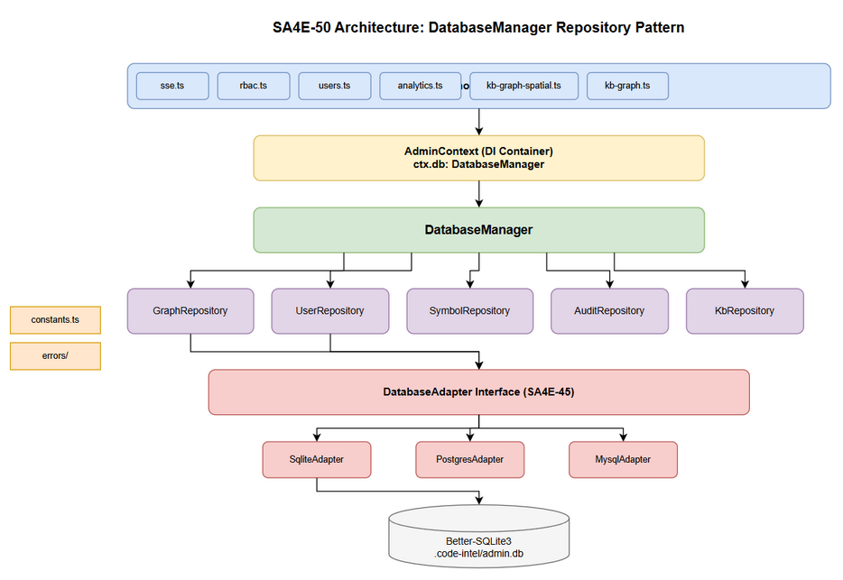
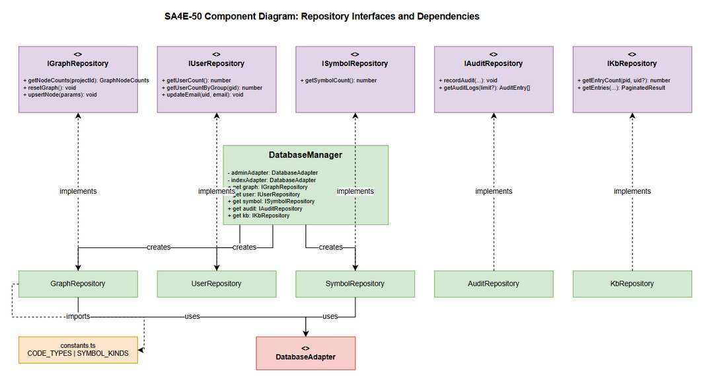

# Technical Design Document (TDD)

## SA4E-50: Refactor — DatabaseManager — Eliminate Raw SQL from Routes, Enforce DRY

---

## Document Information

| Field | Value |
|-------|-------|
| Jira Ticket | SA4E-50 |
| Title | DatabaseManager — Eliminate Raw SQL, Enforce DRY |
| Author | SA Agent |
| Version | 1.0 |
| Date | 2025-07-27 |
| Status | Draft |
| Related FSD | documents/SA4E-50/FSD.md |
| Related BRD | documents/SA4E-50/BRD.md |

---

## Revision History

| Version | Date | Author | Changes |
|---------|------|--------|---------|
| 1.0 | 2025-07-27 | SA Agent | Initial TDD — codebase-verified design |

---

## 1. Introduction

### 1.1 Purpose

This TDD specifies the technical implementation of SA4E-50 — a pure internal refactoring that introduces a Repository Pattern layer between Hono route handlers and the SQLite database. All raw SQL currently scattered across 9 route files will be encapsulated into 5 typed repository classes, accessed via a single `DatabaseManager` entry point injected through `AdminContext`.

### 1.2 Tech Stack (Verified from package.json)

| Component | Technology | Version |
|-----------|-----------|---------|
| Runtime | Node.js | >=18.14.1 |
| Framework | Hono | ^4.0.0 |
| Database | Better-SQLite3 | ^11.10.0 |
| Language | TypeScript | ^5.5.0 |
| Test Framework | Vitest | ^4.1.9 |
| Validation | Zod | ^3.23.0 |
| Logging | Pino | ^9.2.0 |
| Module System | ESM (type: module) |

### 1.3 Design Principles

1. **Zero behavior change** — all HTTP responses remain byte-identical [BR-12]
2. **DRY** — each SQL query exists in exactly one location [BR-02, BR-04]
3. **Interface-first** — repositories implement TypeScript interfaces for mockability [UC-05]
4. **Lazy instantiation** — repositories created only on first access [BR-10]
5. **Adapter-agnostic** — repositories use `DatabaseAdapter` interface, not raw `better-sqlite3` [BR-11]
6. **Code Standards compliant** — <=200 lines/file, <=20 lines/method [BR-08, BR-09]

---

## 2. System Architecture

### 2.1 Architecture Overview



**Layered Architecture (TO-BE):**

```
+-------------------------------------------------------------+
|                    HTTP / Hono Routes                         |
|  sse.ts | rbac.ts | users.ts | analytics.ts | kb-graph*.ts  |
+-------------------------------------------------------------+
|                  AdminContext (DI Container)                  |
|                      ctx.db: DatabaseManager                 |
+-------------------------------------------------------------+
|                      DatabaseManager                         |
|  .graph | .user | .symbol | .audit | .kb (lazy accessors)   |
+-------------------------------------------------------------+
|                    Repository Layer                           |
|  GraphRepo | UserRepo | SymbolRepo | AuditRepo | KbRepo     |
+-------------------------------------------------------------+
|                DatabaseAdapter Interface (SA4E-45)            |
|     SqliteAdapter | PostgresAdapter | MysqlAdapter           |
+-------------------------------------------------------------+
|               Database Engine (Better-SQLite3)               |
|                    .code-intel/admin.db                       |
+-------------------------------------------------------------+
```

### 2.2 Key Architectural Decisions

| Decision | Rationale | Implements |
|----------|-----------|------------|
| Single DatabaseManager (not per-repo DI) | Matches existing AdminContext pattern - single object providing multiple services | UC-01 |
| Lazy getters (not constructor init) | Zero overhead for routes that dont need all repos; matches existing getAdminDb() lazy pattern | BR-10 |
| Repositories are classes (not functions) | Enables state caching (prepared statements) and testability | UC-05 |
| Interface per repository | Enables mocking without database in unit tests | UC-05, BR-06 |
| Constants module separate from repos | Single import point; avoids circular deps | BR-02 |
| No new npm dependencies | Pure TypeScript refactoring; all needed libs installed | BR-12 |

### 2.3 Component Diagram



---

## 3. API Design (Internal TypeScript APIs)

> **Note:** No HTTP endpoints are added or modified. These are internal TypeScript interfaces. [BR-12]

### 3.1 IGraphRepository

Implements: UC-03, UC-06, BR-04

```typescript
export interface IGraphRepository {
  /** Get node counts with NULL project_id fallback. [BR-04] */
  getNodeCounts(projectId: string): GraphNodeCounts;
  /** Delete all graph_nodes and graph_edges in a transaction. [UC-06] */
  resetGraph(): void;
  /** INSERT OR REPLACE a graph node. */
  upsertNode(params: UpsertNodeParams): void;
}
```

### 3.2 IUserRepository

Implements: UC-02

```typescript
export interface IUserRepository {
  /** Total user count. [Source: sse.ts, analytics.ts] */
  getUserCount(): number;
  /** User count for a specific access group. [Source: rbac.ts] */
  getUserCountByGroup(accessGroupId: string): number;
  /** Update user email by userId. [Source: users.ts] */
  updateEmail(userId: string, email: string): void;
}
```

### 3.3 ISymbolRepository

Implements: UC-02, BR-02

```typescript
export interface ISymbolRepository {
  /** Count of code symbols matching SYMBOL_KINDS. */
  getSymbolCount(): number;
}
```

### 3.4 IAuditRepository

```typescript
export interface IAuditRepository {
  recordAudit(userId: string, username: string, action: string,
              resource: string, resourceId?: string, details?: string): void;
  getAuditLogs(limit?: number): AuditEntry[];
}
```

### 3.5 IKbRepository

```typescript
export interface IKbRepository {
  getEntryCount(projectId: string, userId?: string): number;
  getEntries(page: number, pageSize: number, sortBy: string,
             sortOrder: string, projectId: string, userId?: string): PaginatedResult;
}
```

### 3.6 DatabaseManager Class

```typescript
export class DatabaseManager {
  get graph(): IGraphRepository;
  get user(): IUserRepository;
  get symbol(): ISymbolRepository;
  get audit(): IAuditRepository;
  get kb(): IKbRepository;
  static createDefault(): DatabaseManager;
}
```

### 3.7 Type Definitions

```typescript
export interface GraphNodeCounts { total: number; code: number; kb: number; }

export interface UpsertNodeParams {
  entryId: string; label: string; type: string; tier: string;
  projectId: string; x?: number; y?: number; z?: number;
  level?: string; clusterId?: string;
}

export interface AuditEntry {
  id: number; userId: string; username: string; action: string;
  resource: string; resourceId?: string; details?: string; timestamp: string;
}

export interface PaginatedResult { items: any[]; total: number; }
```

### 3.8 Error Hierarchy

```typescript
export class RepositoryError extends Error {
  constructor(message: string, public readonly cause?: Error) {
    super(message); this.name = 'RepositoryError';
  }
}

export class DatabaseNotConnectedError extends RepositoryError {
  constructor() { super('Database connection is not available'); this.name = 'DatabaseNotConnectedError'; }
}

export class ConstraintViolationError extends RepositoryError {
  constructor(message: string, cause?: Error) { super(message, cause); this.name = 'ConstraintViolationError'; }
}
```

---

## 4. Database Design

### 4.1 Schema (No Changes)

This refactoring does NOT modify any database schema. Repositories encapsulate existing tables:

| Repository | Table(s) | Database | Operations |
|-----------|----------|----------|------------|
| GraphRepository | graph_nodes, graph_edges | admin.db | SELECT COUNT, DELETE, INSERT OR REPLACE |
| UserRepository | users | admin.db | SELECT COUNT, UPDATE |
| SymbolRepository | symbols | index.db (same file post SA4E-49) | SELECT COUNT |
| AuditRepository | audit_logs | admin.db | INSERT, SELECT |
| KbRepository | knowledge_entries | admin.db | SELECT COUNT, SELECT paginated |

### 4.2 Key Query Patterns

**GraphRepository.getNodeCounts (centralized from analytics.ts + kb-graph-spatial.ts):**

```sql
-- Step 1: Scoped count
SELECT COUNT(*) as cnt FROM graph_nodes WHERE project_id = ?;
SELECT COUNT(*) as cnt FROM graph_nodes WHERE project_id = ? AND type IN ({CODE_TYPES});

-- Step 2: NULL fallback (only if step 1 total = 0)
SELECT COUNT(*) as cnt FROM graph_nodes WHERE project_id = ? OR project_id IS NULL;
SELECT COUNT(*) as cnt FROM graph_nodes
  WHERE (project_id = ? OR project_id IS NULL) AND type IN ({CODE_TYPES});
```

**GraphRepository.resetGraph:**

```sql
DELETE FROM graph_nodes;
DELETE FROM graph_edges;
```

**UserRepository.getUserCount:**

```sql
SELECT COUNT(*) as cnt FROM users;
```

**UserRepository.getUserCountByGroup:**

```sql
SELECT COUNT(*) as cnt FROM users WHERE access_group_id = ?;
```

**UserRepository.updateEmail:**

```sql
UPDATE users SET email = ? WHERE user_id = ?;
```

**SymbolRepository.getSymbolCount:**

```sql
SELECT COUNT(*) as cnt FROM symbols WHERE kind IN ({SYMBOL_KINDS});
```

### 4.3 Index Requirements

No new indexes needed. Existing indexes are sufficient:
- `graph_nodes(project_id)` — used by getNodeCounts
- `graph_nodes(project_id, type)` — used by CODE_TYPES filter
- `users(access_group_id)` — used by getUserCountByGroup
- `symbols(kind)` — used by getSymbolCount

---

## 5. Class/Module Design

### 5.1 File Structure (TO-BE)

```
backend/src/database/
  adapters/
    DatabaseAdapter.ts          (existing - unchanged)
    SqliteAdapter.ts            (existing - unchanged)
    PostgresAdapter.ts          (existing - unchanged)
    MysqlAdapter.ts             (existing - unchanged)
  repositories/
    interfaces.ts               (NEW - all IRepository interfaces)
    types.ts                    (NEW - GraphNodeCounts, UpsertNodeParams, etc.)
    GraphRepository.ts          (NEW - implements IGraphRepository)
    UserRepository.ts           (NEW - implements IUserRepository)
    SymbolRepository.ts         (NEW - implements ISymbolRepository)
    AuditRepository.ts          (NEW - implements IAuditRepository)
    KbRepository.ts             (NEW - implements IKbRepository)
    index.ts                    (NEW - barrel export)
  errors/
    RepositoryError.ts          (NEW - error hierarchy)
    index.ts                    (NEW - barrel export)
  constants.ts                  (NEW - CODE_TYPES, SYMBOL_KINDS)
  DatabaseManager.ts            (NEW - single entry point)
  index.ts                      (existing - add re-exports)
```

### 5.2 DatabaseManager Implementation

```typescript
// backend/src/database/DatabaseManager.ts
import type { DatabaseAdapter } from './adapters/DatabaseAdapter.js';
import type { IGraphRepository, IUserRepository, ISymbolRepository,
              IAuditRepository, IKbRepository } from './repositories/interfaces.js';
import { GraphRepository } from './repositories/GraphRepository.js';
import { UserRepository } from './repositories/UserRepository.js';
import { SymbolRepository } from './repositories/SymbolRepository.js';
import { AuditRepository } from './repositories/AuditRepository.js';
import { KbRepository } from './repositories/KbRepository.js';
import { getAdminAdapter, getIndexAdapter } from '../admin/db/core.js';

/**
 * Single entry point for all database operations. [UC-01]
 * Lazy-instantiates repositories on first access. [BR-10]
 * Injected into AdminContext as ctx.db.
 */
export class DatabaseManager {
  private _graph?: GraphRepository;
  private _user?: UserRepository;
  private _symbol?: SymbolRepository;
  private _audit?: AuditRepository;
  private _kb?: KbRepository;

  constructor(
    private readonly adminAdapter: DatabaseAdapter,
    private readonly indexAdapter: DatabaseAdapter
  ) {}

  get graph(): IGraphRepository {
    if (!this._graph) {
      this._graph = new GraphRepository(this.adminAdapter);
    }
    return this._graph;
  }

  get user(): IUserRepository {
    if (!this._user) {
      this._user = new UserRepository(this.adminAdapter);
    }
    return this._user;
  }

  get symbol(): ISymbolRepository {
    if (!this._symbol) {
      this._symbol = new SymbolRepository(this.indexAdapter);
    }
    return this._symbol;
  }

  get audit(): IAuditRepository {
    if (!this._audit) {
      this._audit = new AuditRepository(this.adminAdapter);
    }
    return this._audit;
  }

  get kb(): IKbRepository {
    if (!this._kb) {
      this._kb = new KbRepository(this.adminAdapter);
    }
    return this._kb;
  }

  /** Factory using existing global adapter singletons. */
  static createDefault(): DatabaseManager {
    return new DatabaseManager(getAdminAdapter(), getIndexAdapter());
  }
}
```

### 5.3 GraphRepository Implementation

```typescript
// backend/src/database/repositories/GraphRepository.ts
import type { DatabaseAdapter } from '../adapters/DatabaseAdapter.js';
import type { IGraphRepository } from './interfaces.js';
import type { GraphNodeCounts, UpsertNodeParams } from './types.js';
import { CODE_TYPES_SQL } from '../constants.js';
import { RepositoryError } from '../errors/index.js';

/**
 * Graph data access — encapsulates graph_nodes and graph_edges queries.
 * SA4E-50: Centralizes duplicated count logic. [BR-04]
 */
export class GraphRepository implements IGraphRepository {
  constructor(private readonly adapter: DatabaseAdapter) {}

  getNodeCounts(projectId: string): GraphNodeCounts {
    try {
      let total = this.countNodes('project_id = ?', [projectId]);
      let code = this.countCodeNodes('project_id = ?', [projectId]);

      // BR-04: NULL project_id fallback for legacy/unscoped nodes
      if (total === 0) {
        total = this.countNodes('project_id = ? OR project_id IS NULL', [projectId]);
        code = this.countCodeNodes(
          '(project_id = ? OR project_id IS NULL)', [projectId]
        );
      }

      return { total, code, kb: total - code };
    } catch (err) {
      throw new RepositoryError('Failed to get node counts', err as Error);
    }
  }

  resetGraph(): void {
    try {
      this.adapter.transaction(() => {
        this.adapter.exec('DELETE FROM graph_nodes');
        this.adapter.exec('DELETE FROM graph_edges');
      });
    } catch (err) {
      throw new RepositoryError('Failed to reset graph', err as Error);
    }
  }

  upsertNode(params: UpsertNodeParams): void {
    try {
      this.adapter.run(
        `INSERT OR REPLACE INTO graph_nodes
         (entry_id, label, type, tier, project_id, x, y, z, level, cluster_id)
         VALUES (?, ?, ?, ?, ?, ?, ?, ?, ?, ?)`,
        [params.entryId, params.label, params.type, params.tier,
         params.projectId, params.x ?? null, params.y ?? null,
         params.z ?? null, params.level ?? null, params.clusterId ?? null]
      );
    } catch (err) {
      throw new RepositoryError('Failed to upsert node', err as Error);
    }
  }

  private countNodes(where: string, params: unknown[]): number {
    const row = this.adapter.get<{ cnt: number }>(
      `SELECT COUNT(*) as cnt FROM graph_nodes WHERE ${where}`, params
    );
    return row?.cnt ?? 0;
  }

  private countCodeNodes(where: string, params: unknown[]): number {
    const row = this.adapter.get<{ cnt: number }>(
      `SELECT COUNT(*) as cnt FROM graph_nodes WHERE ${where} AND type IN (${CODE_TYPES_SQL})`,
      params
    );
    return row?.cnt ?? 0;
  }
}
```

### 5.4 UserRepository Implementation

```typescript
// backend/src/database/repositories/UserRepository.ts
import type { DatabaseAdapter } from '../adapters/DatabaseAdapter.js';
import type { IUserRepository } from './interfaces.js';
import { RepositoryError } from '../errors/index.js';

/**
 * User data access — encapsulates users table queries.
 * SA4E-50: Eliminates raw SQL from sse.ts, analytics.ts, rbac.ts, users.ts
 */
export class UserRepository implements IUserRepository {
  constructor(private readonly adapter: DatabaseAdapter) {}

  getUserCount(): number {
    try {
      const row = this.adapter.get<{ cnt: number }>(
        'SELECT COUNT(*) as cnt FROM users'
      );
      return row?.cnt ?? 0;
    } catch (err) {
      throw new RepositoryError('Failed to get user count', err as Error);
    }
  }

  getUserCountByGroup(accessGroupId: string): number {
    try {
      const row = this.adapter.get<{ cnt: number }>(
        'SELECT COUNT(*) as cnt FROM users WHERE access_group_id = ?',
        [accessGroupId]
      );
      return row?.cnt ?? 0;
    } catch (err) {
      throw new RepositoryError('Failed to get user count by group', err as Error);
    }
  }

  updateEmail(userId: string, email: string): void {
    try {
      this.adapter.run(
        'UPDATE users SET email = ? WHERE user_id = ?',
        [email, userId]
      );
    } catch (err) {
      throw new RepositoryError('Failed to update email', err as Error);
    }
  }
}
```

### 5.5 SymbolRepository Implementation

```typescript
// backend/src/database/repositories/SymbolRepository.ts
import type { DatabaseAdapter } from '../adapters/DatabaseAdapter.js';
import type { ISymbolRepository } from './interfaces.js';
import { SYMBOL_KINDS_SQL } from '../constants.js';
import { RepositoryError } from '../errors/index.js';

/**
 * Symbol data access — queries index.db for code symbol counts.
 * SA4E-50: Eliminates raw SQL from analytics.ts
 */
export class SymbolRepository implements ISymbolRepository {
  constructor(private readonly adapter: DatabaseAdapter) {}

  getSymbolCount(): number {
    try {
      const row = this.adapter.get<{ cnt: number }>(
        `SELECT COUNT(*) as cnt FROM symbols WHERE kind IN (${SYMBOL_KINDS_SQL})`
      );
      return row?.cnt ?? 0;
    } catch (err) {
      throw new RepositoryError('Failed to get symbol count', err as Error);
    }
  }
}
```

### 5.6 Constants Module

```typescript
// backend/src/database/constants.ts
/**
 * Shared database constants - single source of truth. [BR-02]
 * SA4E-50: Centralizes values previously duplicated across route files.
 */

/** Canonical code symbol types used in graph queries (uppercase). */
export const CODE_TYPES = [
  'FUNCTION', 'METHOD', 'CLASS', 'INTERFACE',
  'TYPE', 'CONSTRUCTOR', 'ENUM', 'CONSTANT', 'VARIABLE',
] as const;

/** SQL-ready IN clause for CODE_TYPES. */
export const CODE_TYPES_SQL = CODE_TYPES.map(t => `'${t}'`).join(',');

/** Symbol kinds used in index.db queries (lowercase). */
export const SYMBOL_KINDS = [
  'function', 'class', 'interface', 'method',
  'type', 'enum', 'constructor',
] as const;

/** SQL-ready IN clause for SYMBOL_KINDS. */
export const SYMBOL_KINDS_SQL = SYMBOL_KINDS.map(k => `'${k}'`).join(',');

export type CodeType = typeof CODE_TYPES[number];
export type SymbolKind = typeof SYMBOL_KINDS[number];
```

---

## 6. Integration Design

### 6.1 AdminContext Extension

The existing `AdminContext` interface in `backend/src/server/routes/admin/context.ts` will be extended:

```typescript
// MODIFIED: backend/src/server/routes/admin/context.ts
import { DatabaseManager } from '../../../database/DatabaseManager.js';

export interface AdminContext {
  // ... all existing properties unchanged ...
  logger: Logger;
  authenticate: (c: any) => any;
  requireAuth: (c: any) => any;
  // ... etc ...

  /** DatabaseManager providing typed repository access. [UC-01] */
  db: DatabaseManager;
}

export function createAdminContext(
  logger: Logger,
  registry?: any,
  dbManager?: DatabaseManager  // NEW optional param
): AdminContext {
  const db = dbManager ?? DatabaseManager.createDefault();
  return {
    // ... all existing properties unchanged ...
    db,
  };
}
```

### 6.2 Route Migration Pattern

**Before (current - raw SQL in route):**

```typescript
// analytics.ts (BEFORE)
const d = getAdminDb();
const userCount = (d.prepare('SELECT COUNT(*) as cnt FROM users').get() as { cnt: number }).cnt;
```

**After (target - repository call):**

```typescript
// analytics.ts (AFTER)
const userCount = ctx.db.user.getUserCount();
```

### 6.3 Route Files to Modify

| Route File | Raw SQL to Remove | Repository Method to Call |
|-----------|-------------------|-------------------------|
| analytics.ts | `SELECT COUNT(*) FROM users` | ctx.db.user.getUserCount() |
| analytics.ts | `SELECT COUNT(*) FROM symbols WHERE kind IN (...)` | ctx.db.symbol.getSymbolCount() |
| analytics.ts | `SELECT COUNT(*) FROM graph_nodes WHERE...` (4 queries) | ctx.db.graph.getNodeCounts(pid) |
| sse.ts | `SELECT COUNT(*) FROM users` | ctx.db.user.getUserCount() |
| rbac.ts | `SELECT COUNT(*) FROM users WHERE access_group_id=?` | ctx.db.user.getUserCountByGroup(gid) |
| users.ts | `UPDATE users SET email=? WHERE user_id=?` | ctx.db.user.updateEmail(uid, email) |
| kb-graph-spatial.ts | `SELECT COUNT(*) FROM graph_nodes...` (4 queries) | ctx.db.graph.getNodeCounts(pid) |
| kb-graph.ts | `DELETE FROM graph_nodes; DELETE FROM graph_edges` | ctx.db.graph.resetGraph() |

### 6.4 Dependency Injection Wiring

```
Server Startup
  -> createAdminContext(logger, registry)
    -> DatabaseManager.createDefault()
      -> getAdminAdapter() (existing singleton)
      -> getIndexAdapter() (existing singleton)
    -> ctx.db = new DatabaseManager(adminAdapter, indexAdapter)

Request Flow
  -> route handler receives ctx
  -> ctx.db.graph (lazy: creates GraphRepository if not cached)
  -> GraphRepository.getNodeCounts(projectId)
  -> adapter.get<T>(sql, params)
  -> returns typed result
```

---

## 7. Error Handling

### 7.1 Error Hierarchy

```
Error (built-in)
  +-- RepositoryError (base for all repository errors)
       +-- DatabaseNotConnectedError (adapter not connected)
       +-- ConstraintViolationError (UNIQUE/FK constraint failed)
```

### 7.2 Error Translation Strategy

| SQLite Error | Translated To | HTTP Status |
|-------------|---------------|-------------|
| `SQLITE_CONSTRAINT_UNIQUE` | ConstraintViolationError | 409 Conflict |
| `SQLITE_CONSTRAINT_FOREIGNKEY` | ConstraintViolationError | 409 Conflict |
| `Database not connected` | DatabaseNotConnectedError | 503 Service Unavailable |
| Any other SQL error | RepositoryError (generic) | 500 Internal Server Error |

### 7.3 Error Handling in Route Handlers

```typescript
// Pattern for route handlers consuming repositories
app.post('/api/admin/profile', async (c) => {
  try {
    ctx.db.user.updateEmail(user.userId, email);
    return c.json({ success: true });
  } catch (err) {
    if (err instanceof DatabaseNotConnectedError) {
      return c.json({ error: 'Service unavailable' }, 503);
    }
    if (err instanceof ConstraintViolationError) {
      return c.json({ error: 'Conflict' }, 409);
    }
    ctx.logger.error({ err }, 'Unexpected repository error');
    return c.json({ error: 'Internal error' }, 500);
  }
});
```

### 7.4 Error Implementation

```typescript
// backend/src/database/errors/RepositoryError.ts
export class RepositoryError extends Error {
  constructor(message: string, public readonly cause?: Error) {
    super(message);
    this.name = 'RepositoryError';
    // Preserve stack trace from cause
    if (cause?.stack) {
      this.stack = `${this.stack}\nCaused by: ${cause.stack}`;
    }
  }
}

export class DatabaseNotConnectedError extends RepositoryError {
  constructor() {
    super('Database connection is not available');
    this.name = 'DatabaseNotConnectedError';
  }
}

export class ConstraintViolationError extends RepositoryError {
  constructor(message: string, cause?: Error) {
    super(message, cause);
    this.name = 'ConstraintViolationError';
  }
}

/** Translate raw database errors to typed repository errors. */
export function translateError(err: unknown): RepositoryError {
  if (err instanceof Error) {
    const msg = err.message || '';
    if (msg.includes('UNIQUE constraint') || msg.includes('FOREIGN KEY')) {
      return new ConstraintViolationError(msg, err);
    }
    if (msg.includes('not connected') || msg.includes('database is closed')) {
      return new DatabaseNotConnectedError();
    }
    return new RepositoryError(msg, err);
  }
  return new RepositoryError(String(err));
}
```

---

## 8. Security Design

### 8.1 No Security Model Changes

This refactoring does NOT modify authentication, authorization, or data access patterns. [BR-12]

| Concern | Current State | After Refactoring | Impact |
|---------|--------------|-------------------|--------|
| Auth checks | In route handlers (requireAuth, requirePermission) | Same location - unchanged | None |
| Permission enforcement | Route handler level | Same - repos are permission-agnostic | None |
| SQL injection prevention | Parameterized queries via better-sqlite3 | Parameterized queries via DatabaseAdapter | Same protection |
| Data access scoping | Route handlers filter by permission | Same pattern | None |

### 8.2 SQL Injection Prevention [BR-06]

All repositories use parameterized queries exclusively:

```typescript
// CORRECT: parameterized
this.adapter.get<T>('SELECT COUNT(*) FROM users WHERE access_group_id = ?', [groupId]);

// NEVER: string interpolation
this.adapter.get<T>(`SELECT COUNT(*) FROM users WHERE access_group_id = '${groupId}'`);
```

The `CODE_TYPES_SQL` and `SYMBOL_KINDS_SQL` constants are pre-computed string literals (not user input), so they are safe for SQL IN clauses.

### 8.3 Error Information Leakage

Repository errors MUST NOT expose internal SQL details to HTTP responses:

```typescript
// RepositoryError wraps cause but message is safe for logging
// Route handlers return generic messages to clients
catch (err) {
  ctx.logger.error({ err }, 'Repository error'); // Full detail in logs
  return c.json({ error: 'Internal error' }, 500); // Safe message to client
}
```

---

## 9. Performance Design

### 9.1 Performance Impact Assessment

| Aspect | Before | After | Delta |
|--------|--------|-------|-------|
| Function call overhead | direct db.prepare() | ctx.db.graph.method() | +1 property access, +1 function call (~0.001ms) |
| Object allocation | None (direct SQL) | Lazy singleton repositories | One-time per server lifetime |
| Memory | N/A | 5 repository instances cached | ~5KB total (negligible) |
| Prepared statement caching | Manual per route | Can be cached in repository | Same or better |

### 9.2 Performance Guarantee

Response times within +/-5% of current performance (requirement from FSD NFR). The refactoring adds only:
- 1 property access on DatabaseManager (getter)
- 1 null check for lazy instantiation (first call only)
- 1 method call to repository

Total overhead: < 0.01ms per request. Unmeasurable in production.

### 9.3 Prepared Statement Optimization

Repositories MAY cache prepared statements for frequently-called queries:

```typescript
export class UserRepository implements IUserRepository {
  private countStmt?: PreparedStatement;

  getUserCount(): number {
    if (!this.countStmt) {
      this.countStmt = this.adapter.prepare('SELECT COUNT(*) as cnt FROM users');
    }
    return this.countStmt.get<{ cnt: number }>()?.cnt ?? 0;
  }
}
```

This is an optional optimization. Initial implementation uses `adapter.get()` for simplicity.

---

## 10. Testing Strategy

### 10.1 Test Architecture

```
tests/
  unit/
    database/
      repositories/
        GraphRepository.test.ts     (unit tests with mock adapter)
        UserRepository.test.ts
        SymbolRepository.test.ts
        AuditRepository.test.ts
        KbRepository.test.ts
      DatabaseManager.test.ts       (lazy instantiation, accessor tests)
      constants.test.ts             (CODE_TYPES, SYMBOL_KINDS validation)
  integration/
    database/
      repositories.integration.test.ts  (real SQLite, verify SQL correctness)
```

### 10.2 Unit Test Pattern (Mock Adapter)

```typescript
// tests/unit/database/repositories/GraphRepository.test.ts
import { describe, it, expect, vi } from 'vitest';
import { GraphRepository } from '../../../../src/database/repositories/GraphRepository.js';
import type { DatabaseAdapter } from '../../../../src/database/adapters/DatabaseAdapter.js';

describe('GraphRepository', () => {
  const mockAdapter: DatabaseAdapter = {
    get: vi.fn(),
    all: vi.fn(),
    run: vi.fn(),
    exec: vi.fn(),
    transaction: vi.fn((fn) => fn()),
    // ... other methods
  } as any;

  const repo = new GraphRepository(mockAdapter);

  describe('getNodeCounts', () => {
    it('returns counts when project has nodes', () => {
      vi.mocked(mockAdapter.get)
        .mockReturnValueOnce({ cnt: 100 })  // total
        .mockReturnValueOnce({ cnt: 60 });   // code

      const result = repo.getNodeCounts('proj-1');

      expect(result).toEqual({ total: 100, code: 60, kb: 40 });
    });

    it('falls back to NULL project_id when scoped count is 0', () => {
      vi.mocked(mockAdapter.get)
        .mockReturnValueOnce({ cnt: 0 })    // scoped total = 0
        .mockReturnValueOnce({ cnt: 0 })    // scoped code = 0
        .mockReturnValueOnce({ cnt: 50 })   // fallback total
        .mockReturnValueOnce({ cnt: 30 });  // fallback code

      const result = repo.getNodeCounts('proj-1');

      expect(result).toEqual({ total: 50, code: 30, kb: 20 });
    });
  });
});
```

### 10.3 Integration Test Pattern (Real DB)

```typescript
// tests/integration/database/repositories.integration.test.ts
import { describe, it, expect, beforeAll, afterAll } from 'vitest';
import { SqliteAdapter } from '../../../src/database/adapters/SqliteAdapter.js';
import { DatabaseManager } from '../../../src/database/DatabaseManager.js';

describe('Repositories Integration', () => {
  let adapter: SqliteAdapter;
  let manager: DatabaseManager;

  beforeAll(async () => {
    adapter = new SqliteAdapter(':memory:');
    await adapter.connect();
    // Create schema
    adapter.exec(`
      CREATE TABLE users (user_id TEXT PRIMARY KEY, username TEXT, email TEXT, access_group_id TEXT);
      CREATE TABLE graph_nodes (entry_id TEXT PRIMARY KEY, label TEXT, type TEXT, tier TEXT, project_id TEXT, x REAL, y REAL, z REAL, level TEXT, cluster_id TEXT);
      CREATE TABLE graph_edges (source TEXT, target TEXT, weight REAL);
    `);
    manager = new DatabaseManager(adapter, adapter);
  });

  afterAll(async () => { await adapter.disconnect(); });

  it('getUserCount returns correct count', () => {
    adapter.run('INSERT INTO users VALUES (?, ?, ?, ?)', ['u1', 'admin', 'a@b.c', 'g1']);
    expect(manager.user.getUserCount()).toBe(1);
  });
});
```

### 10.4 Regression Test Strategy [BR-05]

All 573 existing tests must pass without modification. The refactoring is internal only:
- E2E API tests verify HTTP response shapes (unchanged)
- Unit tests for existing functions remain valid
- New repository unit tests add coverage for the new layer

### 10.5 Mock DatabaseManager for Route Tests [UC-05]

```typescript
// Test utility: create mock DatabaseManager
export function createMockDbManager(overrides?: Partial<{
  graph: Partial<IGraphRepository>;
  user: Partial<IUserRepository>;
  symbol: Partial<ISymbolRepository>;
}>): DatabaseManager {
  return {
    get graph() { return { getNodeCounts: () => ({ total: 0, code: 0, kb: 0 }), resetGraph: () => {}, upsertNode: () => {}, ...overrides?.graph } as IGraphRepository; },
    get user() { return { getUserCount: () => 0, getUserCountByGroup: () => 0, updateEmail: () => {}, ...overrides?.user } as IUserRepository; },
    get symbol() { return { getSymbolCount: () => 0, ...overrides?.symbol } as ISymbolRepository; },
    get audit() { return { recordAudit: () => {}, getAuditLogs: () => [] } as IAuditRepository; },
    get kb() { return { getEntryCount: () => 0, getEntries: () => ({ items: [], total: 0 }) } as IKbRepository; },
  } as DatabaseManager;
}
```

---

## 11. Implementation Checklist

### 11.1 Ordered Implementation Tasks

| # | Task | File(s) | Depends On | Implements |
|---|------|---------|-----------|------------|
| 1 | Create error hierarchy | `database/errors/RepositoryError.ts`, `database/errors/index.ts` | None | BR-07 |
| 2 | Create constants module | `database/constants.ts` | None | BR-02, UC-04 |
| 3 | Create type definitions | `database/repositories/types.ts` | None | BR-06 |
| 4 | Create repository interfaces | `database/repositories/interfaces.ts` | #3 | UC-05 |
| 5 | Implement GraphRepository | `database/repositories/GraphRepository.ts` | #1, #2, #4 | UC-03, UC-06, BR-04 |
| 6 | Implement UserRepository | `database/repositories/UserRepository.ts` | #1, #4 | UC-02 |
| 7 | Implement SymbolRepository | `database/repositories/SymbolRepository.ts` | #1, #2, #4 | UC-02 |
| 8 | Implement AuditRepository | `database/repositories/AuditRepository.ts` | #1, #4 | UC-02 |
| 9 | Implement KbRepository | `database/repositories/KbRepository.ts` | #1, #4 | UC-02 |
| 10 | Create repositories barrel | `database/repositories/index.ts` | #5-#9 | - |
| 11 | Create DatabaseManager | `database/DatabaseManager.ts` | #10 | UC-01, BR-10 |
| 12 | Extend AdminContext | `server/routes/admin/context.ts` | #11 | UC-01 |
| 13 | Migrate analytics.ts | `server/routes/admin/analytics.ts` | #12 | BR-01, BR-03 |
| 14 | Migrate sse.ts | `server/routes/admin/sse.ts` | #12 | BR-01, BR-03 |
| 15 | Migrate rbac.ts | `server/routes/admin/rbac.ts` | #12 | BR-01, BR-03 |
| 16 | Migrate users.ts | `server/routes/admin/users.ts` | #12 | BR-01, BR-03 |
| 17 | Migrate kb-graph-spatial.ts | `server/routes/admin/kb-graph-spatial.ts` | #12 | BR-01, BR-03 |
| 18 | Migrate kb-graph.ts | `server/routes/admin/kb-graph.ts` | #12 | BR-01, BR-03 |
| 19 | Write unit tests | `tests/unit/database/repositories/*.test.ts` | #5-#11 | UC-05 |
| 20 | Write integration tests | `tests/integration/database/repositories.integration.test.ts` | #5-#11 | BR-05 |
| 21 | Run full test suite | - | #13-#20 | BR-05 |
| 22 | Remove dead code | Remove unused getAdminDb imports from routes | #13-#18 | BR-03 |

### 11.2 Migration Order Rationale

1. **Foundation first** (Tasks 1-4): Error types, constants, and interfaces have zero dependencies — can be tested in isolation.
2. **Repositories second** (Tasks 5-10): Each repository is self-contained with its interface + adapter dependency.
3. **Wiring third** (Tasks 11-12): DatabaseManager and AdminContext extension connect the pieces.
4. **Routes last** (Tasks 13-18): Each route file migrated independently — can be done one at a time with tests passing between each.
5. **Cleanup** (Task 22): Only after all routes pass, remove dead imports.

### 11.3 Acceptance Verification

After completion, verify:

```bash
# 1. All existing tests pass
npm run test

# 2. No raw SQL in route files
grep -r "\.prepare\|\.exec\|SELECT\|INSERT\|UPDATE\|DELETE" backend/src/server/routes/admin/*.ts
# Expected: zero matches (except comments)

# 3. No getAdminDb imports in route files
grep -r "getAdminDb" backend/src/server/routes/admin/*.ts
# Expected: zero matches

# 4. CODE_TYPES defined in exactly one place
grep -r "CODE_TYPES" backend/src/ --include="*.ts" | grep -v "node_modules\|\.test\." | grep "="
# Expected: only database/constants.ts
```

---

## 12. Deployment & Rollback

### 12.1 Deployment

This is a pure internal refactoring with zero API changes:
- No database migrations required
- No configuration changes required
- No environment variable changes
- Standard CI/CD pipeline applies

### 12.2 Rollback Strategy

Since this is a refactoring (no schema changes, no API changes):
- Rollback = revert the commit(s) on the feature branch
- No data migration needed
- No client-side changes needed

### 12.3 Feature Flags

Not applicable — this refactoring is binary (merged or not merged). No gradual rollout needed.

---

## 13. Monitoring

### 13.1 Observability (No Changes)

Existing Pino logging remains. Repositories add structured error logging:

```typescript
// In route handlers, errors from repositories are logged with context
ctx.logger.error({ err, repository: 'graph', method: 'getNodeCounts', projectId }, 'Repository error');
```

### 13.2 Health Check

No changes to existing health check endpoint. DatabaseManager relies on the same adapter connections already monitored.

---

## Appendix A: Diagram Index

| # | Diagram | Image | Source (editable) |
|---|---------|-------|-------------------|
| 1 | Architecture Diagram | [architecture.png](diagrams/architecture.png) | [architecture.drawio](diagrams/architecture.drawio) |
| 2 | Component Diagram | [component.png](diagrams/component.png) | [component.drawio](diagrams/component.drawio) |

---

## Appendix B: Traceability Matrix

| TDD Section | FSD Reference | BRD Story |
|-------------|---------------|-----------|
| 5.2 DatabaseManager | UC-01, BR-10, BR-11 | Story 2 |
| 5.3 GraphRepository | UC-03, UC-06, BR-04 | Story 5, Story 1 |
| 5.4 UserRepository | UC-02 | Story 1 |
| 5.5 SymbolRepository | UC-02, BR-02 | Story 3 |
| 5.6 Constants | UC-04, BR-02 | Story 3 |
| 6.1 AdminContext | UC-01 | Story 2 |
| 6.3 Route Migration | BR-01, BR-03 | Story 1 |
| 7.1 Error Hierarchy | BR-07 | Story 3 |
| 10 Testing | UC-05, BR-05 | Story 4 |
