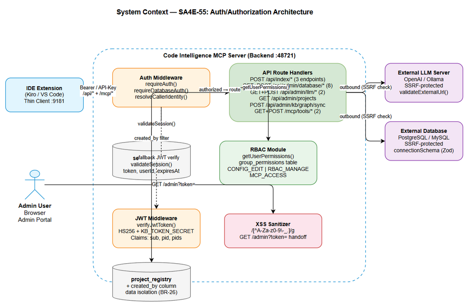
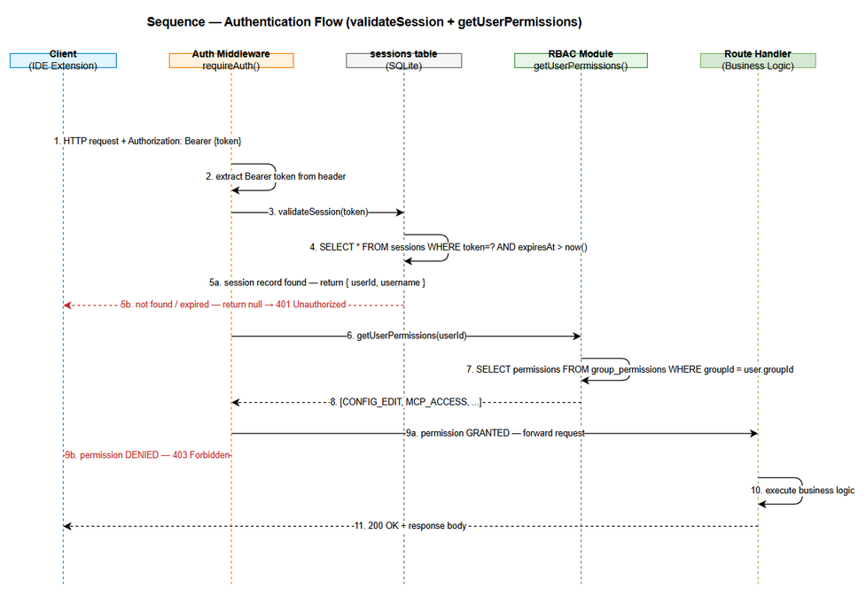
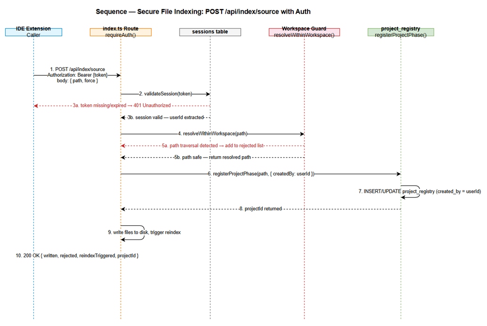
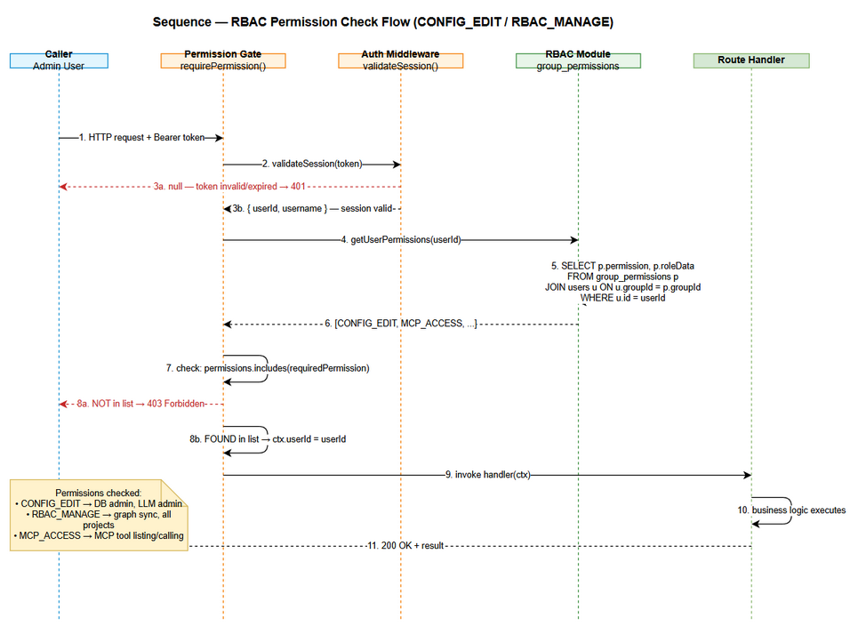
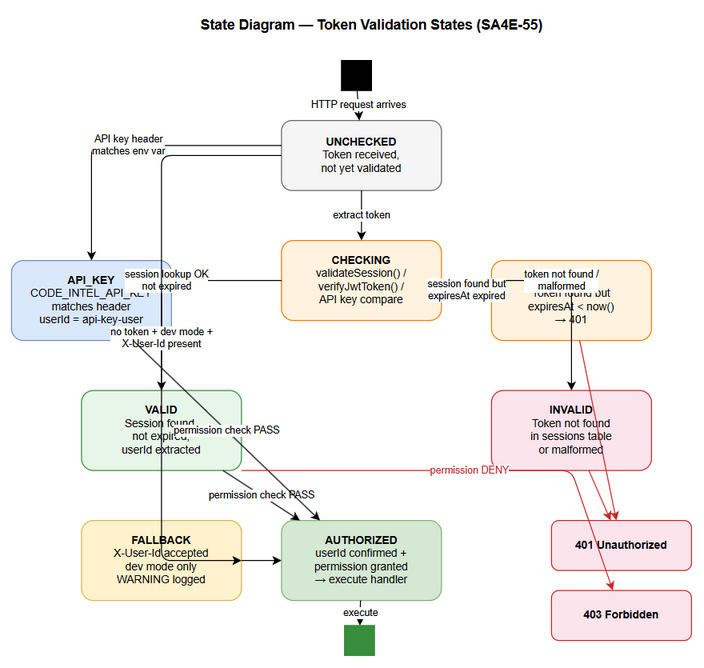

# Functional Specification Document (FSD)

## Code Intelligence MCP Server — SA4E-55: Security: Fix Authentication/Authorization Vulnerabilities in Backend API

---

## Document Information

| Field | Value |
|-------|-------|
| Jira Ticket | SA4E-55 |
| Title | Security: Fix authentication/authorization vulnerabilities in backend API |
| Author | BA Agent |
| Version | 1.0 |
| Date | 2026-07-23 |
| Status | Draft |
| Related BRD | BRD-v1-SA4E-55.docx |

---

## Revision History

| Version | Date | Author | Changes |
|---------|------|--------|---------|
| 1.0 | 2026-07-23 | BA Agent | Initial FSD — derived from BRD SA4E-55 v1.0, covering 20 security findings F-01 to F-20 |

---

## 1. Introduction

### 1.1 Purpose

This FSD translates the business requirements from BRD SA4E-55 into detailed functional specifications for the security hardening of the Code Intelligence MCP Server backend API. It defines Use Cases, Business Rules, API contracts, error handling, and data model changes required to remediate authentication/authorization vulnerabilities F-01 through F-20.

### 1.2 Scope

This document covers functional specifications for all 20 security findings (F-01 to F-20) across 8 business stories:
- **Story 1:** Secure File Indexing Endpoints (F-06, F-07, F-08)
- **Story 2:** Secure Database Administration Endpoints (F-01 to F-05, F-18 to F-20)
- **Story 3:** Verified Identity in MCP Tool Calls (F-10)
- **Story 4:** Authenticate MCP Tool Listing (F-09)
- **Story 5:** Sanitize Admin Portal Token Handoff (F-13)
- **Story 6:** Require CONFIG_EDIT for LLM Endpoints (F-14, F-15)
- **Story 7:** Workspace Data Isolation for Regular Users (F-16)
- **Story 8:** Privilege Check on Graph Sync (F-17)

### 1.3 Definitions & Acronyms

| Term | Definition |
|------|------------|
| Authentication | Verifying identity via a valid session token or JWT |
| Authorization | Verifying the authenticated caller holds the required permission |
| Session Token | Opaque hex string in the sessions table, validated by validateSession() |
| JWT | JSON Web Token signed with HMAC-SHA256 using KB_TOKEN_SECRET. Claims: sub, pid, pids, wid |
| CONFIG_EDIT | RBAC permission for modifying LLM/DB configuration |
| RBAC_MANAGE | RBAC permission for admin-level operations (user mgmt, graph sync) |
| MCP_ACCESS | RBAC permission controlling MCP tool visibility per session user |
| SSRF | Server-Side Request Forgery — attacker causes server to make outbound HTTP to internal hosts |
| XSS | Cross-Site Scripting — unsanitized user input injected into HTML and executed as JavaScript |
| requireAuth() | Helper: validates session/API-key, returns userId or 401 |
| requireDatabaseAuth() | Helper: validates session + CONFIG_EDIT permission, or 401/403 |
| resolveCallerIdentity() | Derives userId from session, JWT, or API key; optional X-User-Id fallback |
| validateExternalUrl() | Middleware that blocks private/reserved IP ranges for SSRF protection |
| F-XX | Finding ID from the security audit (SECURITY-AUTH-AUDIT.md) |

### 1.4 References

| Document | Location |
|----------|----------|
| BRD | BRD-v1-SA4E-55.docx (attached to Jira SA4E-55) |
| Security Audit Report | documents/SECURITY-AUTH-AUDIT.md |
| Architecture Overview | .code-intel/SA4E-ARCHITECTURE.md |
| RBAC Middleware | backend/src/admin/middleware/rbac.middleware.ts |
| JWT Auth Middleware | backend/src/server/middleware/jwt-auth.ts |
| Sessions DB module | backend/src/admin/db/sessions.ts |

---

## 2. System Overview

### 2.1 System Context Diagram



The Code Intelligence MCP Server sits between IDE extensions (clients) and the Admin Portal. All API calls must pass through the authentication/authorization layer before reaching business logic. External systems (LLM servers, external databases) are only accessible to properly authorized callers.

**Key actors and systems:**
- **IDE Extension (Kiro/VS Code):** Calls `/api/index/*` and `/mcp/tools/*` endpoints with session or JWT tokens
- **Admin Portal:** Web UI that calls `/api/admin/*` endpoints; token handoff via `GET /admin?token=`
- **Backend API (Code Intelligence MCP Server):** The system being secured — Hono HTTP server on port 48721
- **Sessions DB:** SQLite database storing session tokens for `validateSession()`
- **External LLM Server:** Called by `/api/admin/llm/test` — subject to SSRF protection
- **External Database:** Called by `/api/admin/database/test-connection` — subject to SSRF protection

### 2.2 System Architecture

The authentication/authorization layer is implemented as middleware wrappers around existing route handlers:

```
HTTP Request
  → requireAuth() / requireDatabaseAuth() / resolveCallerIdentity()
    → validateSession(token) — DB lookup against sessions table
    OR → verifyJwtToken(token) — HMAC-SHA256 verify
    OR → API Key check (CODE_INTEL_API_KEY env var)
      → getUserPermissions(userId) — RBAC lookup
        → requirePermission('CONFIG_EDIT') / requirePermission('RBAC_MANAGE')
          → Route Handler (business logic)
```

---

## 3. Functional Requirements

---

### 3.1 Feature: Secure File Indexing Endpoints

**Source:** BRD Story 1 — Findings F-06, F-07, F-08

#### 3.1.1 Description

Three file-write endpoints (`POST /api/index/source`, `POST /api/index/document`, `POST /api/index/documents`) previously accepted unauthenticated requests, allowing any caller to write files to the server workspace. All three must now require a valid session token before processing the request body.

#### 3.1.2 Use Case: UC-01

**Use Case ID:** UC-01
**Name:** Authenticated File Indexing
**Actor:** IDE Extension (authenticated user)
**Preconditions:**
- Caller has a valid session token (obtained via admin portal login)
- The workspace directory exists and is writable

**Postconditions:**
- Files are written/indexed under the authenticated user's identity
- `project_registry` record created with `created_by = userId`

**Main Flow:**

| Step | Actor | System | Description |
|------|-------|--------|-------------|
| 1 | Sends `POST /api/index/source` with `Authorization: Bearer {token}` | | IDE submits source path for indexing |
| 2 | | Extracts Bearer token from Authorization header | Auth middleware intercepts request |
| 3 | | Calls `validateSession(token)` | Looks up token in sessions table |
| 4 | | Session valid — extracts `userId` from session record | Identity confirmed |
| 5 | | Calls `resolveWithinWorkspace(path)` for path traversal check | Security defense layer |
| 6 | | Calls `registerProjectPhase(path, { createdBy: userId })` | Records audit trail |
| 7 | | Indexes files, triggers reindex | Writes files to disk |
| 8 | | Returns `{ written, rejected, reindexTriggered, projectId }` | HTTP 200 OK |

**Alternative Flows:**

| ID | Condition | Steps |
|----|-----------|-------|
| AF-01a | Caller uses API key (`X-API-Key` header, `CODE_INTEL_API_KEY` set) | Skip session validation; `userId = 'api-key-user'`; proceed to step 5 |
| AF-01b | Some file paths are rejected (path traversal) | `resolveWithinWorkspace` returns null for unsafe paths; those files are counted in `rejected`; safe files are written |

**Exception Flows:**

| ID | Condition | Steps |
|----|-----------|-------|
| EF-01a | No Authorization header and no API key | Returns `401 { "error": "Unauthorized" }` — request rejected immediately |
| EF-01b | Token present but expired or not in sessions table | `validateSession()` returns null → `401 { "error": "Unauthorized" }` |
| EF-01c | Token present but malformed (not valid hex or JWT) | `validateSession()` returns null → `401 { "error": "Unauthorized" }` |
| EF-01d | All submitted file paths fail traversal check | Returns `400` or response with `written: 0, rejected: N` |

#### 3.1.3 Business Rules

| Rule ID | Rule | Source |
|---------|------|--------|
| BR-01 | All three index endpoints MUST require a valid session token or API key before processing any request body | BRD Story 1, AC-1/3/4 |
| BR-02 | The `userId` from the validated session MUST be passed as `createdBy` to `registerProjectPhase()` | BRD Story 1, Req 3 |
| BR-03 | Path traversal protection via `resolveWithinWorkspace()` MUST remain active regardless of auth status | BRD Story 1, Req 4 |
| BR-04 | All three index endpoints use the same `requireAuth()` helper for consistency | BRD Story 1, Req 5 |

#### 3.1.4 API Specifications

**Endpoint 1:** `POST /api/index/source`
**Purpose:** Index a source directory into the code intelligence store

**Request Headers:**
| Header | Required | Description |
|--------|----------|-------------|
| Authorization | Yes* | `Bearer {session_token}` |
| X-API-Key | Yes* | API key (alternative to Bearer) |
*One of the two is required.

**Request Body:**
```json
{ "path": "/absolute/path/to/workspace", "force": false }
```

**Response (200 OK):**
```json
{ "written": 42, "rejected": 0, "reindexTriggered": true, "projectId": "uuid-..." }
```

**HTTP Status Codes:**
| Code | Condition |
|------|-----------|
| 200 | Auth passed, indexing completed |
| 400 | Invalid path or missing required field |
| 401 | No valid token/API key |

---

**Endpoint 2:** `POST /api/index/document`
**Purpose:** Index a single document file

**Request Headers:** Same as Endpoint 1

**Request Body:**
```json
{ "path": "/path/to/file.md", "content": "optional override content" }
```

**Response (200 OK):**
```json
{ "indexed": true, "projectId": "uuid-..." }
```

**HTTP Status Codes:**
| Code | Condition |
|------|-----------|
| 200 | Auth passed, document indexed |
| 401 | No valid token/API key |

---

**Endpoint 3:** `POST /api/index/documents`
**Purpose:** Batch index multiple document files

**Request Headers:** Same as Endpoint 1

**Request Body:**
```json
{ "paths": ["/path/doc1.md", "/path/doc2.md"] }
```

**Response (200 OK):**
```json
{ "written": 2, "rejected": 0 }
```

**HTTP Status Codes:**
| Code | Condition |
|------|-----------|
| 200 | Auth passed, batch indexed |
| 401 | No valid token/API key |

---

### 3.2 Feature: Secure Database Administration Endpoints

**Source:** BRD Story 2 — Findings F-01 to F-05, F-18 to F-20

#### 3.2.1 Description

Eight database administration endpoints were publicly accessible without any authentication. These endpoints expose DB credentials, trigger migrations, and can be abused for SSRF network scanning via the test-connection endpoint. All routes under `/api/admin/database/*` (both `routes/database.ts` and `admin/routes/database.ts`) must require authentication and `CONFIG_EDIT` permission.

#### 3.2.2 Use Case: UC-02

**Use Case ID:** UC-02
**Name:** Authenticated Database Administration
**Actor:** Admin User (with CONFIG_EDIT permission)
**Preconditions:**
- Caller has a valid session token
- Caller's user account is assigned to a group with `CONFIG_EDIT` permission
- Database configuration exists

**Postconditions:**
- Database operation executes with the caller's audited identity
- SSRF attempt (for test-connection) is blocked before any outbound connection

**Main Flow (test-connection example):**

| Step | Actor | System | Description |
|------|-------|--------|-------------|
| 1 | Sends `POST /api/admin/database/test-connection` with Bearer token and connection JSON | | Admin submits connection parameters |
| 2 | | Extracts and validates session token | `requireDatabaseAuth()` wrapper |
| 3 | | Calls `getUserPermissions(userId)` | Fetches RBAC permissions |
| 4 | | Checks `CONFIG_EDIT` in permission list | Authorization gate |
| 5 | | Validates connection schema via Zod `connectionSchema` | Input validation |
| 6 | | Attempts DB connection with validated params | Business logic |
| 7 | | Returns `{ success: true/false, message: "..." }` | HTTP 200 |

**Alternative Flows:**

| ID | Condition | Steps |
|----|-----------|-------|
| AF-02a | `POST /api/admin/database/migrate` | Same auth flow; starts SSE stream of migration progress after auth passes |
| AF-02b | Admin module endpoints (`admin/routes/database.ts`) | Same auth requirements via `authGuard()` middleware + `CONFIG_EDIT` |
| AF-02c | `validateSchema` endpoint (admin module) | Same auth flow; validates schema consistency |

**Exception Flows:**

| ID | Condition | Steps |
|----|-----------|-------|
| EF-02a | No valid session token | Returns `401 { "error": "Unauthorized" }` |
| EF-02b | Valid token but missing `CONFIG_EDIT` permission | Returns `403 { "error": "Forbidden", "message": "CONFIG_EDIT permission required" }` |
| EF-02c | Invalid connection schema (bad host, port out of range) | Returns `400 { "error": "Validation failed", "details": [...] }` |
| EF-02d | `POST /api/admin/database/migrate` called without auth | Returns `401` — SSE stream NEVER opened |

#### 3.2.3 Business Rules

| Rule ID | Rule | Source |
|---------|------|--------|
| BR-05 | All 8 database endpoints MUST require a valid session token | BRD Story 2, Req 1 |
| BR-06 | All 8 database endpoints MUST verify `CONFIG_EDIT` permission after authentication | BRD Story 2, Req 2 |
| BR-07 | `test-connection` endpoint MUST validate connection params against `connectionSchema` (Zod) before any DB connection attempt | BRD Story 2, Req 6 |
| BR-08 | The migrate endpoint MUST NOT open an SSE stream unless auth + permission checks pass first | BRD Story 2, Req 4 |
| BR-09 | Admin-module database routes mirror identical auth requirements via `authGuard()` + `CONFIG_EDIT` | BRD Story 2, Req 1 (both modules) |

#### 3.2.4 API Specifications — Database Admin Endpoints

**Endpoint Group:** `/api/admin/database/*`
**Auth Required:** Bearer session token
**Permission Required:** `CONFIG_EDIT`

| Endpoint | Method | Description | HTTP Codes |
|----------|--------|-------------|------------|
| `/api/admin/database/status` | GET | Get current database connection status | 200, 401 |
| `/api/admin/database/test-connection` | POST | Test a database connection | 200, 400, 401, 403 |
| `/api/admin/database/migrate` | POST | Run database migrations (SSE stream) | 200 SSE, 401, 403 |
| `/api/admin/database/migrate/cancel` | POST | Cancel running migration | 200, 401, 403 |
| `/api/admin/database/switch-to-sqlite` | POST | Switch to SQLite backend | 200, 401, 403 |
| `/api/admin/database/status` (admin module) | GET | Same as above, admin module route | 200, 401, 403 |
| `/api/admin/database/test-connection` (admin module) | POST | Same as above, admin module route | 200, 400, 401, 403 |
| `/api/admin/database/validate-schema` | POST | Validate DB schema consistency | 200, 401, 403 |

**Connection Schema (Zod-validated):**
```json
{
  "engine": "postgresql | mysql | sqlite",
  "host": "string (required for non-sqlite)",
  "port": "integer 1-65535 (required for non-sqlite)",
  "username": "string (required for non-sqlite)",
  "password": "string (required for non-sqlite)",
  "database": "string",
  "ssl": "boolean (optional, default false)"
}
```

**Test-Connection Response (200):**
```json
{ "success": true, "message": "Connection successful", "latencyMs": 12 }
```
or:
```json
{ "success": false, "message": "Connection refused: ECONNREFUSED 192.168.1.1:5432" }
```

---

### 3.3 Feature: Verified Identity in MCP Tool Calls

**Source:** BRD Story 3 — Finding F-10

#### 3.3.1 Description

`POST /mcp/tools/call` previously accepted `X-User-Id` header as the primary identity source, allowing identity spoofing. Caller identity must now be derived exclusively from a cryptographically verified token (session or JWT). `X-User-Id` is demoted to a fallback used only in dev/no-auth mode, with a warning logged.

#### 3.3.2 Use Case: UC-03

**Use Case ID:** UC-03
**Name:** Verified MCP Tool Invocation
**Actor:** IDE Extension User (regular user or admin)
**Preconditions:**
- Caller has a valid session token or JWT
- MCP tool exists and is callable

**Postconditions:**
- Tool is invoked with the caller's verified identity stamped in `__userId` scope key
- Client-supplied reserved scope keys are stripped before stamping

**Main Flow (JWT path):**

| Step | Actor | System | Description |
|------|-------|--------|-------------|
| 1 | Sends `POST /mcp/tools/call` with `Authorization: Bearer {jwt}` and tool arguments | | IDE invokes MCP tool |
| 2 | | Calls `resolveCallerIdentity()` | Checks for session token, then JWT, then API key |
| 3 | | `verifyJwtToken(jwt)` succeeds — extracts `sub` claim as `userId` | Identity verified |
| 4 | | Strips any client-supplied `__projectId`, `__userId`, `__workspaceRoot` from arguments | Reserved key scrubbing |
| 5 | | Validates JWT `pid`/`pids` claims against `X-Project-Id` header (if present) | Project binding check |
| 6 | | Stamps `__userId = userId`, `__projectId`, `__workspaceRoot` into scope | Trusted values injected |
| 7 | | Routes tool call to appropriate handler | Business logic |
| 8 | | Returns tool result | HTTP 200 |

**Alternative Flows:**

| ID | Condition | Steps |
|----|-----------|-------|
| AF-03a | Caller presents valid session token (not JWT) | Step 3 uses session userId instead of JWT sub claim |
| AF-03b | API key auth mode (CODE_INTEL_API_KEY set) | userId = 'api-key-user'; full tool access |
| AF-03c | No valid token, X-User-Id header present, dev/no-auth mode | X-User-Id accepted as fallback; WARNING logged; proceed |

**Exception Flows:**

| ID | Condition | Steps |
|----|-----------|-------|
| EF-03a | No valid token, no API key, not in dev mode | Returns `401 { "error": { "code": "UNAUTHORIZED", "message": "Authentication required" } }` |
| EF-03b | JWT pid/pids claim does not include the X-Project-Id header value | Returns `403 { "error": { "code": "FORBIDDEN", "message": "Project access denied" } }` |
| EF-03c | Client-supplied `__userId` in request body | Field is stripped silently before processing |

#### 3.3.3 Business Rules

| Rule ID | Rule | Source |
|---------|------|--------|
| BR-10 | `userId` for MCP tool calls MUST come from verified token (session or JWT), NOT from X-User-Id header as primary | BRD Story 3, Req 1 |
| BR-11 | Client-supplied reserved scope keys (`__projectId`, `__userId`, `__workspaceRoot`) MUST be stripped before trusted values are stamped | BRD Story 3, Req 6 |
| BR-12 | JWT `pid`/`pids` claim restricts which X-Project-Id values are allowed — mismatch returns 403 | BRD Story 3, Req 7 |
| BR-13 | X-User-Id MAY be accepted as fallback ONLY when no valid token exists AND no API key is configured; a WARNING must be logged | BRD Story 3, Req 4 |

---

### 3.4 Feature: Authenticate MCP Tool Listing

**Source:** BRD Story 4 — Finding F-09

#### 3.4.1 Description

`GET /mcp/tools/list` was unauthenticated, exposing internal tool names and schemas to any caller. It must now require authentication. Authenticated session users are subject to RBAC filtering via `MCP_ACCESS` permission. API-key callers receive the full list.

#### 3.4.2 Use Case: UC-04

**Use Case ID:** UC-04
**Name:** Authenticated MCP Tool Discovery
**Actor:** IDE Extension User
**Preconditions:** Caller is authenticated
**Postconditions:** Caller receives tool list filtered by their `MCP_ACCESS` role data, or empty list if no permission

**Main Flow:**

| Step | Actor | System | Description |
|------|-------|--------|-------------|
| 1 | Sends `GET /mcp/tools/list` with Authorization header | | IDE requests available tools |
| 2 | | `resolveCallerIdentity()` validates token | Auth check |
| 3 | | Calls `getUserPermissions(userId)` | RBAC lookup |
| 4 | | Finds `MCP_ACCESS` permission with `toolAccess` role data | Permission check |
| 5 | | Filters tool list by `toolAccess` allowlist | RBAC filtering |
| 6 | | Returns filtered tool list | HTTP 200 |

**Alternative Flows:**

| ID | Condition | Steps |
|----|-----------|-------|
| AF-04a | API key caller | Skip RBAC filter; return full unfiltered tool list |
| AF-04b | Session user with `MCP_ACCESS` and no `toolAccess` filter (full access) | Return all tool definitions |

**Exception Flows:**

| ID | Condition | Steps |
|----|-----------|-------|
| EF-04a | No valid token | Returns `401 { "error": { "code": "UNAUTHORIZED", "message": "Authentication required" } }` |
| EF-04b | Valid session but user has no `MCP_ACCESS` permission | Returns `{ "tools": [] }` — HTTP 200 (not 403) |

#### 3.4.3 Business Rules

| Rule ID | Rule | Source |
|---------|------|--------|
| BR-14 | `GET /mcp/tools/list` MUST require authentication via `resolveCallerIdentity()` | BRD Story 4, Req 1 |
| BR-15 | Session users without `MCP_ACCESS` permission receive `{ tools: [] }`, not 403 | BRD Story 4, Req 3 |
| BR-16 | API key callers receive the full, unfiltered tool list regardless of RBAC | BRD Story 4, Req 4 |

**API Specification:**

**Endpoint:** `GET /mcp/tools/list`
**Auth Required:** Yes (session token, JWT, or API key)
**Response (200):**
```json
{ "tools": [{ "name": "mem_search", "description": "...", "inputSchema": {...} }] }
```
or when no MCP_ACCESS:
```json
{ "tools": [] }
```

---

### 3.5 Feature: Sanitize Admin Portal Token Handoff

**Source:** BRD Story 5 — Finding F-13

#### 3.5.1 Description

The admin portal served at `GET /admin?token=...` injected the raw `token` query parameter directly into an HTML `<script>` block, enabling XSS attacks via crafted URLs. The token must be sanitized to `[A-Za-z0-9\-_.]` characters only before injection.

#### 3.5.2 Use Case: UC-05

**Use Case ID:** UC-05
**Name:** Safe Admin Portal Token Handoff
**Actor:** Browser (Admin User navigating to Admin Portal)
**Preconditions:** Admin user has a valid session token to pass to the portal
**Postconditions:** HTML page rendered with sanitized token in localStorage; no injected scripts

**Main Flow:**

| Step | Actor | System | Description |
|------|-------|--------|-------------|
| 1 | Navigates to `GET /admin?token=abc123` | | Browser loads admin portal |
| 2 | | Extracts `token` query parameter | Server-side processing |
| 3 | | Applies sanitization: strips all chars NOT matching `[A-Za-z0-9\-_.]` | XSS defense |
| 4 | | Sanitized token = `abc123` (unchanged, valid chars only) | Token ready |
| 5 | | Injects `<script>localStorage.setItem("admin_token","abc123")</script>` into HTML head | Safe injection |
| 6 | | Returns HTML page | HTTP 200 |

**Alternative Flows:**

| ID | Condition | Steps |
|----|-----------|-------|
| AF-05a | `GET /admin` with no `token` parameter | No `<script>` block injected into HTML — page loads without localStorage initialization |

**Exception Flows:**

| ID | Condition | Steps |
|----|-----------|-------|
| EF-05a | Token contains XSS payload (e.g., `x")</script><script>alert(1)</script>`) | Sanitization strips all chars outside `[A-Za-z0-9\-_.]`; result may be empty or partial; if empty, no script injected |
| EF-05b | Token is entirely non-alphanumeric | After sanitization, `safeToken = ""`; no localStorage script injected |

#### 3.5.3 Business Rules

| Rule ID | Rule | Source |
|---------|------|--------|
| BR-17 | Token value from `?token=` query param MUST be sanitized with regex `/[^A-Za-z0-9\-_.]/g` (strip non-matching chars) before HTML injection | BRD Story 5, Req 2 |
| BR-18 | If sanitized token is empty string, no `<script>` block is injected into HTML | BRD Story 5, Req 3 |
| BR-19 | The sanitized token is placed in `localStorage.setItem("admin_token", "{safeToken}")` within the HTML `<head>` | BRD Story 5, Req 4 |

**API Specification:**

**Endpoint:** `GET /admin`
**Query Parameters:**
| Parameter | Type | Required | Description |
|-----------|------|----------|-------------|
| token | string | No | Session token to pre-load into admin portal localStorage |

**Response (200):** HTML page. If token present and non-empty after sanitization:
```html
<head>
  <script>localStorage.setItem("admin_token","abc123")</script>
</head>
```
If no token or empty after sanitization: no `<script>` block.

---

### 3.6 Feature: Require CONFIG_EDIT for LLM Endpoints

**Source:** BRD Story 6 — Findings F-14, F-15

#### 3.6.1 Description

LLM admin endpoints (`GET /api/admin/llm/models`, `POST /api/admin/llm/test`) lacked the `CONFIG_EDIT` permission check, allowing any authenticated user to trigger outbound HTTP calls to the LLM server. This creates SSRF risk. Additionally, API keys in LLM config responses must be masked.

#### 3.6.2 Use Case: UC-06

**Use Case ID:** UC-06
**Name:** CONFIG_EDIT-Gated LLM Administration
**Actor:** Admin User (with CONFIG_EDIT permission)
**Preconditions:**
- Valid session token
- Caller has `CONFIG_EDIT` permission

**Postconditions:** LLM operation executes; SSRF check blocks private IPs; API key masked in responses

**Main Flow (llm/test):**

| Step | Actor | System | Description |
|------|-------|--------|-------------|
| 1 | Sends `POST /api/admin/llm/test` with Bearer token | | Admin tests LLM connectivity |
| 2 | | `validateSession(token)` — auth check | Identity verified |
| 3 | | `requirePermission('CONFIG_EDIT')` | Authorization check |
| 4 | | Reads `llm.baseUrl` from config | Get configured URL |
| 5 | | Calls `validateExternalUrl(llm.baseUrl)` | SSRF protection — checks against private IP blocklist |
| 6 | | Makes outbound HTTP call to LLM server | Business logic |
| 7 | | Returns `{ success, provider, model, latencyMs }` with `apiKey: "***"` | Masked response |

**Exception Flows:**

| ID | Condition | Steps |
|----|-----------|-------|
| EF-06a | No valid token | Returns `401 { "error": "Unauthorized" }` |
| EF-06b | Valid token but no `CONFIG_EDIT` | Returns `403 { "error": "Forbidden" }` |
| EF-06c | `llm.baseUrl` resolves to private/reserved IP (e.g., 169.254.169.254, 10.x.x.x) | Returns `200 { "success": false, "message": "SSRF blocked: private IP range detected" }` |

#### 3.6.3 Business Rules

| Rule ID | Rule | Source |
|---------|------|--------|
| BR-20 | `GET /api/admin/llm/models` MUST require `CONFIG_EDIT` permission | BRD Story 6, Req 1 |
| BR-21 | `POST /api/admin/llm/test` MUST require `CONFIG_EDIT` permission | BRD Story 6, Req 2 |
| BR-22 | `validateExternalUrl()` MUST block private/reserved IP ranges when `llm.baseUrl` is a non-localhost host | BRD Story 6, Req 3 |
| BR-23 | LLM API key MUST be masked as `"***"` in all GET config responses | BRD Story 6, Req 4 |

**API Specifications:**

**Endpoint:** `GET /api/admin/llm/models`
**Auth:** Bearer token + `CONFIG_EDIT`
**Response (200):**
```json
{ "models": ["gpt-4o", "claude-3-5-sonnet"], "provider": "openai" }
```

**Endpoint:** `POST /api/admin/llm/test`
**Auth:** Bearer token + `CONFIG_EDIT`
**Response (200 — SSRF blocked):**
```json
{ "success": false, "message": "SSRF blocked: destination resolves to private IP 169.254.169.254" }
```
**Response (200 — success):**
```json
{ "success": true, "provider": "openai", "model": "gpt-4o", "latencyMs": 320 }
```

---

### 3.7 Feature: Workspace Data Isolation for Regular Users

**Source:** BRD Story 7 — Finding F-16

#### 3.7.1 Description

`GET /api/admin/projects` returned all rows from `project_registry` regardless of caller identity, leaking workspace data across users. The endpoint must filter results based on the caller's permission level: admins (`RBAC_MANAGE`) see all; regular users see only their own workspaces.

#### 3.7.2 Use Case: UC-07

**Use Case ID:** UC-07
**Name:** Scoped Workspace Listing
**Actor:** Regular User OR Admin User
**Preconditions:** Caller is authenticated with a valid session token
**Postconditions:** Caller receives only workspace records matching their identity or all records (admin)

**Main Flow (regular user):**

| Step | Actor | System | Description |
|------|-------|--------|-------------|
| 1 | Sends `GET /api/admin/projects` with Bearer token | | User requests workspace list |
| 2 | | `validateSession(token)` — extracts `userId` | Identity verified |
| 3 | | `getUserPermissions(userId)` — checks for `RBAC_MANAGE` | Permission check |
| 4 | | Caller does NOT have `RBAC_MANAGE` | Regular user path |
| 5 | | Queries: `SELECT * FROM project_registry WHERE created_by = userId ORDER BY last_seen DESC LIMIT 100` | Scoped query |
| 6 | | Returns `{ projects: [...] }` (only caller's workspaces) | HTTP 200 |

**Alternative Flows:**

| ID | Condition | Steps |
|----|-----------|-------|
| AF-07a | Caller has `RBAC_MANAGE` (admin) | Step 5 queries ALL rows: `SELECT * FROM project_registry ORDER BY last_seen DESC LIMIT 100` |
| AF-07b | Regular user has no registered workspaces | Returns `{ "projects": [] }` — HTTP 200 (not 403) |

**Exception Flows:**

| ID | Condition | Steps |
|----|-----------|-------|
| EF-07a | No valid session token | Returns `401 { "error": "Unauthorized" }` |

#### 3.7.3 Business Rules

| Rule ID | Rule | Source |
|---------|------|--------|
| BR-24 | `GET /api/admin/projects` MUST require authentication | BRD Story 7, Req 1 |
| BR-25 | Callers with `RBAC_MANAGE` permission receive ALL projects (up to 100 rows, ordered `last_seen DESC`) | BRD Story 7, Req 2 bullet 1 |
| BR-26 | Callers without `RBAC_MANAGE` receive ONLY projects where `created_by` matches their `userId` | BRD Story 7, Req 2 bullet 2 |
| BR-27 | Empty array (not 403) returned when a regular user has no registered workspaces | BRD Story 7, AC-5 |

**API Specification:**

**Endpoint:** `GET /api/admin/projects`
**Auth Required:** Bearer session token
**Response (200):**
```json
{
  "projects": [
    {
      "project_id": "uuid-...",
      "display_name": "my-workspace",
      "workspace_path": "/home/duc.nguyen.10/projects/myapp",
      "last_seen": "2026-07-23T10:00:00Z"
    }
  ]
}
```

---

### 3.8 Feature: Privilege Check on Graph Sync

**Source:** BRD Story 8 — Finding F-17

#### 3.8.1 Description

`POST /api/admin/kb/graph/sync` was gated on `GRAPH_VIEW` (read-only permission), allowing read-only users to trigger a destructive graph reset. The permission must be elevated to `RBAC_MANAGE` (admin-only).

#### 3.8.2 Use Case: UC-08

**Use Case ID:** UC-08
**Name:** Admin-Only Graph Sync
**Actor:** Admin User (with RBAC_MANAGE permission)
**Preconditions:**
- Valid session token
- Caller has `RBAC_MANAGE` permission
**Postconditions:** Graph sync initiated asynchronously; endpoint returns immediately

**Main Flow:**

| Step | Actor | System | Description |
|------|-------|--------|-------------|
| 1 | Sends `POST /api/admin/kb/graph/sync` with Bearer token | | Admin requests graph rebuild |
| 2 | | `validateSession(token)` | Auth check |
| 3 | | `requirePermission('RBAC_MANAGE')` | Admin-level permission check |
| 4 | | Calls `db.graph.resetGraph()` asynchronously | Destructive write — clears graph |
| 5 | | Calls `graphService.fullSync()` asynchronously | Full rebuild |
| 6 | | Returns `{ status: "sync_started", message: "Graph sync triggered in background." }` immediately | HTTP 200 |

**Exception Flows:**

| ID | Condition | Steps |
|----|-----------|-------|
| EF-08a | No valid session token | Returns `401 { "error": "Unauthorized" }` |
| EF-08b | Valid token but only `GRAPH_VIEW` permission (no `RBAC_MANAGE`) | Returns `403 { "error": "Forbidden", "message": "RBAC_MANAGE permission required" }` |

#### 3.8.3 Business Rules

| Rule ID | Rule | Source |
|---------|------|--------|
| BR-28 | `POST /api/admin/kb/graph/sync` MUST require `RBAC_MANAGE` permission (NOT `GRAPH_VIEW`) | BRD Story 8, Req 2 |
| BR-29 | The graph reset operation MUST run asynchronously — endpoint returns `{ status: "sync_started" }` immediately | BRD Story 8, Req 4 |

**API Specification:**

**Endpoint:** `POST /api/admin/kb/graph/sync`
**Auth Required:** Bearer session token + `RBAC_MANAGE`
**Response (200):**
```json
{ "status": "sync_started", "message": "Graph sync triggered in background." }
```

---

## 4. Consolidated Business Rules Table

| Rule ID | Rule Description | Endpoints Affected | Source Finding |
|---------|-----------------|-------------------|----------------|
| BR-01 | Index endpoints require valid session token or API key | POST /api/index/* (3 endpoints) | F-06, F-07, F-08 |
| BR-02 | userId from session passed as createdBy to registerProjectPhase() | POST /api/index/source | F-06 |
| BR-03 | Path traversal protection via resolveWithinWorkspace() always active | POST /api/index/* | F-06, F-07, F-08 |
| BR-04 | All index endpoints use same requireAuth() helper | POST /api/index/* | F-06, F-07, F-08 |
| BR-05 | All 8 DB admin endpoints require valid session token | /api/admin/database/* (8 endpoints) | F-01 to F-05, F-18 to F-20 |
| BR-06 | All 8 DB admin endpoints require CONFIG_EDIT permission | /api/admin/database/* | F-01 to F-05, F-18 to F-20 |
| BR-07 | test-connection validates input against connectionSchema (Zod) | POST /api/admin/database/test-connection | F-02, F-19 |
| BR-08 | migrate endpoint does NOT open SSE stream unless auth passes | POST /api/admin/database/migrate | F-03 |
| BR-09 | Admin-module DB routes mirror same auth via authGuard() | /api/admin/database/* (admin module) | F-18, F-19, F-20 |
| BR-10 | MCP tool call userId from verified token, NOT X-User-Id | POST /mcp/tools/call | F-10 |
| BR-11 | Reserved scope keys stripped from client request body | POST /mcp/tools/call | F-10 |
| BR-12 | JWT pid/pids restricts X-Project-Id; mismatch = 403 | POST /mcp/tools/call | F-10 |
| BR-13 | X-User-Id as fallback only in dev mode; WARNING logged | POST /mcp/tools/call | F-10 |
| BR-14 | GET /mcp/tools/list requires authentication | GET /mcp/tools/list | F-09 |
| BR-15 | Session user without MCP_ACCESS gets { tools: [] }, not 403 | GET /mcp/tools/list | F-09 |
| BR-16 | API key callers get full unfiltered tool list | GET /mcp/tools/list | F-09 |
| BR-17 | Token sanitized with /[^A-Za-z0-9\\-_.]/g before HTML injection | GET /admin | F-13 |
| BR-18 | Empty sanitized token = no script block injected | GET /admin | F-13 |
| BR-19 | Sanitized token placed in localStorage.setItem in HTML head | GET /admin | F-13 |
| BR-20 | GET /api/admin/llm/models requires CONFIG_EDIT | GET /api/admin/llm/models | F-14 |
| BR-21 | POST /api/admin/llm/test requires CONFIG_EDIT | POST /api/admin/llm/test | F-15 |
| BR-22 | validateExternalUrl() blocks private IPs for LLM test | POST /api/admin/llm/test | F-15 |
| BR-23 | LLM API key masked as "***" in GET config responses | GET /api/admin/config | F-14 |
| BR-24 | GET /api/admin/projects requires authentication | GET /api/admin/projects | F-16 |
| BR-25 | RBAC_MANAGE callers get ALL projects (limit 100) | GET /api/admin/projects | F-16 |
| BR-26 | Regular callers get only their own projects (created_by = userId) | GET /api/admin/projects | F-16 |
| BR-27 | Empty array returned (not 403) when user has no workspaces | GET /api/admin/projects | F-16 |
| BR-28 | Graph sync requires RBAC_MANAGE (not GRAPH_VIEW) | POST /api/admin/kb/graph/sync | F-17 |
| BR-29 | Graph sync returns immediately; operation runs async | POST /api/admin/kb/graph/sync | F-17 |

---

## 5. Complete API Specifications — All 18 Secured Endpoints

### 5.1 Authentication Header

All secured endpoints (except `GET /admin`) use:
```
Authorization: Bearer {session_token_or_jwt}
```
or for API key mode:
```
X-API-Key: {api_key_value}
```

### 5.2 Endpoint Reference Table

| # | Endpoint | Method | Auth | Permission | Status Codes | Finding |
|---|----------|--------|------|-----------|--------------|---------|
| 1 | /api/index/source | POST | Bearer/API-Key | — | 200, 400, 401 | F-06 |
| 2 | /api/index/document | POST | Bearer/API-Key | — | 200, 400, 401 | F-07 |
| 3 | /api/index/documents | POST | Bearer/API-Key | — | 200, 400, 401 | F-08 |
| 4 | /api/admin/database/status | GET | Bearer | CONFIG_EDIT | 200, 401, 403 | F-01 |
| 5 | /api/admin/database/test-connection | POST | Bearer | CONFIG_EDIT | 200, 400, 401, 403 | F-02 |
| 6 | /api/admin/database/migrate | POST | Bearer | CONFIG_EDIT | 200 SSE, 401, 403 | F-03 |
| 7 | /api/admin/database/migrate/cancel | POST | Bearer | CONFIG_EDIT | 200, 401, 403 | F-04 |
| 8 | /api/admin/database/switch-to-sqlite | POST | Bearer | CONFIG_EDIT | 200, 401, 403 | F-05 |
| 9 | /mcp/tools/list | GET | Bearer/JWT/API-Key | MCP_ACCESS* | 200, 401 | F-09 |
| 10 | /mcp/tools/call | POST | Bearer/JWT/API-Key | — | 200, 401, 403 | F-10 |
| 11 | /admin | GET | — | — | 200 | F-13 |
| 12 | /api/admin/llm/models | GET | Bearer | CONFIG_EDIT | 200, 401, 403 | F-14 |
| 13 | /api/admin/llm/test | POST | Bearer | CONFIG_EDIT | 200, 401, 403 | F-15 |
| 14 | /api/admin/projects | GET | Bearer | RBAC_MANAGE** | 200, 401 | F-16 |
| 15 | /api/admin/kb/graph/sync | POST | Bearer | RBAC_MANAGE | 200, 401, 403 | F-17 |
| 16 | /api/admin/database/status (admin mod) | GET | Bearer | CONFIG_EDIT | 200, 401, 403 | F-18 |
| 17 | /api/admin/database/test-connection (admin mod) | POST | Bearer | CONFIG_EDIT | 200, 400, 401, 403 | F-19 |
| 18 | /api/admin/database/validate-schema | POST | Bearer | CONFIG_EDIT | 200, 401, 403 | F-20 |

*MCP_ACCESS: absence returns `{ tools: [] }` not 403
**RBAC_MANAGE: absence returns scoped results, not 403

### 5.3 Detailed Request/Response Schemas

#### POST /api/index/source

**Request:**
```json
{
  "path": "string (absolute path to workspace directory)",
  "force": "boolean (optional, default false — force full reindex)"
}
```

**Response 200:**
```json
{
  "written": "integer — files written",
  "rejected": "integer — files rejected (path traversal)",
  "reindexTriggered": "boolean",
  "projectId": "string (UUID)"
}
```

**Response 401:**
```json
{ "error": "Unauthorized" }
```

#### POST /api/admin/database/test-connection

**Request:**
```json
{
  "engine": "postgresql | mysql | sqlite",
  "host": "string",
  "port": "integer (1-65535)",
  "username": "string",
  "password": "string",
  "database": "string",
  "ssl": "boolean (optional)"
}
```

**Response 200:**
```json
{
  "success": "boolean",
  "message": "string",
  "latencyMs": "integer (optional)"
}
```

**Response 403:**
```json
{ "error": "Forbidden", "message": "CONFIG_EDIT permission required" }
```

#### POST /mcp/tools/call

**Request:**
```json
{
  "name": "string (tool name)",
  "arguments": {
    "param1": "value1",
    "param2": "value2"
  }
}
```
Note: Client-supplied `__userId`, `__projectId`, `__workspaceRoot` in `arguments` are stripped server-side.

**Response 200:**
```json
{
  "content": [{ "type": "text", "text": "tool result..." }]
}
```

**Response 403 (JWT project mismatch):**
```json
{ "error": { "code": "FORBIDDEN", "message": "Project access denied" } }
```

#### GET /api/admin/projects

**Response 200 (admin — all projects):**
```json
{
  "projects": [
    {
      "project_id": "string (UUID)",
      "display_name": "string",
      "workspace_path": "string",
      "last_seen": "string (ISO 8601)"
    }
  ]
}
```

---

## 6. Error Handling

### 6.1 Standard Error Response Format

All error responses use consistent JSON structure:

```json
{ "error": "string (short code or message)" }
```
or for MCP endpoints:
```json
{ "error": { "code": "ERROR_CODE", "message": "Human readable message" } }
```

### 6.2 Error Code Reference

| HTTP Status | Error Code | Message | Trigger Condition |
|-------------|------------|---------|-------------------|
| 401 | UNAUTHORIZED | "Unauthorized" | No Authorization header, no API key, or token not found in sessions table |
| 401 | UNAUTHORIZED | "Unauthorized" | Token expired (session record not found or TTL exceeded) |
| 401 | UNAUTHORIZED | "Unauthorized" | Malformed token (invalid hex, invalid JWT signature, wrong algorithm) |
| 401 | UNAUTHORIZED | "Authentication required" | MCP tool list/call with no token and AUTH mode enabled |
| 403 | FORBIDDEN | "Forbidden" | Authenticated but lacks required permission (CONFIG_EDIT, RBAC_MANAGE) |
| 403 | FORBIDDEN | "Project access denied" | JWT pid/pids claim does not include X-Project-Id header value |
| 400 | VALIDATION_ERROR | "Validation failed: {details}" | DB connection schema validation failure (Zod) |
| 400 | INVALID_PATH | "Invalid or unsafe file path" | resolveWithinWorkspace() returns null (path traversal attempt) |
| 200 | — | "SSRF blocked: {reason}" | validateExternalUrl() detects private/reserved IP (returned as 200 with success: false) |

### 6.3 Authentication Error Decision Tree

```
Request arrives at secured endpoint
├── Has Authorization header?
│   ├── YES: Extract Bearer token
│   │   ├── validateSession(token) returns session?
│   │   │   ├── YES → userId = session.userId → proceed to permission check
│   │   │   └── NO → try verifyJwtToken(token)
│   │   │       ├── Valid JWT → userId = jwt.sub → proceed
│   │   │       └── Invalid JWT → 401 Unauthorized
│   │   └── (non-Bearer) → 401 Unauthorized
│   └── NO: Has X-API-Key header?
│       ├── YES (CODE_INTEL_API_KEY set and matches) → userId = 'api-key-user' → proceed
│       └── NO: Dev/no-auth mode enabled?
│           ├── YES + X-User-Id present → userId = X-User-Id (WARNING logged) → proceed
│           └── NO → 401 Unauthorized
└── Permission check (if required for endpoint)
    ├── getUserPermissions(userId) includes required permission?
    │   ├── YES → execute route handler
    │   └── NO → 403 Forbidden
    └── (No permission required) → execute route handler
```

### 6.4 SSRF Error Handling

For `POST /api/admin/database/test-connection` and `POST /api/admin/llm/test`:

| Scenario | HTTP Code | Response |
|----------|-----------|----------|
| Target is public IP, connection succeeds | 200 | `{ "success": true, "message": "...", "latencyMs": N }` |
| Target is public IP, connection refused | 200 | `{ "success": false, "message": "Connection refused: ECONNREFUSED" }` |
| Target resolves to private IP (10.x, 172.16-31.x, 192.168.x, 169.254.x) | 200 | `{ "success": false, "message": "SSRF blocked: destination resolves to private IP range" }` |
| Target is localhost / 127.0.0.1 | 200 | `{ "success": false, "message": "SSRF blocked: loopback address not allowed" }` |

Note: SSRF detection returns HTTP 200 with `success: false` (not 4xx) to avoid exposing internal routing decisions in error codes.

### 6.5 XSS Error Handling (Admin Portal)

The admin portal does NOT return error responses for XSS-stripped tokens. Instead:
- The token is silently sanitized server-side
- If sanitized token is empty → no localStorage injection occurs
- No HTTP error code is returned — the HTML page still loads normally
- The admin portal UI will not have a pre-loaded token and will prompt for login

---

## 7. Data Model

### 7.1 Entity Relationship Diagram


### 7.2 Logical Entities

#### Entity: sessions

Stores admin session tokens. Used by `validateSession()` to authenticate callers.

| Attribute | Type | Required | Business Rule | Description |
|-----------|------|----------|---------------|-------------|
| id | TEXT (UUID) | Yes | Unique session identifier | Primary key |
| userId | TEXT | Yes | Matches users table id | Identity of authenticated user |
| username | TEXT | Yes | BR-26 (used for created_by matching) | Human-readable username |
| token | TEXT | Yes | Opaque hex string | Session token presented in Authorization header |
| createdAt | TEXT (ISO 8601) | Yes | — | Session creation timestamp |
| expiresAt | TEXT (ISO 8601) | Yes | Token rejected if now > expiresAt | Session expiry time |
| lastUsedAt | TEXT (ISO 8601) | No | — | Last request timestamp |

#### Entity: project_registry

Stores registered workspaces. Modified to include `created_by` for data isolation (BR-26).

| Attribute | Type | Required | Business Rule | Description |
|-----------|------|----------|---------------|-------------|
| project_id | TEXT (UUID) | Yes | — | Primary key |
| display_name | TEXT | Yes | — | Human-readable workspace name |
| workspace_path | TEXT | Yes | — | Absolute path to the workspace directory |
| last_seen | TEXT (ISO 8601) | Yes | BR-25 (ORDER BY last_seen DESC) | Last activity timestamp |
| created_by | TEXT | Yes | **NEW — BR-02, BR-26** | userId or username of the user who registered this workspace |

**Migration Note:** Existing rows before SA4E-55 will have `created_by = NULL` or `'legacy'`. Admin users (RBAC_MANAGE) see these rows; regular users do not.

#### Entity: group_permissions

Stores RBAC permissions per group. Read by `getUserPermissions()`.

| Attribute | Type | Required | Business Rule | Description |
|-----------|------|----------|---------------|-------------|
| id | INTEGER | Yes | — | Primary key |
| groupId | TEXT | Yes | FK → groups.id | The RBAC group |
| permission | TEXT | Yes | BR-06, BR-20, BR-21, BR-28 | Permission name: CONFIG_EDIT, RBAC_MANAGE, MCP_ACCESS, GRAPH_VIEW, etc. |
| roleData | TEXT (JSON) | No | BR-15 | Optional JSON for MCP_ACCESS toolAccess filter |
| createdAt | TEXT (ISO 8601) | Yes | — | Assignment timestamp |

#### Entity: users (reference)

| Attribute | Type | Description |
|-----------|------|-------------|
| id | TEXT (UUID) | User identifier (matches sessions.userId) |
| username | TEXT | Login username (matches sessions.username) |
| groupId | TEXT | FK → groups.id (determines permissions) |

### 7.3 Relationships

| From Entity | To Entity | Cardinality | Description |
|-------------|-----------|-------------|-------------|
| sessions | users | N:1 | Many sessions per user (multiple logins) |
| users | group_permissions | 1:N via groups | User belongs to group; group has permissions |
| project_registry | users | N:1 via created_by | Many workspaces can belong to one user |

---

## 8. Sequence Diagrams

### 8.1 Authentication Flow



The sequence shows `validateSession()` and `getUserPermissions()` calls for a protected endpoint request.

### 8.2 Secure File Indexing Flow



The sequence shows `POST /api/index/source` with auth, path traversal check, and project registration.

### 8.3 RBAC Permission Check Flow



The sequence shows how permission verification works for CONFIG_EDIT and RBAC_MANAGE gates.

---

## 9. State Diagrams

### 9.1 Token Validation States



**Token lifecycle states:**
- **UNCHECKED:** Token received but not yet validated
- **VALID:** Token found in sessions table, not expired, userId extracted
- **INVALID:** Token not found in sessions table, or malformed
- **EXPIRED:** Token found but `expiresAt` is in the past
- **API_KEY:** Request authenticated via API key (bypasses session check)
- **FALLBACK:** X-User-Id accepted as fallback (dev mode only, WARNING logged)

---

## 10. Security Requirements

### 10.1 Authentication & Authorization Matrix

| Role | Permission | Accessible Endpoints |
|------|------------|----------------------|
| Unauthenticated | None | GET /admin (HTML only, no data) |
| Authenticated User (any) | — | POST /api/index/*, POST /mcp/tools/call, GET /mcp/tools/list |
| Authenticated User | MCP_ACCESS | GET /mcp/tools/list (filtered by toolAccess) |
| Admin User | CONFIG_EDIT | GET /api/admin/database/*, POST /api/admin/database/*, GET /api/admin/llm/*, POST /api/admin/llm/* |
| Admin User | RBAC_MANAGE | GET /api/admin/projects (all rows), POST /api/admin/kb/graph/sync |
| API Key User | All | All endpoints including MCP tools (full list) |

### 10.2 Data Sensitivity Classification

| Data Type | Classification | Business Requirement |
|-----------|---------------|---------------------|
| Session tokens | Restricted | Never logged, never returned in responses, transmitted only in Authorization header |
| DB credentials (password) | Restricted | Never logged; masked in responses; encrypted at rest |
| LLM API key | Confidential | Masked as "***" in GET /api/admin/config response |
| userId / username | Internal | Used for audit trail, data isolation, RBAC |
| Workspace paths | Internal | Scoped per user; admins see all |
| MCP tool schemas | Internal | Not exposed to unauthenticated callers |

### 10.3 Audit Trail

| Event | Logged Fields | Business Reason |
|-------|--------------|-----------------|
| Auth failure (401) | timestamp, route, token prefix (first 8 chars), client IP | Security monitoring — detect brute force |
| Permission denied (403) | timestamp, userId, route, required permission | Privilege escalation detection |
| File indexed | timestamp, userId, path, written/rejected counts | Audit trail for disk writes |
| Graph sync initiated | timestamp, userId | Destructive operation audit |
| SSRF blocked | timestamp, userId, destination URL, reason | Security incident tracking |
| X-User-Id fallback used | timestamp, userId (from header), route | Warning — dev mode leakage |
| DB migration started | timestamp, userId | Destructive operation audit |

---

## 11. Non-Functional Requirements

| Category | Business Requirement | Acceptance Criteria |
|----------|---------------------|---------------------|
| Security | All mutation endpoints require authentication | Zero endpoints accept unauthenticated writes — verified by security audit |
| Security | Authorization is role-based (RBAC) | Permission checked per-operation via GroupPermission model |
| Security | Identity is cryptographically verified | userId from JWT/session only; client header as fallback with warning |
| Security | SSRF prevention on outbound HTTP | validateExternalUrl() blocks private/reserved IPs before any outbound call |
| Security | XSS prevention on HTML injection | Tokens stripped to [A-Za-z0-9\\-_.] before HTML injection |
| Security | Data isolation per user | /api/admin/projects returns only caller-scoped data for non-admin users |
| Performance | Auth checks add < 5ms per request | validateSession() is a lightweight indexed DB lookup; verifyHs256 is in-process crypto |
| Availability | Auth failures are fail-closed | validateSession() errors return null (deny), not throw (bypass) |
| Auditability | Privilege escalation attempts logged | Rejected auth/permission checks logged with userId, route, reason |
| Backward Compat | Existing IDE extensions work during migration | CODE_INTEL_REQUIRE_AUTH env flag allows gradual rollout |

---

## 12. Testing Considerations

### 12.1 Test Scenarios

| ID | Scenario | Input | Expected Output | Priority |
|----|----------|-------|-----------------|----------|
| TC-01 | Index without auth | POST /api/index/source, no Authorization header | HTTP 401 | High |
| TC-02 | Index with valid session | POST /api/index/source, valid Bearer token | HTTP 200, files indexed | High |
| TC-03 | Index with expired token | POST /api/index/source, expired session token | HTTP 401 | High |
| TC-04 | DB admin without auth | GET /api/admin/database/status, no token | HTTP 401 | High |
| TC-05 | DB admin without CONFIG_EDIT | Valid token, no CONFIG_EDIT | HTTP 403 | High |
| TC-06 | DB admin with CONFIG_EDIT | Valid token + CONFIG_EDIT | HTTP 200 | High |
| TC-07 | test-connection invalid schema | Missing engine field | HTTP 400 | Medium |
| TC-08 | MCP tools/call with valid JWT | Bearer JWT with sub=duc.nguyen.10 | __userId = duc.nguyen.10 | High |
| TC-09 | MCP tools/call with X-User-Id only | X-User-Id: admin, no token, no auth mode | Accepted with WARNING logged | Medium |
| TC-10 | MCP tools/call strips reserved keys | __userId in request body | __userId stripped silently | High |
| TC-11 | JWT project mismatch | JWT pid=projectA, X-Project-Id=projectB | HTTP 403 | High |
| TC-12 | tools/list without auth | GET /mcp/tools/list, no token | HTTP 401 | High |
| TC-13 | tools/list no MCP_ACCESS | Valid token, no MCP_ACCESS permission | { "tools": [] } HTTP 200 | High |
| TC-14 | tools/list API key | X-API-Key valid | Full tool list returned | Medium |
| TC-15 | XSS via token param | GET /admin?token=x%22%3Cscript%3E | XSS payload stripped, clean HTML | High |
| TC-16 | Empty token after sanitize | GET /admin?token=%22%3C%3E | No script block in HTML | High |
| TC-17 | LLM models without CONFIG_EDIT | Valid token, no CONFIG_EDIT | HTTP 403 | High |
| TC-18 | LLM test SSRF blocked | llm.baseUrl = http://169.254.169.254 | { success: false, message: "SSRF blocked..." } | High |
| TC-19 | Projects - regular user isolation | Valid token, no RBAC_MANAGE | Only caller's projects returned | High |
| TC-20 | Projects - admin sees all | Valid token + RBAC_MANAGE | All projects in registry | High |
| TC-21 | Graph sync with GRAPH_VIEW only | Valid token + GRAPH_VIEW, no RBAC_MANAGE | HTTP 403 | High |
| TC-22 | Graph sync with RBAC_MANAGE | Valid token + RBAC_MANAGE | { status: "sync_started" } HTTP 200 | High |
| TC-23 | Path traversal blocked | POST /api/index/source, path=../../etc/passwd | Path in rejected count, not written | High |
| TC-24 | Migrate without auth | POST /api/admin/database/migrate, no token | HTTP 401, no SSE stream opened | High |

---

## 13. Appendix

### 13.1 Diagram Index

| # | Diagram | Image | Source (editable) |
|---|---------|-------|-------------------|
| 1 | System Context — Auth/Authorization Architecture | [system-context.png](diagrams/system-context.png) | [system-context.drawio](diagrams/system-context.drawio) |
| 2 | Sequence — Authentication Flow (validateSession + getUserPermissions) | [sequence-auth.png](diagrams/sequence-auth.png) | [sequence-auth.drawio](diagrams/sequence-auth.drawio) |
| 3 | Sequence — Secure File Indexing (POST /api/index/source) | [sequence-index.png](diagrams/sequence-index.png) | [sequence-index.drawio](diagrams/sequence-index.drawio) |
| 4 | Sequence — RBAC Permission Check Flow | [sequence-rbac.png](diagrams/sequence-rbac.png) | [sequence-rbac.drawio](diagrams/sequence-rbac.drawio) |
| 5 | State — Token Validation States | [state-auth.png](diagrams/state-auth.png) | [state-auth.drawio](diagrams/state-auth.drawio) |
| 6 | Business Flow | [business-flow.png](diagrams/business-flow.png) | [business-flow.drawio](diagrams/business-flow.drawio) |
| 7 | Use Case | [use-case.png](diagrams/use-case.png) | [use-case.drawio](diagrams/use-case.drawio) |

### 13.2 Change Log from BRD

| Change | Reason |
|--------|--------|
| BR-27 added: empty array not 403 for no-workspace user | Clarified from BRD AC-5 — prevents confusing regular users with permission errors |
| SSRF returns HTTP 200 with success:false instead of 4xx | Security design: don't expose internal routing in error codes |
| X-User-Id fallback documented as dev-mode only | BRD Req 4 clarified: only when no API key configured AND dev/no-auth mode |
| Sanitized empty token → no script injection (not 400) | UX decision: admin portal still loads, user prompted to log in |
| project_registry.created_by column documented as NEW | Migration required — existing rows get NULL/legacy sentinel value |

### 13.3 Security Findings Coverage Map

| Finding | Story | Use Case | Business Rules | API Section |
|---------|-------|----------|----------------|-------------|
| F-01 | Story 2 | UC-02 | BR-05, BR-06 | 5.2 #4 |
| F-02 | Story 2 | UC-02 | BR-05, BR-06, BR-07 | 5.2 #5, 5.3 |
| F-03 | Story 2 | UC-02 | BR-05, BR-06, BR-08 | 5.2 #6 |
| F-04 | Story 2 | UC-02 | BR-05, BR-06 | 5.2 #7 |
| F-05 | Story 2 | UC-02 | BR-05, BR-06 | 5.2 #8 |
| F-06 | Story 1 | UC-01 | BR-01 to BR-04 | 5.2 #1, 5.3 |
| F-07 | Story 1 | UC-01 | BR-01, BR-03, BR-04 | 5.2 #2 |
| F-08 | Story 1 | UC-01 | BR-01, BR-03, BR-04 | 5.2 #3 |
| F-09 | Story 4 | UC-04 | BR-14 to BR-16 | 3.4.3 |
| F-10 | Story 3 | UC-03 | BR-10 to BR-13 | 5.3 |
| F-13 | Story 5 | UC-05 | BR-17 to BR-19 | 3.5.3 |
| F-14 | Story 6 | UC-06 | BR-20, BR-23 | 5.2 #12 |
| F-15 | Story 6 | UC-06 | BR-21, BR-22 | 5.2 #13, 5.3 |
| F-16 | Story 7 | UC-07 | BR-24 to BR-27 | 5.2 #14, 5.3 |
| F-17 | Story 8 | UC-08 | BR-28, BR-29 | 5.2 #15 |
| F-18 | Story 2 | UC-02 | BR-05, BR-06, BR-09 | 5.2 #16 |
| F-19 | Story 2 | UC-02 | BR-05, BR-06, BR-07, BR-09 | 5.2 #17 |
| F-20 | Story 2 | UC-02 | BR-05, BR-06, BR-09 | 5.2 #18 |
