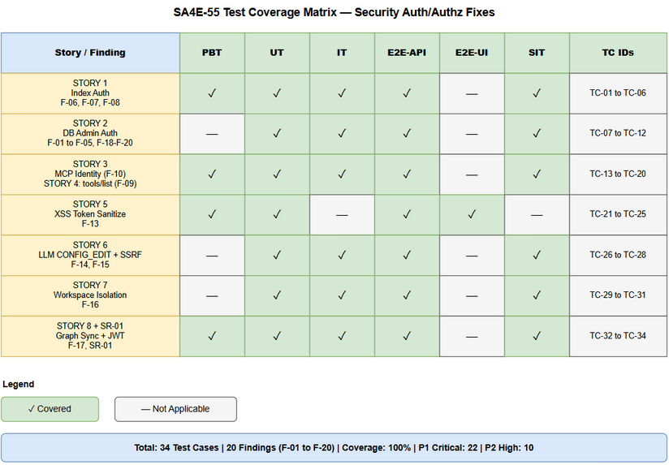
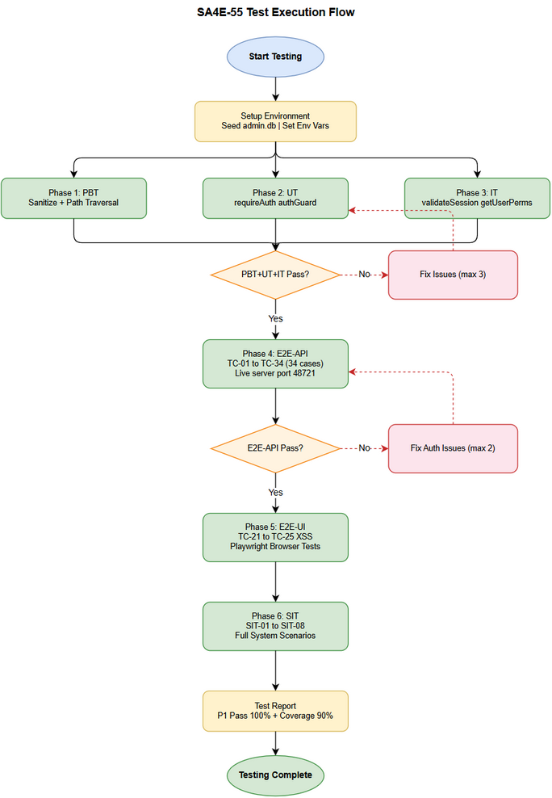

# System Test Plan (STP)

## Code Intelligence MCP Server — SA4E-55: Security: Fix Authentication/Authorization Vulnerabilities in Backend API

---

## Document Information

| Field | Value |
|-------|-------|
| Jira Ticket | SA4E-55 |
| Title | System Test Plan — Security: Fix Authentication/Authorization Vulnerabilities |
| Author | QA Agent |
| Version | 1.0 |
| Date | 2026-07-23 |
| Status | Draft |
| Related BRD | BRD-v1-SA4E-55.docx |
| Related FSD | FSD-v1-SA4E-55.docx |
| Related TDD | TDD-v1-SA4E-55.docx |

---

## Revision History

| Version | Date | Author | Changes |
|---------|------|--------|---------|
| 1.0 | 2026-07-23 | QA Agent | Initial STP — 34 test cases across 6 test levels covering F-01 to F-20 |

---

## 1. Introduction

### 1.1 Purpose

This System Test Plan (STP) defines the testing strategy, scope, levels, environment, data requirements, and traceability matrix for verifying all security fixes introduced in SA4E-55. The plan covers 8 user stories (20 security findings F-01 to F-20) across the Code Intelligence MCP Server backend API.

### 1.2 Scope

**In Scope:**
- All 18 secured API endpoints (F-01 to F-20)
- Authentication middleware: `requireAuth()`, `requireDatabaseAuth()`, `resolveCallerIdentity()`, `authGuard()`
- Authorization (RBAC): `CONFIG_EDIT`, `RBAC_MANAGE`, `MCP_ACCESS` permission checks
- XSS sanitization on `GET /admin?token=`
- SSRF protection on `POST /api/admin/llm/test`
- Workspace data isolation (`GET /api/admin/projects`)
- Privilege escalation prevention (graph sync)
- JWT identity verification and project binding
- `created_by` column migration idempotency

**Out of Scope:**
- Frontend (Admin Portal UI) business logic beyond token handoff
- LLM model inference performance
- Database migration correctness beyond auth gate
- IDE extension client-side behavior

### 1.3 References

| Document | Location |
|----------|----------|
| BRD | documents/SA4E-55/BRD.md |
| FSD | documents/SA4E-55/FSD.md |
| TDD | documents/SA4E-55/TDD.md |
| Security Audit | documents/SECURITY-AUTH-AUDIT.md |
| Architecture | .code-intel/SA4E-ARCHITECTURE.md |

---

## 2. Test Objectives

| # | Objective |
|---|-----------|
| 1 | Verify all 18 secured endpoints return `401` when called without valid authentication |
| 2 | Verify `CONFIG_EDIT`-gated endpoints return `403` for authenticated users without the permission |
| 3 | Verify `RBAC_MANAGE`-gated operations return `403` for non-admin authenticated users |
| 4 | Verify `resolveCallerIdentity()` derives userId from session/JWT only — X-User-Id is demoted to fallback |
| 5 | Verify XSS payload in `?token=` query param is stripped before HTML injection |
| 6 | Verify SSRF protection blocks private IP ranges on LLM test endpoint |
| 7 | Verify workspace isolation: regular users see only their own projects |
| 8 | Verify graph sync requires RBAC_MANAGE (not GRAPH_VIEW) |
| 9 | Verify SSE stream is NOT opened for unauthenticated migrate requests |
| 10 | Verify path traversal protection is independent of auth status |
| 11 | Verify JWT without KB_TOKEN_SECRET is rejected |
| 12 | Verify created_by column migration is idempotent |

---

## 3. Test Levels

This plan covers six test levels as required by the SDLC pipeline.

### 3.1 PBT - Property-Based Testing

**Goal:** Verify security properties hold for all valid and semi-valid inputs.

**Scope:**
- Token sanitization regex (`/[^A-Za-z0-9\-_.]/g`) - property: any input containing non-allowlist chars produces stripped output
- Path traversal variants - property: `resolveWithinWorkspace()` rejects any path escaping workspace root
- JWT structure variants - property: any token with invalid HMAC signature is rejected

**Tooling:** fast-check (TypeScript property-based testing library)

| Property | Invariant |
|----------|-----------|
| `safeToken = sanitize(anyString)` | Result matches `/^[A-Za-z0-9\-_.]*$/` |
| `resolveWithinWorkspace(anyPath)` | Returns null if path contains `..` traversal |
| `verifyJwtToken(tampered)` | Returns `{ valid: false }` for any tampered JWT |

### 3.2 UT - Unit Tests

**Goal:** Isolate and verify individual auth helper functions with mocked dependencies.

| Module | Functions Under Test |
|--------|---------------------|
| `api-index.ts` | `requireAuth()` - session valid, session null, no header |
| `database.ts` (routes) | `requireDatabaseAuth()` - session valid, session null |
| `admin/database.ts` | `authGuard()` - auth+CONFIG_EDIT pass, auth-fail, perm-fail |
| `admin/static.ts` | Token sanitization - XSS payloads, valid tokens, empty |
| `admin/config.ts` | `validateExternalUrl()` - private IPs, public IPs, localhost |
| `tools.ts` | `resolveCallerIdentity()` - API key mode, session, JWT, X-User-Id fallback |
| `tools.ts` | `stripReservedKeys()` - removes __userId, __projectId, __workspaceRoot |
| `jwt-auth.ts` | `verifyJwtToken()` - valid JWT, expired, tampered, missing secret |

**Test Framework:** Jest / Vitest with mocks for `validateSession()` and `getUserPermissions()`
**Coverage Target:** >= 90% branch coverage on all 8 auth modules

### 3.3 IT - Integration Tests

**Goal:** Verify auth helpers interact correctly with the real SQLite admin.db (sessions + group_permissions tables).

**Scope:**
- `validateSession()` with real SQLite sessions table (valid token, expired token, unknown token)
- `getUserPermissions()` with real SQLite group_permissions (CONFIG_EDIT present, absent)
- `verifyJwtToken()` with real KB_TOKEN_SECRET env var (valid, invalid, missing secret)
- `registerProject()` upsert with `createdBy` param — first registration wins, no overwrite on conflict

**Test Setup:** In-memory SQLite via better-sqlite3 with seeded test data. No external services needed.

**Key Scenarios:**
| Scenario | Expected |
|----------|----------|
| validateSession(valid-hex-token) | Returns { userId, username } |
| validateSession(expired-token) | Returns null |
| getUserPermissions(userId with CONFIG_EDIT) | Returns [ { permissionId: 'CONFIG_EDIT', ... } ] |
| getUserPermissions(userId without CONFIG_EDIT) | Returns [] or list without CONFIG_EDIT |
| verifyJwtToken(valid JWT, KB_TOKEN_SECRET set) | Returns { valid: true, payload: { sub, pid } } |
| verifyJwtToken(valid JWT, KB_TOKEN_SECRET='') | Returns { valid: false } |
| registerProject(id, name, path, userId1) twice | created_by remains userId1 on second call |

### 3.4 E2E-API - End-to-End API Tests

**Goal:** Execute full HTTP round-trips against the live Hono server to verify auth gates from client perspective.

**Scope:** All 34 test cases defined in STC.md (TC-01 to TC-34).

**Tooling:** supertest or fetch-based test runner against local server on port 48721.

**Test Data Setup:**
- Seed admin.db with:
  - User `test-user-no-perms` with session token `valid-token-no-perms`
  - User `test-admin-config-edit` with session token `valid-token-config-edit`, permission CONFIG_EDIT
  - User `test-admin-rbac` with session token `valid-token-rbac-manage`, permissions RBAC_MANAGE + CONFIG_EDIT
  - User `test-mcp-user` with session token `valid-token-mcp`, permission MCP_ACCESS
  - project_registry row with `created_by = test-user-no-perms`
  - project_registry row with `created_by = test-admin-rbac`
- KB_TOKEN_SECRET=test-secret-32-bytes-for-hs256
- CODE_INTEL_API_KEY=test-api-key-12345

**Server Startup:** `NODE_ENV=test node dist/server.js` on port 48721

### 3.5 E2E-UI - End-to-End UI Tests

**Goal:** Verify Admin Portal behavior from browser perspective — XSS prevention, token handoff, page loading.

**Scope:**
- TC-21 through TC-25: `GET /admin?token=` XSS sanitization verified in rendered HTML
- Admin Portal RBAC page loading with valid/invalid tokens
- No JavaScript execution from injected malicious tokens

**Tooling:** Playwright against server serving static admin SPA.

**Gherkin Scenarios:**

```gherkin
Feature: Admin Portal Token Handoff XSS Prevention

  Scenario: Valid token is injected safely
    Given the admin portal is accessible at GET /admin
    When I navigate to GET /admin?token=abc123
    Then the HTML response contains localStorage.setItem("admin_token","abc123")
    And no unexpected script tags are present

  Scenario: XSS payload is stripped from token
    Given the admin portal is accessible at GET /admin
    When I navigate to GET /admin?token=x"<script>alert(1)</script>
    Then the HTML response does NOT contain alert(1)
    And the sanitized token contains only [A-Za-z0-9\-_.] characters

  Scenario: No token produces no localStorage script
    Given the admin portal is accessible at GET /admin
    When I navigate to GET /admin with no token parameter
    Then no localStorage.setItem script block is present in HTML

  Scenario: RBAC page loads correctly
    Given the admin portal is accessible
    When I navigate to GET /admin?page=rbac with a valid token
    Then the RBAC management page is rendered

  Scenario: XSS in page param is blocked
    Given the admin portal is accessible
    When I navigate to GET /admin?page=');alert(1);//
    Then no alert(1) executes and page renders safely
```

### 3.6 SIT - System Integration Testing

**Goal:** Verify end-to-end security flows across the full system with realistic user scenarios and multi-component interactions.

**Scope:**
- Full authentication flow: Admin Portal login -> session token -> API call
- IDE Extension MCP flow: JWT auth -> tools/list -> tools/call with identity verification
- Workspace isolation: two separate users registering and listing workspaces
- Permission escalation attempt: regular user attempting CONFIG_EDIT operations
- Graph sync privilege: GRAPH_VIEW user vs RBAC_MANAGE user on sync endpoint

**SIT Scenarios:**

| SIT-ID | Scenario | Components | Expected Outcome |
|--------|----------|------------|-----------------|
| SIT-01 | Admin logs in, gets session, calls DB admin endpoint | Admin Portal + /api/admin/database/* | 200 OK with data |
| SIT-02 | Regular user calls DB admin endpoint | sessions table + /api/admin/database/status | 401 Unauthorized |
| SIT-03 | IDE Extension indexes files via JWT auth | JWT middleware + /api/index/source | Files written, userId stamped |
| SIT-04 | Two users register workspaces; each sees only own | project_registry + /api/admin/projects | Isolated results |
| SIT-05 | GRAPH_VIEW user attempts graph sync | kb-graph.ts + RBAC | 403 Forbidden |
| SIT-06 | RBAC_MANAGE user triggers graph sync | kb-graph.ts + RBAC | { status: sync_started } |
| SIT-07 | LLM test with private IP baseUrl | config.ts + url-validator | { success: false, SSRF blocked } |
| SIT-08 | API key caller gets full tool list | tools.ts + API key auth | All tools returned (no RBAC filter) |

---

## 4. Test Environment Setup

### 4.1 Environment Configuration

| Item | Value |
|------|-------|
| Runtime | Node.js 20.x LTS |
| Framework | Hono 4.x |
| Database | better-sqlite3 9.x (in-memory for UT/IT, file-based for E2E) |
| OS | Windows 10/11 or Linux (Ubuntu 22.04) |
| Port | 48721 |
| Test Framework | Jest + supertest (API), Playwright (UI) |

### 4.2 Environment Variables

| Variable | Value (Test) | Purpose |
|----------|-------------|---------|
| KB_TOKEN_SECRET | `test-secret-32-bytes-for-hs256` | JWT signing/verification |
| CODE_INTEL_API_KEY | `test-api-key-12345` | API key auth mode testing |
| CODE_INTEL_REQUIRE_AUTH | `true` | Enforce auth on all endpoints |
| NODE_ENV | `test` | Disable request logging noise |
| ADMIN_DB_PATH | `:memory:` (UT/IT) / `./test-admin.db` (E2E) | SQLite database location |

### 4.3 Database Seed Script

```sql
-- Sessions: valid tokens for test users
INSERT INTO sessions (token, userId, username, createdAt, expiresAt) VALUES
  ('valid-token-no-perms', 'user-001', 'regular.user', datetime('now'), datetime('now', '+7 days')),
  ('valid-token-config-edit', 'user-002', 'admin.config', datetime('now'), datetime('now', '+7 days')),
  ('valid-token-rbac-manage', 'user-003', 'admin.rbac', datetime('now'), datetime('now', '+7 days')),
  ('valid-token-mcp', 'user-004', 'mcp.user', datetime('now'), datetime('now', '+7 days')),
  ('expired-token-001', 'user-001', 'regular.user', datetime('now', '-8 days'), datetime('now', '-1 day'));

-- Groups
INSERT INTO groups (id, name) VALUES ('g1', 'config-admins'), ('g2', 'rbac-admins'), ('g3', 'mcp-users');
INSERT INTO user_groups (userId, groupId) VALUES
  ('user-002', 'g1'), ('user-003', 'g1'), ('user-003', 'g2'), ('user-004', 'g3');

-- Permissions
INSERT INTO group_permissions (groupId, permissionId) VALUES
  ('g1', 'CONFIG_EDIT'), ('g2', 'RBAC_MANAGE'), ('g3', 'MCP_ACCESS');

-- Projects (for workspace isolation tests)
INSERT INTO project_registry (project_id, display_name, workspace_path, created_by, last_seen) VALUES
  ('proj-001', 'User001 Workspace', '/home/regular.user/project', 'user-001', datetime('now')),
  ('proj-002', 'Admin Workspace', '/home/admin.rbac/project', 'user-003', datetime('now')),
  ('proj-legacy', 'Legacy Workspace', '/home/legacy/project', '', datetime('now', '-30 days'));
```

### 4.4 JWT Test Tokens

```
# Valid JWT (sub=test-user, pid=proj-001, signed with KB_TOKEN_SECRET=test-secret-32-bytes-for-hs256)
Header: { "alg": "HS256", "typ": "JWT" }
Payload: { "sub": "user-001", "pid": "proj-001", "iat": <now>, "exp": <now+3600> }

# Valid JWT (pid mismatch test - pid=proj-999)
Payload: { "sub": "user-001", "pid": "proj-999", "iat": <now>, "exp": <now+3600> }

# JWT without secret (KB_TOKEN_SECRET='') - should be rejected
```

---

## 5. Test Data Requirements

### 5.1 User Accounts

| UserID | Username | Session Token | Permissions | Purpose |
|--------|----------|--------------|-------------|---------|
| user-001 | regular.user | valid-token-no-perms | (none) | Tests: no-auth paths, data isolation |
| user-002 | admin.config | valid-token-config-edit | CONFIG_EDIT | Tests: DB admin, LLM admin |
| user-003 | admin.rbac | valid-token-rbac-manage | CONFIG_EDIT + RBAC_MANAGE | Tests: graph sync, workspace admin |
| user-004 | mcp.user | valid-token-mcp | MCP_ACCESS | Tests: tools/list with MCP access |
| (expired) | regular.user | expired-token-001 | (none) | Tests: expired token rejection |

### 5.2 Project Registry Data

| Project ID | Display Name | Created By | Purpose |
|------------|-------------|------------|---------|
| proj-001 | User001 Workspace | user-001 | Workspace isolation — owned by regular user |
| proj-002 | Admin Workspace | user-003 | Workspace isolation — owned by admin |
| proj-legacy | Legacy Workspace | '' (empty) | Legacy rows; regular user should NOT see these |

### 5.3 XSS Test Vectors

| Vector | Input | Expected Sanitized |
|--------|-------|-------------------|
| XSS-01 | `abc123` | `abc123` |
| XSS-02 | `x"<script>alert(1)</script>` | `xscriptalert1script` |
| XSS-03 | `` | `imgsrcxonerroralert1` |
| XSS-04 | `'); DROP TABLE sessions;--` | `DROPTABLEsessions` |
| XSS-05 | `../../../../etc/passwd` | `etcpasswd` |
| XSS-06 | `` (empty string) | `` (empty — no script injected) |
| XSS-07 | `valid.token-123_abc` | `valid.token-123_abc` (unchanged) |

### 5.4 Path Traversal Test Vectors

| Vector | Input Path | Expected |
|--------|-----------|---------|
| PT-01 | `../../../etc/passwd` | Rejected (null) |
| PT-02 | `/absolute/outside/workspace` | Rejected (null) |
| PT-03 | `./valid/relative/path.ts` | Accepted |
| PT-04 | `valid-file.ts` | Accepted |
| PT-05 | `subdir/../../../escape` | Rejected (null) |

### 5.5 SSRF Test Vectors

| Vector | URL | Expected |
|--------|-----|---------|
| SSRF-01 | `http://169.254.169.254/latest/meta-data` | Blocked (SSRF: link-local) |
| SSRF-02 | `http://10.0.0.1:8080` | Blocked (SSRF: private) |
| SSRF-03 | `http://192.168.1.100:11434` | Blocked (SSRF: RFC-1918) |
| SSRF-04 | `http://127.0.0.1:11434` | Allowed (localhost exception) |
| SSRF-05 | `http://localhost:11434` | Allowed (localhost) |
| SSRF-06 | `https://api.openai.com` | Allowed (public internet) |

---

## 6. Requirements Traceability Matrix (RTM)

| Story | Finding(s) | Business Rule(s) | Test Cases | Coverage |
|-------|-----------|-----------------|------------|---------|
| STORY 1: Secure File Indexing | F-06, F-07, F-08 | BR-01, BR-02, BR-03, BR-04 | TC-01, TC-02, TC-03, TC-04, TC-05, TC-06 | 100% |
| STORY 2: Secure DB Admin (routes) | F-01, F-02, F-03, F-04, F-05 | BR-05, BR-06, BR-07, BR-08 | TC-07, TC-08, TC-09, TC-10, TC-11 | 100% |
| STORY 2: Secure DB Admin (admin) | F-18, F-19, F-20 | BR-09 | TC-12 | 100% |
| STORY 3: Verified MCP Identity | F-10 | BR-10, BR-11, BR-12, BR-13 | TC-13, TC-14, TC-15, TC-16 | 100% |
| STORY 4: Authenticated tools/list | F-09 | BR-14, BR-15, BR-16 | TC-17, TC-18, TC-19, TC-20 | 100% |
| STORY 5: XSS Token Sanitization | F-13 | BR-17, BR-18, BR-19 | TC-21, TC-22, TC-23, TC-24, TC-25 | 100% |
| STORY 6: LLM CONFIG_EDIT + SSRF | F-14, F-15 | BR-20, BR-21, BR-22, BR-23 | TC-26, TC-27, TC-28 | 100% |
| STORY 7: Workspace Isolation | F-16 | BR-24, BR-25, BR-26, BR-27 | TC-29, TC-30, TC-31 | 100% |
| STORY 8: Graph Sync Privilege | F-17 | (story 8 rules) | TC-32, TC-33 | 100% |
| Additional: JWT secret enforcement | SR-01 | (TDD constraint) | TC-34 | 100% |

**Summary:** 34 test cases covering 20 security findings (F-01 to F-20) + 1 additional constraint (SR-01). RTM coverage: **100%**.

### 6.1 Finding Coverage Matrix

| Finding | Severity | Test Cases | Status |
|---------|----------|-----------|--------|
| F-01: GET /api/admin/database/status no auth | High | TC-07 | Covered |
| F-02: POST /api/admin/database/test-connection no auth | Critical | TC-08, TC-09, TC-10 | Covered |
| F-03: POST /api/admin/database/migrate no auth | Critical | TC-11 | Covered |
| F-04: POST /api/admin/database/migrate/cancel no auth | High | TC-11 (migrate group) | Covered |
| F-05: POST /api/admin/database/switch-to-sqlite no auth | High | TC-11 (db group) | Covered |
| F-06: POST /api/index/source no auth | Critical | TC-01, TC-02, TC-03 | Covered |
| F-07: POST /api/index/document no auth | Critical | TC-04 | Covered |
| F-08: POST /api/index/documents no auth | Critical | TC-05 | Covered |
| F-09: GET /mcp/tools/list no auth | Medium | TC-17, TC-18, TC-19, TC-20 | Covered |
| F-10: Identity spoofing via X-User-Id | High | TC-13, TC-14, TC-15, TC-16 | Covered |
| F-13: XSS via ?token= injection | High | TC-21, TC-22, TC-23, TC-24, TC-25 | Covered |
| F-14: GET /api/admin/llm/models no CONFIG_EDIT | Medium | TC-26 | Covered |
| F-15: POST /api/admin/llm/test SSRF | High | TC-27, TC-28 | Covered |
| F-16: Workspace data leakage | Medium | TC-29, TC-30, TC-31 | Covered |
| F-17: Graph sync on read-only perm | Medium | TC-32, TC-33 | Covered |
| F-18: GET /api/admin/database/status (admin) no auth | High | TC-12 | Covered |
| F-19: POST /api/admin/database/test-connection (admin) no auth | Critical | TC-12 | Covered |
| F-20: POST /api/admin/database/validate-schema no auth | Critical | TC-12 | Covered |
| SR-01: JWT without KB_TOKEN_SECRET | High | TC-34 | Covered |

---

## 7. Test Execution Schedule

| Phase | Level | Duration | Order |
|-------|-------|----------|-------|
| 1 | PBT (Property-Based) | 1 day | First — runs with Jest on dev machine |
| 2 | UT (Unit Tests) | 1 day | Second — runs with Jest, mocked dependencies |
| 3 | IT (Integration Tests) | 1 day | Third — real SQLite, in-memory |
| 4 | E2E-API | 2 days | Fourth — live server, full HTTP round-trips |
| 5 | E2E-UI | 1 day | Fifth — Playwright against live server |
| 6 | SIT | 1 day | Last — full system scenarios |

**Total estimated duration:** 7 days

---

## 8. Entry/Exit Criteria

### 8.1 Entry Criteria

- All 11 modified files are implemented and compiled successfully
- Admin DB migration (`created_by` column) runs without error
- Server starts on port 48721 without errors
- Test seed data script executes successfully
- KB_TOKEN_SECRET and CODE_INTEL_API_KEY env vars set for test environment

### 8.2 Exit Criteria

- All 34 test cases executed
- Pass rate >= 100% for Critical security test cases (TC-01 to TC-20, TC-34)
- Pass rate >= 95% overall (max 1-2 low-severity misses)
- No regression on existing non-security test cases
- Code coverage >= 90% on auth-related modules

---

## 9. Risk and Mitigation

| Risk | Likelihood | Impact | Mitigation |
|------|------------|--------|-----------|
| JWT secret not set in test env | Low | High | Pre-test env validation script |
| SQLite in-memory DB not seeded correctly | Medium | Medium | Verified seed script in CI |
| Playwright browser unavailable in CI | Low | Low | Headless mode + retry |
| SSRF test hitting real network | Low | Medium | Use loopback/mock URLs only |
| Rate limiting interfering with E2E tests | Low | Low | Disable rate limiting in test mode |

---

## 10. Diagram Index

| # | Diagram | Image | Source (editable) |
|---|---------|-------|-------------------|
| 1 | Test Coverage Matrix | [test-coverage.png](diagrams/test-coverage.png) | [test-coverage.drawio](diagrams/test-coverage.drawio) |
| 2 | Test Execution Flow | [test-execution-flow.png](diagrams/test-execution-flow.png) | [test-execution-flow.drawio](diagrams/test-execution-flow.drawio) |




