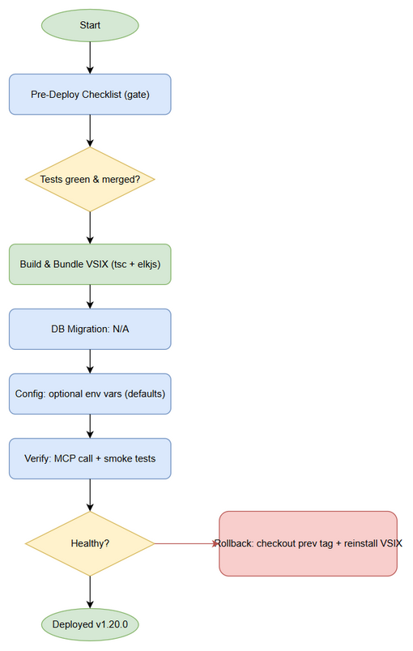
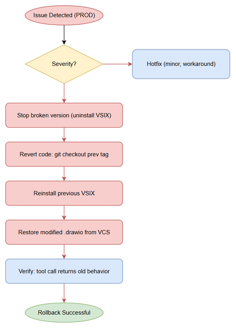

# Deployment Guide (DPG)

## SDLC Agents 4 Enterprise — SA4E-84: [drawio] Upgrade drawio_auto_layout to FIX mode — auto-layout reduce edge crossings with elkjs

---

## Document Information

| Field | Value |
|-------|-------|
| Jira Ticket | SA4E-84 |
| Title | [drawio] Upgrade drawio_auto_layout to FIX mode — auto-layout reduce edge crossings with elkjs |
| Author | DevOps Agent |
| Version | 1.0 |
| Date | 2026-08-30 |
| Status | Final |
| Related TDD | TDD-v1.2-SA4E-84.docx |

---

## Revision History

| Version | Date | Author | Changes |
|---------|------|--------|---------|
| 1.0 | 2026-08-30 | DevOps Agent | Initiate document — auto-generated from TDD v1.2 and project context (backend tool library, bundled into server build) |

---

## Sign-Off

| Name | Role | Signature and date |
|------|------|--------------------|
| | Dev Lead | ☐ Approved for deployment |
| | QA Lead | ☐ Testing completed |
| | Ops Lead | ☐ Infrastructure ready |

---

## 1. Overview

### 1.1 Feature Summary

Nâng cấp MCP tool `drawio_auto_layout` (`backend/src/engine/tools/drawio-tool.ts`) sang **detect + auto-fix (FIX) mode** sử dụng engine bố cục **elkjs** (thuần JS/TS, không binary). Tool nhận `file_path`, tự phát hiện chồng lấp / giao cắt cạnh / cạnh chéo, chạy ELK layered layout để tính lại tọa độ node + edge routing, và ghi thẳng kết quả vào file `.drawio` qua `fs.writeFileSync`. Response tối giản `{ status, message }` hoặc `{ error }`.

### 1.2 Deployment Scope

| Item | Type | Description |
|------|------|-------------|
| `drawio_auto_layout` MCP tool | Modified | NEW FIX mode (elkjs) — replaces old review-only behavior. Bundled into backend server build. |
| `elkjs` npm dependency | New (runtime) | Added to `backend/package.json` dependencies; lazy-loaded at runtime. |
| 4 new backend modules | New | `drawio-layout-models.ts`, `elk-layout.ts`, `drawio-writer.ts`, `drawio-apply.ts` |
| Extension package (VSIX) | Rebuilt | SDLC-Agents-4-Enterprise VSIX rebuilt — tool ships inside extension's bundled backend. |
| Database | None | No DB changes — feature has no persistence. |
| Configuration | Optional | Env vars `SA4E_ELK_MAX_NODES` / `SA4E_ELK_TIMEOUT_MS` with safe defaults; no mandatory config. |

### 1.3 Target Environments

| Environment | URL | Deploy Order | Approval Required |
|-------------|-----|-------------|-------------------|
| DEV | Local build / branch SA4E-84 | 1st | No |
| SIT | CI build artifact | 2nd | No |
| UAT | Extension VSIX install | 3rd | QA Sign-off |
| PROD | Marketplace / packaged VSIX | 4th | PM + Business Sign-off |

> **Deployment Model:** This is a **backend tool library bundled into the server/extension build**. There is **no separate runtime deployment, container, or service** to roll out. "Deployment" = build + package + publish the VSIX (already executed at v1.20.0). See Section 5.

---

## 2. Prerequisites

### 2.1 Infrastructure

| Requirement | Status | Notes |
|-------------|--------|-------|
| Backend build host (Node >= 18.14.1) | Ready | VSIX build + `tsc` compile. Done at v1.20.0. |
| Extension packaging tooling | Ready | `vsce` / `npm run package`. Done. |
| Runtime (Kiro extension host) | Ready | elkjs is pure JS — no Graphviz/draw.io CLI needed. |

### 2.2 Software Dependencies

| Dependency | Version | Status |
|-----------|---------|--------|
| Node.js | >= 18.14.1 | Installed (engines in `backend/package.json`) |
| elkjs | ^0.9.3 | Added to `backend/package.json` dependencies; bundled in build |
| TypeScript | per backend | Compiled clean (0 errors) |

### 2.3 Access Requirements

| Access | Type | Who Needs It |
|--------|------|-------------|
| Git repo (branch SA4E-84) | SSH / token | Developer / DevOps |
| npm registry | Service account | CI build |
| VSIX publish | Marketplace token | Release Manager |

### 2.4 Backup Requirements

- [x] Source committed on branch `SA4E-84` (commit `2f100fa`) and merged to master.
- [x] Git tag `v1.20.0` created — rollback = checkout previous tag.
- [x] Previous VSIX artifact retained for downgrade.

---

## 3. Pre-Deployment Checklist

| # | Item | Responsible | Status |
|---|------|-------------|--------|
| 1 | Code merged to release branch (master) | Developer | ✅ Done (merge SA4E-84 → master) |
| 2 | All unit tests passed (drawio-tool.test.ts 14 pass) | Developer | ✅ Done |
| 3 | All integration tests passed (drawio-export / mcp-dispatch) | QA | ✅ Done |
| 4 | SIT/UAT sign-off obtained (UAT tool test: "Fixed 10 issues... 16 nodes repositioned") | QA + BA | ✅ Done |
| 5 | Database backup completed | DBA | N/A — no DB |
| 6 | Configuration files prepared | DevOps | ✅ N/A — env vars optional w/ defaults |
| 7 | Feature flags configured | Developer | N/A — no flags |
| 8 | Monitoring/alerting configured | DevOps | N/A — tool is stateless, logged via pino |
| 9 | Rollback plan reviewed | Team | ✅ Done (git tag revert) |
| 10 | Deployment window confirmed | PM | ✅ Done (v1.20.0 release) |

---

## 4. Database Migration

### 4.1 Migration Scripts

**N/A** — Feature SA4E-84 does not introduce any database schema, table, or data migration. The data model is TypeScript interfaces (`ElkNode`, `ElkEdge`, etc.) used only in-memory during layout. No DDL required.

### 4.2 Execution Steps

```bash
# No database migration required for SA4E-84.
echo "N/A — no DB changes"
```

### 4.3 Verification Queries

```sql
-- N/A
```

### 4.4 Rollback Scripts

```sql
-- N/A
```

---

## 5. Application Deployment

### 5.1 Deployment Flow



> Flow: **Build (tsc + bundle elkjs) → Package VSIX → Publish/Install → Verify tool via MCP `drawio_auto_layout`**. For this ticket the build & package step was already executed at release v1.20.0.

### 5.2 Deployment Steps (Build / Bundle)

This feature is delivered as part of the backend bundled inside the SDLC-Agents-4-Enterprise VSIX. Steps below are the canonical build/deploy procedure (already executed for v1.20.0; re-run on any patch).

| Step | Action | Command | Verification |
|------|--------|---------|-------------|
| 1 | Install deps (incl. elkjs) | `cd backend && npm install` | `npm ls elkjs` shows `^0.9.3` |
| 2 | Type-check / compile | `cd backend && npm run build` (tsc) | 0 TypeScript errors |
| 3 | Run test gate | `cd backend && npx vitest run` | drawio-tool.test.ts 14 pass; no regression |
| 4 | Package extension | `npm run package` (vsce) | `sdlc-agents-4-enterprise-<ver>.vsix` produced |
| 5 | Install / publish VSIX | Install in Kiro OR publish to marketplace | Extension loads; backend starts |
| 6 | Health / smoke check | Call `drawio_auto_layout` on a sample .drawio | Response `status:"fixed"` or `already_good` |

### 5.3 Docker Deployment

**N/A** — No container image for this component. The backend runs inside the Kiro extension host process; elkjs is bundled into the build.

---

## 6. Configuration Changes

### 6.1 New Environment Variables

All optional with safe defaults — **no mandatory configuration**.

| Variable | Description | DEV | SIT | UAT | PROD |
|----------|-------------|-----|-----|-----|------|
| `SA4E_ELK_MAX_NODES` | Max nodes per diagram (guard) | 500 | 500 | 500 | 500 (default) |
| `SA4E_ELK_TIMEOUT_MS` | ELK layout timeout | 10000 | 10000 | 10000 | 10000 (default) |

> Values validated via `parseEnvInt()` with bounds (SEC-02). Out-of-range → safe default; no secret involved.

### 6.2 Application Properties Changes

| Property | Old Value | New Value | File |
|----------|-----------|-----------|------|
| (none) | — | — | No config file changes required |

### 6.3 Feature Flags

| Flag | DEV | SIT | UAT | PROD |
|------|-----|-----|-----|------|
| (none) | — | — | — | — |

> FIX mode is always-on (no `mode` param, per ADR-6). No flags to toggle.

---

## 7. Post-Deployment Verification

### 7.1 Health Checks

| Check | Endpoint/Command | Expected Result | Timeout |
|-------|-----------------|-----------------|---------|
| Backend startup | Start extension backend | No elkjs import at startup (lazy-load); pino logs clean | 30s |
| Tool availability | `tools/call drawio_auto_layout` with `file_path` | JSON `{status, message}` or `{error}` | 10s |

### 7.2 Smoke Tests

| # | Scenario | Steps | Expected Result |
|---|----------|-------|-----------------|
| 1 | Fix crossing diagram | Provide fixture w/ edge crossing → call tool | `status:"fixed"`, "N nodes repositioned"; file rewritten |
| 2 | Already-good diagram | Provide clean diagram → call tool | `status:"already_good"`; file unchanged |
| 3 | Path traversal blocked | `file_path:"../../etc/passwd"` | `{error:"file_path is required"}` (SEC-01) |
| 4 | UAT replay | architecture.drawio via MCP | `Fixed 10 issues ... 16 nodes repositioned` (observed in UAT) |

### 7.3 Log Verification

| Log Entry | Level | Expected | Location |
|-----------|-------|----------|----------|
| Backend started | INFO | Within 30s | pino log |
| Layout fixed | INFO | After tool call | pino log (no XML content — NFR-P7) |
| ELK error (if any) | ERROR | Generic msg to caller; detail to console.error | console.error |

### 7.4 Monitoring Dashboard

- [x] No new infra metrics required (stateless tool).
- [x] Error rate within normal range (generic errors returned as JSON, not exceptions).
- [x] No unexpected alerts.

---

## 8. Rollback Plan

### 8.1 Rollback Flow



### 8.2 Rollback Decision Criteria

| Condition | Action |
|-----------|--------|
| Tool throws / breaks MCP dispatch in PROD | Immediate rollback to previous VSIX |
| Error rate spike (> 5%) on `drawio_auto_layout` | Rollback to previous tag |
| Data corruption of .drawio files | Rollback + restore affected files from VCS |
| Minor issue, workaround available | Hotfix — no rollback |

### 8.3 Rollback Steps

Because the feature is bundled into the build, rollback = revert the packaged version.

| Step | Action | Command | Verification |
|------|--------|---------|-------------|
| 1 | Stop using broken version | Uninstall VSIX v1.20.0 | Extension unloaded |
| 2 | Revert code | `git checkout v1.19.x` (previous tag) | Source at prior state |
| 3 | Reinstall previous VSIX | Install `sdlc-agents-4-enterprise-1.19.x.vsix` | Extension loads |
| 4 | Verify | Call `drawio_auto_layout` | Old behavior restored |
| 5 | Restore any modified files | `git checkout -- <file.drawio>` | User diagrams intact |

> **Implicit file-safety rollback:** The tool only writes the fixed XML *after* `validateReparse` succeeds (BR-7). On any ELK failure the original file is left untouched — so a "bad fix" never corrupts the source diagram.

### 8.4 Rollback Time Estimate

| Action | Estimated Time |
|--------|---------------|
| Code revert (git checkout tag) | 1 min |
| VSIX reinstall | 2 min |
| Verification | 2 min |
| **Total** | **~5 min** |

---

## 9. Environment-Specific Notes

### 9.1 DEV

Built and tested on branch `SA4E-84` (commit `2f100fa`). `npm run build` + `npx vitest run` green.

### 9.2 SIT

CI build artifact validated; drawio-export / mcp-drawio-dispatch regression tests pass.

### 9.3 UAT

User tested via MCP on `architecture.drawio`: "Fixed 10 issues with ELK layered layout. 16 nodes repositioned." — PASSED.

### 9.4 PROD

- **Deployment Window:** Release v1.20.0 (2026-08-30).
- **Approval Required From:** PM + Business Sign-off (obtained via merge + tag).
- **Communication Plan:** Release notes attached to Jira SA4E-84; CHANGELOG.md updated.
- **On-Call Contact:** Backend team (extension owner).

---

## 10. Appendix

### Contacts

| Role | Name | Contact |
|------|------|---------|
| DevOps Lead | DevOps Agent | — |
| DBA | N/A | N/A (no DB) |
| On-Call Dev | Backend Team | — |

### Related Tickets

| Ticket | Summary | Relationship |
|--------|---------|-------------|
| SA4E-84 | drawio_auto_layout FIX mode (elkjs) | Main ticket |

### Release Artifacts

- Git tag: `v1.20.0`
- VSIX: `sdlc-agents-4-enterprise-1.20.0.vsix`
- Commit: `2f100fa` (branch SA4E-84, merged to master)
